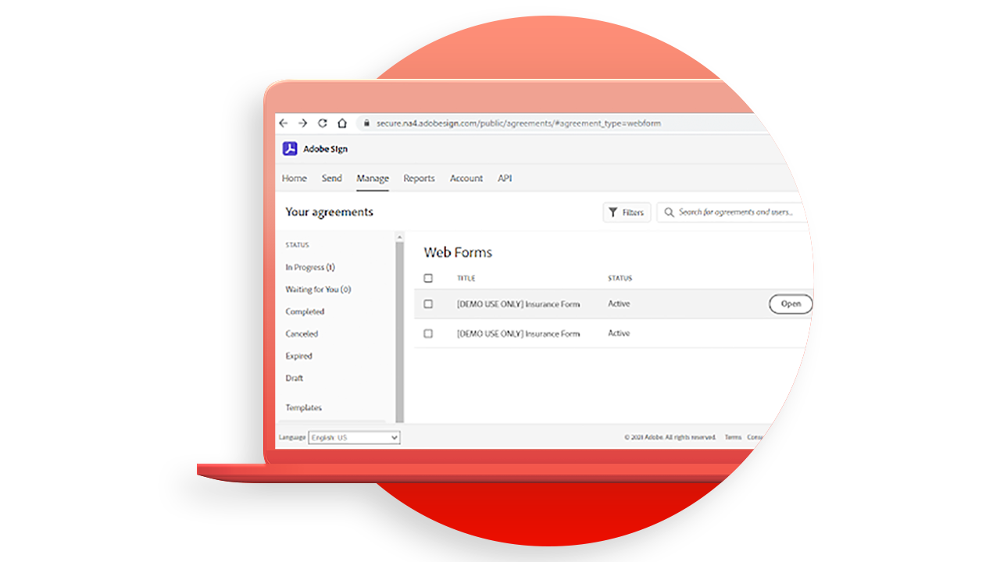

# Acrobat Sign API - Tutorials.

Mit Acrobat Sign-APIs können Sie Anwendungen erstellen und die Acrobat Sign-Benutzungsoberfläche und -funktionen in Ihre Anwendungen einbetten.

## Erste Schritte

<table style="table-layout:fixed">
<tr>
   <td>
    
    

    <a href="signapi.md"><strong>Erste Schritte</strong></a>
    

    <em>Erfahren Sie, wie Sie die Sign-API in Ihre Anwendung einbeziehen, um Signaturen und andere Informationen zu erfassen</em>
     
  </td>
  <td>
    
    

     
  </td>
  <td>
    
    

     
  </td>
  <td>
    
    

     
  </td>
</tr>
</table>

## Kurzanleitung für Acrobat Sign Embed

Erfahren Sie, wie Sie beginnen, die OEM-Version von Acrobat Sign in Ihre Anwendung einzubetten. Dieses Handbuch wurde speziell für OEM-Partner entwickelt, die einen Signaturprozess in ihrer Anwendung erstellen und einbetten.

<table style="table-layout:fixed">
<tr>
 <td>
   
    

   <a href="sign-up-developer-account.md"><strong>Registrieren für ein Entwicklerkonto</strong></a>
    

    <em>Hier erfahren Sie, wie Sie sich für ein Entwicklerkonto für Acrobat Sign registrieren, das mit der Sign- und API-Funktion vollständig aktiviert ist.</em>
     
  </td>
  <td>
   
    

   <a href="creating-your-application.md"><strong>Erstellen der Anwendung</strong></a>
    

    <em>Erfahren Sie, wie Sie eine Anwendung in Acrobat Sign erstellen.</em>
     
  </td>
   <td>
   
    

   <a href="creating-an-embed-link.md"><strong>Erstellen eines Einbettungslinks</strong></a>
    

    <em>Hier erfahren Sie, wie Sie einen Einbettungslink für OAuth erstellen, mit dem die Anwendung Berechtigungen für Benutzer erhält.</em>
     
  </td>
  <td>
   
    

   <a href="generating-an-access-token.md"><strong>Generieren eines Zugriffstokens</strong></a>
    

    <em>Erfahren Sie, wie Sie ein Zugriffstoken generieren, das mit der Acrobat Sign API verwendet werden kann</em>
     
  </td>
</tr>
<tr>
  <td>
   
    

   <a href="creating-a-transient-document.md"><strong>Erstellen von temporären Dokumenten</strong></a>
    

    <em>Erfahren Sie, wie Sie ein temporäres Dokument erstellen, das mit der Acrobat Sign-API verwendet werden kann.</em>
     
  </td>
  <td>
    
    

     
  </td>
   <td>
    
    

     
  </td>
  <td>
    
    

     
  </td>
</tr>
</table>
