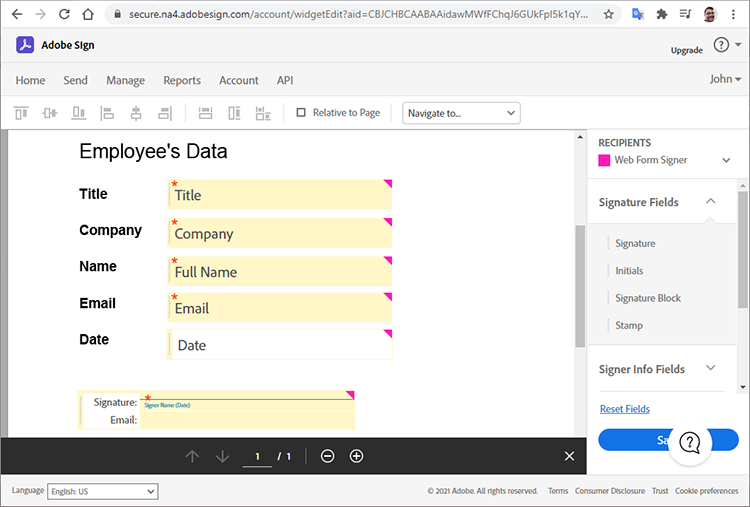
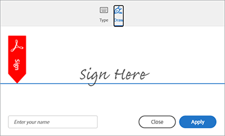

# Erste Schritte mit der Adobe Sign API


[Acrobat Sign API](https://www.adobe.io/apis/documentcloud/sign.html) ist eine großartige Möglichkeit, die Verwaltung von signierten Vereinbarungen zu verbessern. Entwickler können ihre Systeme ganz einfach mit der Sign-API integrieren, die eine zuverlässige, einfache Möglichkeit bietet, Dokumente hochzuladen, zum Signieren zu senden, Erinnerungen zu senden und elektronische Signaturen zu erfassen.

## Lernziel.

In diesem praktischen Tutorial wird erläutert, wie Entwickler die Sign-API verwenden können, um Anwendungen und Workflows zu verbessern, die mit [!DNL Adobe Acrobat Services]. [!DNL Acrobat Services] umfasst [Adobe PDF Services API](https://www.adobe.io/apis/documentcloud/dcsdk/pdf-tools.html), [Adobe PDF Embed-API](https://www.adobe.io/apis/documentcloud/viesdk) (kostenlos) und [Adobe Dokumentenerzeugung API](https://www.adobe.io/apis/documentcloud/dcsdk/doc-generation.html).

Insbesondere erfahren Sie, wie Sie die Acrobat Sign API in Ihre Anwendung integrieren, um Signaturen und andere Informationen, wie z. B. Mitarbeiterinformationen in einem Versicherungsformular, zu erfassen. Es werden generische Schritte mit vereinfachten HTTP-Anforderungen und -Antworten verwendet. Sie können diese Anforderungen in Ihrer bevorzugten Sprache implementieren. Sie können eine PDF mit einer Kombination aus [[!DNL Acrobat Services] APIs](https://www.adobe.io/apis/documentcloud/dcsdk/), laden Sie sie als [kurzlebig](https://www.adobe.io/apis/documentcloud/sign/docs.html#!adobedocs/adobe-sign/master/overview/terminology.md) Dokument hinzufügen und mithilfe der Vereinbarung oder [Widget](https://www.adobe.io/apis/documentcloud/sign/docs.html#!adobedocs/adobe-sign/master/overview/terminology.md) Workflow.

## Erstellen eines PDF-Dokuments

Lege eine Microsoft Word-Vorlage an, und speichere sie auf dem PDF. Oder Sie können Ihre Pipeline mithilfe der Dokumentenerzeugung-API automatisieren, um eine in Word erstellte Vorlage hochzuladen und dann ein PDF-Dokument zu generieren. Die Dokumentenerzeugung-API ist Teil von [!DNL Acrobat Services], [sechs Monate lang kostenlos, danach zahlen wie gewohnt für nur 0,05 US-Dollar pro Dokumenttransaktion](https://www.adobe.io/apis/documentcloud/dcsdk/pdf-pricing.html).

In diesem Beispiel ist die Vorlage nur ein einfaches Dokument, in dem einige Unterzeichnerfelder ausgefüllt werden müssen. Nennen Sie die Felder vorerst und fügen Sie später die tatsächlichen Felder in dieses Tutorial ein.


## Ermitteln des gültigen API-Zugriffspunkts

Vor der Verwendung der Sign-API [ein kostenloses Entwicklerkonto erstellen](https://acrobat.adobe.com/ca/en/sign/developer-form.html) , um auf die API zuzugreifen, den Austausch und die Ausführung von Dokumenten zu testen und die E-Mail-Funktion zu testen.

Adobe verteilt die Acrobat Sign API in vielen Bereitstellungseinheiten, die als &quot;Shards&quot; bezeichnet werden, auf der ganzen Welt. Jeder Shard dient dem Konto eines Kunden, z. B. NA1, NA2, NA3, EU1, JP1, AU1, IN1 und andere. Die Shard-Namen entsprechen geografischen Standorten. Diese Shards bilden den Basis-URI (Zugriffspunkte) der API-Endpunkte.

Um auf die Sign-API zuzugreifen, müssen Sie zunächst den richtigen Zugriffspunkt für Ihr Konto ermitteln. Dies kann je nach Ihrem Standort api.na1.adobesign.com, api.na4.adobesign.com, api.eu1.adobesign.com oder andere sein.

```
  GET /api/rest/v6/baseUris HTTP/1.1
  Host: https://api.adobesign.com
  Authorization: Bearer {YOUR-INTEGRATION-KEY-HERE}
  Accept: application/json

  Response Body (example):

  {
    "apiAccessPoint": "https://api.na4.adobesign.com/", 
    "webAccessPoint": "https://secure.na4.adobesign.com/" 
  }
```

Im obigen Beispiel ist eine Antwort mit dem Wert als Zugriffspunkt.

>[!IMPORTANT]
>
>In diesem Fall müssen alle nachfolgenden Anforderungen, die Sie an die Sign-API stellen, diesen Zugriffspunkt verwenden. Wenn Sie einen Zugriffspunkt verwenden, der nicht Ihrer Region dient, wird eine Fehlermeldung angezeigt.

## Hochladen eines temporären Dokuments

Mit Adobe Sign können Sie verschiedene Flows erstellen, die Dokumente für Signaturen oder Datenerfassung vorbereiten. Unabhängig vom Ablauf Ihrer Anwendung müssen Sie zuerst ein Dokument hochladen, das nur sieben Tage lang verfügbar ist. Die nachfolgenden API-Aufrufe müssen dann auf dieses temporäre Dokument verweisen.

Das Dokument wird mit einer POST an die `/transientDocuments` Endpunkt. Die mehrteilige Anforderung besteht aus dem Dateinamen, einem Dateistream und dem MIME-Typ (Medien) der Dokumentdatei. Die Endpunktantwort enthält eine ID, die das Dokument identifiziert.

Darüber hinaus kann Ihre Anwendung eine Rückruf-URL für Acrobat Sign zum Pingen angeben und die Anwendung benachrichtigen, wenn der Signaturvorgang abgeschlossen ist.


```
  POST /api/rest/v6/transientDocuments HTTP/1.1
  Host: {YOUR-API-ACCESS-POINT}
  Authorization: Bearer {YOUR-INTEGRATION-KEY-HERE}
  x-api-user: email:your-api-user@your-domain.com
  Content-Type: multipart/form-data
  File-Name: "Insurance Form.pdf"
  File: "[path]\Insurance Form.pdf"
  Accept: application/json

  Response Body (example):

  {
     "transientDocumentId": "3AAA...BRZuM"
  }
```

## Erstellen eines Webformulars

Webformulare (früher als Signatur-Widgets bezeichnet) sind gehostete Dokumente, die jeder signieren kann, der Zugriff hat. Beispiele für Webformulare sind Anmeldungsblätter, Haftungsausschlüsse und andere Dokumente, auf die viele Personen zugreifen und die online unterschreiben.

Um ein neues Webformular mit der Sign-API zu erstellen, müssen Sie zunächst ein temporäres Dokument hochladen. Die Anforderung der POST an die `/widgets` Endpunkt verwendet den zurückgegebenen `transientDocumentId` .

In diesem Beispiel lautet das Webformular `ACTIVE`, aber Sie können es in einem von drei verschiedenen Zuständen erstellen:

* ENTWURF - zum schrittweisen Erstellen des Webformulars

* AUTHORING - zum Hinzufügen oder Bearbeiten von Formularfeldern im Webformular

* ACTIVE: Sofortiges Hosten des Webformulars

Die Informationen über die Teilnehmer des Formulars müssen ebenfalls definiert werden. Die `memberInfos` enthält Daten über die Teilnehmer, z. B. E-Mail. Derzeit unterstützt diese Gruppe nicht mehr als ein Mitglied. Da die E-Mail-Adresse des Webformular-Unterzeichners zum Zeitpunkt der Erstellung des Webformulars jedoch unbekannt ist, sollte die E-Mail-Adresse leer gelassen werden, wie im folgenden Beispiel dargestellt. Die `role` definiert die Rolle, die von den Membern in `memberInfos` (z. B. &quot;UNTERZEICHNER&quot; und &quot;GENEHMIGER&quot;).

```
  POST /api/rest/v6/widgets HTTP/1.1
  Host: {YOUR-API-ACCESS-POINT}
  Authorization: Bearer {YOUR-INTEGRATION-KEY-HERE}
  x-api-user: email:your-api-user@your-domain.com
  Content-Type: application/json

  Request Body:

  {
    "fileInfos": [
      {
      "transientDocumentId": "YOUR-TRANSIENT-DOCUMENT-ID"
      }
     ],
    "name": "Insurance Form",
      "widgetParticipantSetInfo": {
          "memberInfos": [{
              "email": ""
          }],
      "role": "SIGNER"
      },
      "state": "ACTIVE"
  }

  Response Body (example):

  {
     "id": "CBJ...PXoK2o"
  }
```

Sie können ein Webformular als `DRAFT` oder `AUTHORING`ändern Sie dann seinen Status, während das Formular Ihre Anwendungspipeline durchläuft. Informationen zum Ändern des Status eines Webformulars finden Sie unter [PUT /widgets/{widgetId}/state](https://secure.na4.adobesign.com/public/docs/restapi/v6#!/widgets/updateWidgetState) Endpunkt.

## Webformular-Hosting-URL lesen

Der nächste Schritt besteht darin, die URL zu ermitteln, die das Webformular hostet. Der Endpunkt /widgets ruft eine Liste von Webformulardaten ab, einschließlich der gehosteten URL des Webformulars, das Sie an Ihre Benutzer weiterleiten, um Signaturen und andere Formulardaten zu erfassen.

Dieser Endpunkt gibt eine Liste zurück, sodass Sie das bestimmte Formular anhand seiner ID im `userWidgetList` bevor Sie die URL abrufen, die das Webformular hostet:

```
  GET /api/rest/v6/widgets HTTP/1.1
  Host: {YOUR-API-ACCESS-POINT}
  Authorization: Bearer {YOUR-INTEGRATION-KEY-HERE}
  Accept: application/json

  Response Body:

  {
    "userWidgetList": [
      {
        "id": "CBJCHB...FGf",
        "name": "Insurance Form",
        "groupId": "CBJCHB...W86",
        "javascript": "<script type='text/javascript' ...
        "modifiedDate": "2021-03-13T15:52:41Z",
        "status": "ACTIVE",
        "Url":
        "https://secure.na4.adobesign.com/public/esignWidget?wid=CBFCIB...Rag*",
        "hidden": false
      },
      {
        "id": "CBJCHB...I8_",
        "name": "Insurance Form",
        "groupId": "CBJCHBCAABAAyhgaehdJ9GTzvNRchxQEGH_H1ya0xW86",
        "javascript": "<script type='text/javascript' language='JavaScript'
        src='https://sec
        "modifiedDate": "2021-03-13T02:47:32Z",
        "status": "ACTIVE",
        "Url":
        "https://secure.na4.adobesign.com/public/esignWidget?wid=CBFCIB...AAB",
        "hidden": false
      },
      {
        "id": "CBJCHB...Wmc",
```

## Webformular verwalten

Dieses Formular ist ein PDF-Dokument, das von Benutzern ausgefüllt werden kann. Sie müssen dem Bearbeiter des Formulars jedoch mitteilen, welche Felder die Benutzer ausfüllen müssen und wo sie sich im Dokument befinden:


Im obigen Dokument werden die Felder noch nicht angezeigt. Sie werden hinzugefügt, während definiert wird, welche Felder die Informationen des Unterzeichners sowie deren Größe und Position erfassen.

Wechseln Sie zur Registerkarte [Webformulare](https://secure.na4.adobesign.com/public/agreements/#agreement_type=webform) auf der Seite &quot;Ihre Vereinbarungen&quot; und suchen Sie nach dem Formular, das Sie erstellt haben.


Klicken **Bearbeiten** , um die Dokumentbearbeitungsseite zu öffnen. Die verfügbaren vordefinierten Felder befinden sich auf der rechten Seite.


Der Editor ermöglicht es Ihnen, Text- und Signaturfelder per Drag &amp; Drop einzufügen. Nachdem Sie alle erforderlichen Felder hinzugefügt haben, können Sie sie skalieren und ausrichten, um das Formular zu optimieren. Klicken Sie abschließend auf **Speichern** , um das Formular zu erstellen.



## Senden eines Webformulars zum Signieren

Wenn Sie das Webformular fertig gestellt haben, müssen Sie es übermitteln, damit es ausgefüllt und signiert werden kann. Nach dem Speichern des Formulars können Sie die URL und den eingebetteten Code anzeigen und kopieren.

**Webformular-URL kopieren**: Verwenden Sie diese URL, um Benutzer zur Überprüfung und Signatur an eine gehostete Version dieser Vereinbarung zu senden. Beispiel:

[https://secure.na4.adobesign.com/public/esignWidget?wid=CBFCIBAA3babw\*](https://secure.na4.adobesign.com/public/esignWidget?wid=CBFCIBAA3AAABLblqZhCndYscuKcDMPiVfQlpaGPb-5D7ebE9NUTQ6x6jK7PIs8HCtTzr3HOx8U6D5qqbabw*)

**Webformular-Einbettungscode kopieren**: Fügen Sie die Vereinbarung Ihrer Website hinzu, indem Sie diesen Code kopieren und in Ihre HTML einfügen.

Beispiel:

```
<iframe
src="https://secure.na4.adobesign.com/public/esignWidget?wid=CBFC
...yx8*&hosted=false" width="100%" height="100%" frameborder="0"
style="border: 0;
overflow: hidden; min-height: 500px; min-width: 600px;"></iframe>
```


Wenn Ihre Benutzer auf die gehostete Version Ihres Formulars zugreifen, überprüfen sie das temporäre Dokument, das zuerst mit den Feldern hochgeladen wurde, die wie angegeben positioniert sind.


Der Benutzer füllt dann die Felder aus und signiert das Formular.


Als Nächstes signiert der Benutzer das Dokument mit einer zuvor gespeicherten Signatur oder mit einer neuen.




Wenn der Benutzer auf **Anwenden**, fordert Adobe sie auf, ihre E-Mail zu öffnen und die Signatur zu bestätigen. Die Signatur steht bis zum Eingang der Bestätigung aus.


Diese Authentifizierung bietet zusätzliche Faktor-Authentifizierung und erhöht die Sicherheit des Unterzeichnungsprozesses.


## Lesen abgeschlossener Webformulare

Jetzt ist es an der Zeit, die Formulardaten zu erhalten, die Benutzer ausgefüllt haben. Die `/widgets/{widgetId}/formData` Der Endpunkt ruft die Daten ab, die der Benutzer beim Signieren des Formulars in ein interaktives Formular eingegeben hat.

```
GET /api/rest/v6/widgets/{widgetId}/formData HTTP/1.1
Host: {YOUR-API-ACCESS-POINT}
Authorization: Bearer {YOUR-INTEGRATION-KEY-HERE}
Accept: text/csv
```

Der resultierende CSV-Datenstrom enthält Formulardaten.

```
Response Body:
"Agreement
name","completed","email","role","first","last","title","company","agreementId",
"email verified","web form signed/approved"
"Insurance Form","","myemail@email.com","SIGNER","John","Doe","My Job Title","My
Company Name","","","2021-03-07 19:32:59"
```

## Erstellen einer Vereinbarung

Alternativ zu Webformularen können Sie Vereinbarungen erstellen. In den folgenden Abschnitten werden einige einfache Schritte zum Verwalten von Vereinbarungen mithilfe der Sign-API veranschaulicht.

Wenn ein Dokument zum Signieren oder Genehmigen an bestimmte Empfänger gesendet wird, wird eine Vereinbarung erstellt. Sie können den Status und Abschluss einer Vereinbarung mithilfe von APIs nachverfolgen.

Sie können eine Vereinbarung mit einem [Übergangsdokument](https://helpx.adobe.com/sign/kb/how-to-send-an-agreement-through-REST-API.html), [Bibliotheksdokument](https://www.adobe.io/apis/documentcloud/sign/docs.html#!adobedocs/adobe-sign/master/samples/send_using_library_doc.md)oder URL. In diesem Beispiel basiert die Vereinbarung auf dem `transientDocumentId`, wie auch das zuvor erstellte Webformular.

```
POST /api/rest/v6/agreements HTTP/1.1
Host: {YOUR-API-ACCESS-POINT}
Authorization: Bearer {YOUR-INTEGRATION-KEY-HERE}
x-api-user: email:your-api-user@your-domain.com
Content-Type: application/json
Accept: application/json
Request Body:
{
    "fileInfos": [
      {
      "transientDocumentId": "{transientDocumentId}"
      }
     ],
    "name": "{agreementName}",
    "participantSetsInfo": [
      {
      "memberInfos": [
          {
          "email": "{signerEmail}"
          }
        ],
        "order": 1,
        "role": "SIGNER"
      }
    ],
    "signatureType": "ESIGN",
    "state": "IN_PROCESS"
  }
```

In diesem Beispiel wird die Vereinbarung als WIRD_VERARBEITET erstellt. Sie können sie jedoch in einem von drei verschiedenen Status erstellen:

* ENTWURF: Die Vereinbarung wird vor dem Versand schrittweise erstellt.

* AUTHORING - Zum Hinzufügen oder Bearbeiten von Formularfeldern in der Vereinbarung

* WIRD_VERARBEITET - zum sofortigen Senden der Vereinbarung

Um einen Vereinbarungsstatus zu ändern, verwenden Sie den Katalog `PUT /agreements/{agreementId}/state` Endpunkt, um einen der folgenden zulässigen Statusübergänge auszuführen:

* ENTWURF ZUM AUTHORING

* AUTHORING to IN_PROCESS

* IN_PROCESS to CANCELLED

Die `participantSetsInfo` Die obige Eigenschaft enthält E-Mails von Personen, von denen erwartet wird, dass sie an der Vereinbarung teilnehmen, und gibt an, welche Aktion sie ausführen (signieren, genehmigen, bestätigen usw.). Im obigen Beispiel gibt es nur einen Teilnehmer: Unterzeichner festlegen. Schriftliche Signaturen sind auf vier pro Dokument beschränkt.

Im Gegensatz zu Webformularen versendet die Adobe eine Vereinbarung automatisch zur Signatur, wenn Sie eine Vereinbarung erstellen. Der Endpunkt gibt den eindeutigen Bezeichner der Vereinbarung zurück.


```
  Response Body:

  {
     id (string): The unique identifier of the agreement
  }
```

## Abrufen von Informationen über Vereinbarungsmitglieder

Nachdem Sie eine Vereinbarung erstellt haben, können Sie mit dem `/agreements/{agreementId}/members` -Endpunkt, um Informationen über Mitglieder der Vereinbarung abzurufen. Sie können beispielsweise überprüfen, ob ein Teilnehmer die Vereinbarung signiert hat.

```
GET /api/rest/v6/agreements/{agreementId}/members HTTP/1.1
Host: {YOUR-API-ACCESS-POINT}
Authorization: Bearer {YOUR-INTEGRATION-KEY-HERE}
Accept: application/json
```

Der resultierende JSON-Antwortkörper enthält Informationen über die Teilnehmer.

```
  Response Body:

  {
     "participantSets":[
        {
           "memberInfos":[
              {
                 "id":"CBJ...xvM",
                 "email":"participant@email.com",
                 "self":false,
                 "securityOption":{
                    "authenticationMethod":"NONE"
                 },
                 "name":"John Doe",
                 "status":"ACTIVE",
                 "createdDate":"2021-03-16T03:48:39Z",
                 "userId":"CBJ...vPv"
              }
           ],
           "id":"CBJ...81x",
           "role":"SIGNER",
           "status":"WAITING_FOR_MY_SIGNATURE",
           "order":1
        }
     ],
```

## Erinnerungen für Vereinbarungen senden

Abhängig von den Geschäftsregeln kann eine Frist verhindern, dass Teilnehmer die Vereinbarung nach einem bestimmten Datum unterzeichnen. Wenn die Vereinbarung ein Ablaufdatum hat, können Sie Teilnehmer daran erinnern, sobald dieses Datum näher rückt.

Basierend auf den Informationen der Vereinbarungsmitglieder, die Sie nach dem Aufruf der `/agreements/{agreementId}/members` im letzten Abschnitt können Sie E-Mail-Erinnerungen an alle Teilnehmer senden, die die Vereinbarung noch nicht unterzeichnet haben.

Eine POST der `/agreements/{agreementId}/reminders` endpoint erstellt eine Erinnerung für die angegebenen Teilnehmer einer Vereinbarung, die vom `agreementId` -Parameter.

```
POST /agreements/{agreementId}/reminders HTTP/1.1
Host: {YOUR-API-ACCESS-POINT}
Authorization: Bearer {YOUR-INTEGRATION-KEY-HERE}
x-api-user: email:your-api-user@your-domain.com
Content-Type: application/json
Accept: application/json
  Request Body:

  {
    "recipientParticipantIds": [{agreementMemberIdList}],
    "agreementId": "{agreementId}",
    "note": "This is a reminder that you haven't signed the agreement yet.",
    "status": "ACTIVE"
  }

  Response Body:

  {
     id (string, optional): An identifier of the reminder resource created on the
     server. If provided in POST or PUT, it will be ignored
  }
```

Sobald Sie die Erinnerung senden, erhalten die Benutzer eine E-Mail mit den Details der Vereinbarung und einem Link zur Vereinbarung.


## Abgeschlossene Vereinbarungen werden gelesen

Wie Webformulare können Sie Details zu Vereinbarungen lesen, die von den Empfängern signiert wurden. Die `/agreements/{agreementId}/formData` Der Endpunkt ruft die Daten ab, die der Benutzer beim Signieren des Webformulars eingegeben hat.

```
GET /api/rest/v6/agreements/{agreementId}/formData HTTP/1.1
Host: {YOUR-API-ACCESS-POINT}
Authorization: Bearer {YOUR-INTEGRATION-KEY-HERE}
Accept: text/csv
Response Body:
"completed","email","role","first","last","title","company","agreementId"
"2021-03-16 18:11:45","myemail@email.com","SIGNER","John","Doe","My Job Title","My
Company Name","CBJCHBCAABAA5Z84zy69q_Ilpuy5DzUAahVfcNZillDt"
```

## Nächste Schritte

Mit der Acrobat Sign-API können Sie Dokumente, Webformulare und Vereinbarungen verwalten. Die vereinfachten, aber vollständigen Workflows, die mit Webformularen und Vereinbarungen erstellt wurden, werden auf eine generische Weise ausgeführt, die es Entwicklern ermöglicht, sie mit jeder Sprache zu implementieren.

Eine Übersicht über die Funktionsweise der Sign-API finden Sie in den [Entwicklerhandbuch zur API-Nutzung](https://www.adobe.io/apis/documentcloud/sign/docs.html#!adobedocs/adobe-sign/master/api_usage.md). Diese Dokumentation enthält kurze Artikel zu vielen der im Artikel beschriebenen Schritte sowie weitere verwandte Themen.

Die Acrobat Sign-API ist über mehrere Ebenen von [Einzelbenutzer- und Mehrbenutzer-Abos für elektronische Signaturen](https://acrobat.adobe.com/de/de/sign/pricing/plans.html), damit Sie ein Preismodell wählen können, das Ihren Anforderungen am besten entspricht. Da Sie jetzt wissen, wie einfach es ist, die Sign-API in Ihre Anwendungen zu integrieren, könnten Sie an anderen Funktionen wie [Acrobat Sign Webhooks](https://www.adobe.io/apis/documentcloud/sign/docs.html#!adobedocs/adobe-sign/master/webhooks.md), ein Push-basiertes Programmiermodell. Anstatt dass Ihre App häufige Überprüfungen in Acrobat Sign-Ereignissen durchführen muss, können Sie mit Webhooks eine HTTP-URL registrieren, für die die Sign-API bei jedem Auftreten eines POST eine Ereignisrückrufanforderung ausführt. Webhooks ermöglichen eine robuste Programmierung, indem sie Ihre Anwendung mit Echtzeit- und Sofortaktualisierungen versorgen.

Im [pay as you go pricing](https://www.adobe.io/apis/documentcloud/dcsdk/pdf-pricing.html), wenn Ihre sechsmonatige kostenlose Testversion der Adobe PDF Services API endet, sowie die kostenlose Adobe PDF Embed-API.

Um Ihrer App spannende Funktionen wie die automatische Dokumenterstellung und Dokumentsignatur hinzuzufügen, beginnen Sie mit [[!DNL Adobe Acrobat Services]](https://www.adobe.io/apis/documentcloud/dcsdk/gettingstarted.html).
