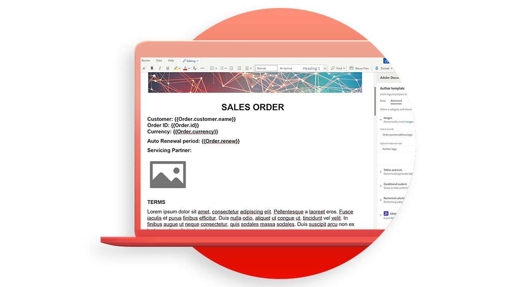

# API-Tutorials zur Dokumenterstellung

Die Dokumentenerzeugung-API erstellt PDF- und Word-Dokumente aus Word-Vorlagen und JSON-Daten.

>[!NOTE]
>
>Die Dokumentenerzeugung-API ist in der PDF Services-API enthalten.

<table style="table-layout:fixed">
<tr>
 <td>
   
  </td>
  <td>
    
    

     
  </td>
   <td>
    
    

     
  </td>
  </td>
   <td>
    
    

     
  </td>
</tr>
</table>

## Erstellen von Vorlagen

Die API für die Dokumentenerzeugung akzeptiert eine Dokumentvorlage (mit Vorlagen-Tags) zusammen mit den Eingabedaten, um das endgültige Dokument zu generieren. Das endgültige Dokument wird generiert, indem alle Vorlagen-Tags in der Dokumentvorlage durch den dynamischen Inhalt ersetzt werden, der auf den tatsächlichen Werten basiert, die der Dateneingabe entsprechen.

<table style="table-layout:fixed">
<tr>
 <td>
   
    

   <a href="taggeroverview.md"><strong>Übersicht über das Adobe-Tag zum Generieren von Dokumenten</strong></a>
    

    <em>Verschaffen Sie sich einen Überblick über den Adobe-Tagger für die Dokumentgenerierung, der für die Verwendung mit der Adobe-API für die Dokumentgenerierung entwickelt wurde</em>
    2 
  </td>
  <td>
   
    

   <a href="taggeraddtexttags.md"><strong>Hinzufügen von Text-Tags</strong></a>
    

    <em>Erfahren Sie, wie Sie Text-Tags zu Microsoft Word-Vorlagen hinzufügen, indem Sie den Adobe-Tagger für die Dokumentgenerierung zur Verwendung mit der Adobe-API für die Dokumentengenerierung verwenden</em>
    2 
  </td>
  <td>
   
    

   <a href="taggeraddimagetags.md"><strong>Hinzufügen von Bild-Tags</strong></a>
    

    <em>Erfahren Sie, wie Sie mit dem Adobe-Tagger für die Dokumentgenerierung Image-Tags zu Microsoft Word-Vorlagen hinzufügen, um mithilfe der API für die Dokumentgenerierung von Adobe-Dokumenten Bilder dynamisch in Dokumente zu übertragen</em>
    2 
  </td>
  <td>
   
    

   <a href="taggertables.md"><strong>Hinzufügen von Tabellen und Listen-Tags</strong></a>
    

    <em>Erfahren Sie, wie Sie Tabellen und Listen-Tags mithilfe des Adobe-Taggers für die Dokumentgenerierung zu Microsoft Word-Vorlagen hinzufügen, um Tabellen- oder Listenzeilen anhand von Daten mithilfe der Adobe-API für die Dokumentengenerierung dynamisch hinzuzufügen</em>
    2 
  </td>
</tr>
<tr>
  <td>
   
    

   <a href="taggercalculations.md"><strong>Festlegen von numerischen Berechnungs-Tags</strong></a>
    

    <em>Erfahren Sie, wie Sie numerische Berechnungs-Tags in Microsoft Word-Vorlagen mithilfe des Adobe-Taggers für die Dokumentgenerierung festlegen, um Aggregationen oder die Arithmetik von Datenwerten mithilfe der Adobe-API für die Dokumentgenerierung zu berechnen</em>
    2 
  </td>
  <td>
   
    

   <a href="taggerconditional.md"><strong>Bedingten Inhalt einstellen</strong></a>
    

    <em>Erfahren Sie, wie Sie Abschnitte in Microsoft Word-Vorlagen mithilfe des Adobe-Taggers für die Dokumentenerzeugung festlegen, um Abschnitte eines Dokuments anhand von Daten mithilfe der Adobe-API für die Dokumentenerzeugung dynamisch ein- oder auszuschließen</em>
    2 
  </td>
  <td>
    
    

     
  </td>
   <td>
    
    

     
  </td>
</tr>
</table>
