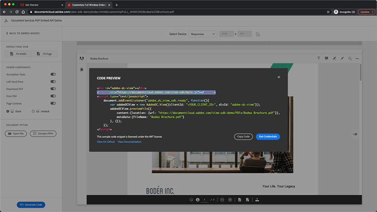

# PDF-Onlineerlebnis kontrollieren und Analysen einholen

Hat Ihr Unternehmen PDF auf Ihrer Website veröffentlicht? Hier erfahren Sie, wie Sie die Adobe PDF Embed-API verwenden, um das Erscheinungsbild zu steuern, die Zusammenarbeit zu ermöglichen und Analysen darüber zu erfassen, wie Benutzer mit PDF interagieren, einschließlich Zeitaufwand für eine Seite und Suchvorgänge. Um dieses 4-teilige praktische Tutorial zu beginnen, wählen Sie *Erste Schritte mit der PDF Embed-API*.

<table style="table-layout:fixed">
<tr>
  <td>
    <a href="controlpdfexperience.md#part1">
        
    </a>
    <div>
    <a href="controlpdfexperience.md#part1"><strong>Teil 1: Erste Schritte mit der PDF Embed-API</strong></a>
    </div>
  </td>
  <td>
    <a href="controlpdfexperience.md#part2">
        
    </a>
    <div>
    <a href="controlpdfexperience.md#part2"><strong>Teil 2: Hinzufügen der PDF Embed-API zu einer Webseite</strong></a>
    </div>
  </td>
  <td>
   <a href="controlpdfexperience.md#part3">
      
   </a>
    <div>
    <a href="controlpdfexperience.md#part3"><strong>Teil 3: Zugriff auf Analytics-APIs</strong></a>
    </div>
  </td>
  <td>
   <a href="controlpdfexperience.md#part4">
      
   </a>
    <div>
    <a href="controlpdfexperience.md#part4"><strong>Teil 4: Interaktivität basierend auf Ereignissen hinzufügen</strong></a>
    </div>
  </td>
</tr>
</table>

## Teil 1: Erste Schritte mit der PDF Embed-API {#part1}

Im ersten Teil lernst du, wie du mit allem anfängst, was du für die ersten Teile brauchst. Sie beginnen mit dem Abrufen von API-Zugangsberechtigungen.

**Was Sie benötigen**

* Tutorial-Ressourcen [Download](https://github.com/benvanderberg/adobe-pdf-embed-api-tutorial)
* Adobe ID [hier abrufen](https://account.adobe.com/de)
* Webserver (Node JS, PHP usw.)
* Grundkenntnisse in HTML / JavaScript / CSS

**Was wir verwenden**

* Ein einfacher Webserver (Knoten)
* Visual Studio-Code
* GitHub

### Abrufen von Anmeldedaten

1. Rufen Sie die Website [Adobe.io](https://developer.adobe.com/) auf.
1. Klicken Sie auf **[!UICONTROL Weitere Informationen]** unter Erstellen ansprechender Dokumenterlebnisse.

   

   Dadurch gelangen Sie zur Startseite von [!DNL Adobe Acrobat Services].

1. Klicken Sie in der Navigationsleiste auf **[!UICONTROL Erste Schritte]**.

   Sie sehen eine Option in **Erste Schritte mit [!DNL Acrobat Services] APIs** bis **Neue Anmeldeinformationen erstellen** oder **Vorhandene Anmeldeinformationen verwalten**.

1. Klicken Sie auf die Schaltfläche **[!UICONTROL Erste Schritte]** unter **[!UICONTROL Neue Anmeldeinformationen erstellen]**.

   

1. Wählen Sie das Optionsfeld **[!UICONTROL PDF Embed API]**, und fügen Sie im nächsten Fenster einen Anmeldeinformationsnamen Ihrer Wahl und eine Anwendungsdomäne hinzu.

   >[!NOTE]
   >
   >Diese Anmeldeinformationen können nur in der Anwendungsdomäne verwendet werden, die hier aufgeführt ist. Sie können jede beliebige Domäne verwenden.

   

1. Klicken Sie auf **[!UICONTROL Anmeldeinformationen erstellen]**.

   Auf der letzten Seite des Assistenten finden Sie die Details zu den Clientanmeldeinformationen. Lassen Sie dieses Fenster geöffnet, damit Sie zu ihm zurückkehren und die Client-ID (API-Schlüssel) zur späteren Verwendung kopieren können.

1. Klicken Sie auf **[!UICONTROL Dokumentation anzeigen]**, um die Dokumentation mit detaillierten Informationen zur Verwendung dieser API aufzurufen.

   

## Teil 2: PDF Embed-API zu einer Webseite hinzufügen {#part2}

Im zweiten Teil lernen Sie, wie Sie die PDF Embed-API ganz einfach in eine Webseite einbetten können. Dazu verwenden Sie die Online-Demo von Adobe PDF Embed API, um unseren Code zu erstellen.

### Abrufen des Übungscodes

Wir haben Code erstellt, den Sie verwenden können. Sie können zwar Ihren eigenen Code verwenden, aber die Demonstrationen befinden sich im Kontext der Tutorial-Ressourcen. Laden Sie hier den Beispielcode [&#128279;](https://github.com/benvanderberg/adobe-pdf-embed-api-tutorial) herunter.

1. Gehen Sie zu [[!DNL Adobe Acrobat Services] Website](https://developer.adobe.com/document-services/homepage/).

   ![Screenshot der [!DNL Adobe Acrobat Services]-Website](assets/ControlPDF_6.png)

1. Klicken Sie in der Navigationsleiste auf **[!UICONTROL APIs]**, und navigieren Sie dann im Dropdown-Link zur Seite **[!UICONTROL PDF Embed API]**.

   

1. Klicken Sie auf **[!UICONTROL Demo testen]**.

   Ein neues Fenster mit der Entwickler-Sandbox für PDF Embed-API wird angezeigt.

   

   Hier sehen Sie die Optionen für die verschiedenen Anzeigemodi.

1. Klicken Sie auf die verschiedenen Anzeigemodi für &quot;Volles Fenster&quot;, &quot;Größter Container&quot;, &quot;Inline&quot; und &quot;Leuchtpult&quot;.

   

1. Klicken Sie auf **[!UICONTROL Volles Fenster]**, Anzeigemodus, und klicken Sie dann auf die Schaltfläche **[!UICONTROL Anpassen]**, um die Optionen ein- und auszuschalten.

   

1. Deaktivieren Sie die Option **[!UICONTROL PDF herunterladen]**.
1. Klicken Sie auf die Schaltfläche **[!UICONTROL Code generieren]**, um die Codevorschau anzuzeigen.
1. Kopieren Sie **[!UICONTROL Client-ID]** aus dem Fenster Client-Anmeldeinformationen aus Teil 1.

   

1. Öffnen Sie die Datei **[!UICONTROL Web]** -> **[!UICONTROL Ressourcen]** -> **[!UICONTROL js]** -> **[!UICONTROL dc-config.js]** in Ihrem Code-Editor.

   Die Variable &quot;clientID&quot; ist bereits vorhanden.

1. Fügen Sie Ihre Client-Anmeldedaten zwischen den doppelten Anführungszeichen ein, um die clientID auf Ihre Anmeldedaten festzulegen.

1. Kehren Sie zur Entwickler-Sandbox-Codevorschau zurück.

1. Kopieren Sie die zweite Zeile, die das Adobe-Skript enthält:

   ```
   <script src=https://documentccloud.adobe.com/view-sdk/main.js></script>
   ```

   

1. Wechseln Sie zu Ihrem Code-Editor und öffnen Sie die Datei **[!UICONTROL Web]** -> **[!UICONTROL Übung]** -> **[!UICONTROL index.html]**.

1. Fügen Sie den Skriptcode in Zeile 18 in `<head>` der Datei unter dem Kommentar mit folgendem Text ein: **TODO: EXERCISE 1: INSERT EMBED API SCRIPT TAG**.

   

1. Kehren Sie zur Entwickler-Sandbox-Codevorschau zurück und kopieren Sie die erste Codezeile, die Folgendes enthält:

   ```
   <div id="adobe-dc-view"></div>
   ```

   

1. Wechseln Sie zu Ihrem Code-Editor und öffnen Sie die Datei **[!UICONTROL Web]** -> **[!UICONTROL Übung]** -> **[!UICONTROL index.html]** erneut.

1. Fügen Sie den `<div>`-Code in Zeile 67 in `<body>` der Datei unter dem Kommentar **HINWEIS: ÜBUNG 1: PDF-EINBETTUNGS-API-CODE EINFÜGEN** ein.

   

1. Kehren Sie zur Entwickler-Sandbox-Codevorschau zurück und kopieren Sie die Codezeilen für `<script>` unten:

   ```
   <script type="text/javascript">
       document.addEventListener("adobe_dc_view_sdk.ready",             function(){ 
           var adobeDCView = new AdobeDC.View({clientId:                     "<YOUR_CLIENT_ID>", divId: "adobe-dc-view"});
           adobeDCView.previewFile({
               content:{location: {url: "https://documentcloud.                adobe.com/view-sdk-demo/PDFs/Bodea Brochure.                    pdf"}},
               metaData:{fileName: "Bodea Brochure.pdf"}
           }, {showDownloadPDF: false});
       });
   </script>
   ```

1. Wechseln Sie zu Ihrem Code-Editor und öffnen Sie die Datei **[!UICONTROL Web]** -> **[!UICONTROL Übung]** -> **[!UICONTROL index.html]** erneut.

1. Fügen Sie den Code &quot;`<script>`&quot; in Zeile 68 unter dem Tag &quot;`<div>`&quot; in &quot;`<body>`&quot; der Datei ein.

1. Ändern Sie Zeile 70 derselben Datei **index.html**, um die zuvor erstellte clientID-Variable einzuschließen.

   

1. Ändern Sie Zeile 72 derselben Datei **index.html**, um den Speicherort der PDF-Datei zu aktualisieren und eine lokale Datei zu verwenden.

   In den Tutorial-Dateien in **/resources/pdfs/whitepaper.pdf** ist eine verfügbar.

1. Speichern Sie die geänderten Dateien und zeigen Sie eine Vorschau Ihrer Website an, indem Sie zu **`<your domain>`/summit21/web/training/** navigieren.

   Sie sollten das technische Whitepaper-Rendering im Vollfenstermodus in Ihrem Browser sehen.

## Teil 3: Zugriff auf Analytics-APIs {#part3}

Nachdem Sie nun erfolgreich eine Webseite erstellt haben, auf der die PDF Embed-API eine PDF rendert, können Sie im dritten Teil sehen, wie JavaScript-Ereignisse zum Messen von Analysen verwendet werden, um zu verstehen, wie Benutzer PDF verwenden.

### Auffinden von Dokumentation

Es gibt viele verschiedene JavaScript-Ereignisse, die als Teil der PDF Embed-API verfügbar sind. Sie können über die [!DNL Adobe Acrobat Services]-Dokumentation darauf zugreifen.

1. Navigieren Sie zur Website [Dokumentation](https://developer.adobe.com/document-services/docs/overview).
1. Überprüfen Sie die verschiedenen Ereignistypen, die als Teil der API verfügbar sind. Diese sind als Referenz nützlich und auch für zukünftige Projekte hilfreich.

   

1. Kopieren Sie den Beispielcode, der auf der Website aufgeführt ist.

   Verwenden Sie dies als Grundlage für unseren Code und ändern Sie ihn.

   

   ```
   const eventOptions = {
     //Pass the PDF analytics events to receive.
      //If no event is passed in listenOn, then all PDF         analytics events will be received.
   listenOn: [ AdobeDC.View.Enum.PDFAnalyticsEvents.    PAGE_VIEW, AdobeDC.View.Enum.PDFAnalyticsEvents.DOCUMENT_DOWNLOAD],
     enablePDFAnalytics: true
   }
   
   
   adobeDCView.registerCallback(
     AdobeDC.View.Enum.CallbackType.EVENT_LISTENER,
     function(event) {
       console.log("Type " + event.type);
       console.log("Data " + event.data);
     }, eventOptions
   );
   ```

1. Suchen Sie den zuvor hinzugefügten Codeabschnitt, der wie der folgende aussieht, und hängen Sie den obigen Code nach diesem Code in **index.html** an:

   

1. Laden Sie die Seite in Ihren Webbrowser und öffnen Sie die Konsole, um die Konsolenausgaben aus den verschiedenen Ereignissen anzuzeigen, während Sie mit dem PDF-Viewer interagieren.

   

   

### Schalter zum Erfassen von Ereignissen hinzufügen

Nachdem Sie die Ereignisse in console.log ausgegeben haben, ändern wir das Verhalten, je nachdem, welche Ereignisse angezeigt werden. Dazu verwenden Sie ein Beispiel für einen Switch.

1. Navigieren Sie zu **snippets/eventsSwitch.js** und kopieren Sie den Inhalt der Datei in den Tutorial-Code.

   

1. Fügen Sie den Code in die Ereignis-Listener-Funktion ein.

   

1. Überprüfen Sie, ob die Konsole korrekt ausgibt, wenn die Seite geladen wird und Sie mit dem PDF Viewer interagieren.

### Adobe Analytics

Wenn Sie Ihrem Viewer Adobe Analytics-Support hinzufügen möchten, können Sie die auf der Website dokumentierten Anweisungen befolgen.

>[!IMPORTANT]
>
>Auf Ihrer Webseite muss Adobe Analytics bereits auf der Seite in der Kopfzeile geladen sein.

Navigieren Sie zur [Adobe Analytics-Dokumentation](https://www.adobe.com/devnet-docs/dcsdk_io/viewSDK/howtodata.html#adobe-analytics) und überprüfen Sie, ob Adobe Analytics bereits auf Ihrer Webseite aktiviert ist. Folgen Sie den Anweisungen zum Einrichten einer reportSuite.

### Google Analytics


Die Adobe PDF Embed-API bietet eine standardmäßige Integration mit Adobe Analytics. Da alle Events als JavaScript-Events verfügbar sind, ist es jedoch möglich, Google Analytics zu integrieren, indem PDF-Events erfasst und die Funktion ga() verwendet wird, um das Event zu Adobe Analytics hinzuzufügen.

1. Navigieren Sie zu **snippets/eventsSwitchGA.js**, um zu sehen, wie Sie Google Analytics integrieren können.
1. Überprüfen und verwenden Sie diesen Code als Beispiel, wenn Ihre Webseite mit Adobe Analytics verfolgt wird und sie bereits auf der Webseite eingebettet ist.

   

## Teil 4: Interaktivität basierend auf Ereignissen hinzufügen {#part4}

Im vierten Teil dieses Tutorials lernst du, wie du eine Paywall-Ebene über dem PDF-Viewer anlegst. Diese Paywall-Ebene wird nach dem Scrollen über die zweite Seite angezeigt.

### Paywall-Beispiel

Navigieren Sie zu diesem [Beispiel einer PDF hinter einer Paywall](https://www3.technologyevaluation.com/research/white-paper/the-forrester-wave-digital-decisioning-platforms-q4-2020.html). In diesem Beispiel erfahren Sie, wie Sie Interaktivität zusätzlich zu einem PDF-Anwendererlebnis hinzufügen.

### Paywall-Code hinzufügen

1. Gehen Sie zu snippets/paywallCode.html und kopieren Sie den Inhalt.
1. Suchen Sie in exercise/index.html nach `<!-- TODO: EXERCISE 3: INSERT PAYWALL CODE -->`.

   

1. Fügen Sie den kopierten Code nach dem Kommentar ein.
1. Wechseln Sie zu **snippets/paywallCode.js** und kopieren Sie den Inhalt.

   

1. Fügen Sie den Code an diesem Speicherort ein.

### Demo mit Paywall testen

Jetzt können Sie die Demo ansehen.

1. Laden Sie **index.html** erneut auf Ihre Website.
1. Scrollen Sie nach unten zu einer Seite > 2.
1. Das Dialogfeld &quot;Aufrufen&quot; anzeigen, um den Benutzer nach der zweiten Seite herauszufordern.

   

## Weitere Ressourcen

Weitere Ressourcen finden Sie [hier](https://developer.adobe.com/document-services/docs/overview).
