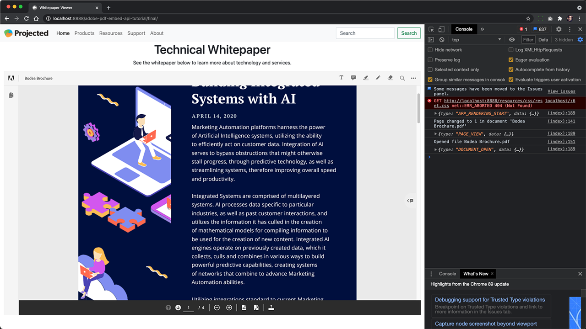

# PDF-Onlineerlebnis kontrollieren und Analysen einholen

Hat Ihr Unternehmen PDF auf Ihrer Website veröffentlicht? Hier erfahren Sie, wie Sie die Adobe PDF Embed-API verwenden, um das Erscheinungsbild zu steuern, die Zusammenarbeit zu ermöglichen und Analysen darüber zu erfassen, wie Benutzer mit PDF interagieren, einschließlich Zeitaufwand für eine Seite und Suchvorgänge. Um dieses 4-teilige praktische Tutorial zu beginnen, wählen Sie *Erste Schritte mit der PDF Embed-API*.

<table style="table-layout:fixed">
<tr>
  <td>
    <a href="controlpdfexperience.md#part1">
        
    </a>
    <div>
    <a href="controlpdfexperience.md#part1"><strong>Teil 1: Erste Schritte mit der PDF Embed-API</strong></a>
    </div>
  </td>
  <td>
    <a href="controlpdfexperience.md#part2">
        
    </a>
    <div>
    <a href="controlpdfexperience.md#part2"><strong>Teil 2: PDF Embed-API zu einer Webseite hinzufügen</strong></a>
    </div>
  </td>
  <td>
   <a href="controlpdfexperience.md#part3">
      
   </a>
    <div>
    <a href="controlpdfexperience.md#part3"><strong>Teil 3: Zugriff auf Analytics-APIs</strong></a>
    </div>
  </td>
  <td>
   <a href="controlpdfexperience.md#part4">
      
   </a>
    <div>
    <a href="controlpdfexperience.md#part4"><strong>Teil 4: Interaktivität basierend auf Ereignissen hinzufügen</strong></a>
    </div>
  </td>
</tr>
</table>

## Teil 1: Erste Schritte mit der PDF Embed-API {#part1}

Im ersten Teil lernst du, wie du mit allem anfängst, was du für die ersten Teile brauchst. Sie beginnen mit dem Abrufen von API-Zugangsberechtigungen.

**Was Sie benötigen**

* Tutorial-Ressourcen [Herunterladen](https://github.com/benvanderberg/adobe-pdf-embed-api-tutorial)
* Adobe ID [hier herunterladen](https://accounts.adobe.com/de)
* Webserver (Node JS, PHP usw.)
* Grundkenntnisse in HTML / JavaScript / CSS

**Was wir verwenden**

* Ein einfacher Webserver (Knoten)
* Visual Studio-Code
* GitHub

### Abrufen von Anmeldedaten

1. Wechseln Sie zur Registerkarte [Website von Adobe.io](https://www.adobe.io/).
1. Klicken **[!UICONTROL Weitere Informationen]** unter Entwickeln Sie ansprechende Dokumentenerlebnisse.

   

   Dadurch gelangen Sie zur Registerkarte [!DNL Adobe Acrobat Services] Startseite.

1. Klicken **[!UICONTROL Erste Schritte]** in der Navigationsleiste.

   Sie sehen eine Option in **Erste Schritte mit [!DNL Acrobat Services] API** bis **Neue Anmeldeinformationen erstellen** oder **Vorhandene Anmeldeinformationen verwalten**.

1. Klicken **[!UICONTROL Erste Schritte]** Schaltfläche unter **[!UICONTROL Neue Anmeldeinformationen erstellen]**.

   

1. Wählen Sie die **[!UICONTROL PDF Embed-API]** und fügen Sie im nächsten Fenster einen Anmeldeinformationsnamen Ihrer Wahl und eine Anwendungsdomäne hinzu.

   >[!NOTE]
   >
   >Diese Anmeldeinformationen können nur in der Anwendungsdomäne verwendet werden, die hier aufgeführt ist. Sie können jede beliebige Domäne verwenden.

   

1. Klicken **[!UICONTROL Anmeldeinformationen erstellen]**.

   Auf der letzten Seite des Assistenten finden Sie die Details zu den Clientanmeldeinformationen. Lassen Sie dieses Fenster geöffnet, damit Sie zu ihm zurückkehren und die Client-ID (API-Schlüssel) zur späteren Verwendung kopieren können.

1. Klicken **[!UICONTROL Dokumentation anzeigen]** , um zur Dokumentation mit detaillierten Informationen zur Verwendung dieser API zu gelangen.

   

## Teil 2: PDF Embed-API zu einer Webseite hinzufügen {#part2}

Im zweiten Teil lernen Sie, wie Sie die PDF Embed-API ganz einfach in eine Webseite einbetten können. Dazu verwenden Sie die Online-Demo von Adobe PDF Embed API, um unseren Code zu erstellen.

### Abrufen des Übungscodes

Wir haben Code erstellt, den Sie verwenden können. Sie können zwar Ihren eigenen Code verwenden, aber die Demonstrationen befinden sich im Kontext der Tutorial-Ressourcen. Beispielcode herunterladen [hier](https://github.com/benvanderberg/adobe-pdf-embed-api-tutorial).

1. Wechseln zu [[!DNL Adobe Acrobat Services] Website](https://www.adobe.io/apis/documentcloud/dcsdk/).

   ![Screenshot von [!DNL Adobe Acrobat Services] Website](assets/ControlPDF_6.png)

1. Klicken **[!UICONTROL API]** in der Navigationsleiste, und gehen Sie dann zur Registerkarte &quot; **[!UICONTROL PDF Embed-API]** &quot; im Dropdown-Link auswählen.

   

1. Klicken **[!UICONTROL Demo testen]**.

   Ein neues Fenster mit der Entwickler-Sandbox für PDF Embed-API wird angezeigt.

   

   Hier sehen Sie die Optionen für die verschiedenen Anzeigemodi.

1. Klicken Sie auf die verschiedenen Anzeigemodi für &quot;Volles Fenster&quot;, &quot;Größter Container&quot;, &quot;Inline&quot; und &quot;Leuchtpult&quot;.

   

1. Klicken **[!UICONTROL Volles Fenster]** Anzeigemodus, klicken Sie dann auf das Symbol **[!UICONTROL Anpassen]** , um Optionen ein- und auszuschalten.

   

1. Deaktivieren **[!UICONTROL Herunterladen]** PDF.
1. Klicken **[!UICONTROL Code generieren]** , um die Codevorschau anzuzeigen.
1. Kopieren **[!UICONTROL Client-ID]** im Fenster Client-Zugangsdaten aus Teil 1.

   

1. Öffnen Sie die **[!UICONTROL Web]** -> **[!UICONTROL Ressourcen]** -> **[!UICONTROL js]** -> **[!UICONTROL dc-config.js]** in Ihrem Code-Editor.

   Die Variable &quot;clientID&quot; ist bereits vorhanden.

1. Fügen Sie Ihre Client-Anmeldedaten zwischen den doppelten Anführungszeichen ein, um die clientID auf Ihre Anmeldedaten festzulegen.

1. Kehren Sie zur Entwickler-Sandbox-Codevorschau zurück.

1. Kopieren Sie die zweite Zeile, die das Adobe-Skript enthält:

   ```
   <script src=https://documentccloud.adobe.com/view-sdk/main.js></script>
   ```

   

1. Wechseln Sie zu Ihrem Code-Editor und öffnen Sie das Dialogfeld **[!UICONTROL Web]** -> **[!UICONTROL Übung]** -> **[!UICONTROL index.html]** -Datei.

1. Fügen Sie den Skriptcode in das `<head>` der Datei in Zeile 18 unter dem folgenden Kommentar: **TODO: ÜBUNG 1: API-SKRIPT-TAG EINBETTEN**.

   

1. Kehren Sie zur Entwickler-Sandbox-Codevorschau zurück und kopieren Sie die erste Codezeile, die Folgendes enthält:

   ```
   <div id="adobe-dc-view"></div>
   ```

   

1. Wechseln Sie zu Ihrem Code-Editor und öffnen Sie das Dialogfeld **[!UICONTROL Web]** -> **[!UICONTROL Übung]** -> **[!UICONTROL index.html]** -Datei erneut aus.

1. Fügen Sie die `<div>` in die `<body>` der Datei in Zeile 67 unter dem Kommentar, der **TODO: ÜBUNG 1: PDF-EINBETTUNGS-API-CODE EINFÜGEN**.

   

1. Kehren Sie zur Entwickler-Sandbox-Codevorschau zurück und kopieren Sie die Codezeilen für die `<script>` unten:

   ```
   <script type="text/javascript">
       document.addEventListener("adobe_dc_view_sdk.ready",             function(){ 
           var adobeDCView = new AdobeDC.View({clientId:                     "<YOUR_CLIENT_ID>", divId: "adobe-dc-view"});
           adobeDCView.previewFile({
               content:{location: {url: "https://documentcloud.                adobe.com/view-sdk-demo/PDFs/Bodea Brochure.                    pdf"}},
               metaData:{fileName: "Bodea Brochure.pdf"}
           }, {showDownloadPDF: false});
       });
   </script>
   ```

1. Wechseln Sie zu Ihrem Code-Editor und öffnen Sie das Dialogfeld **[!UICONTROL Web]** -> **[!UICONTROL Übung]** -> **[!UICONTROL index.html]** -Datei erneut aus.

1. Fügen Sie die `<script>` in die `<body>` der Akte in Zeile 68 unter der Nummer `<div>` Tag.

1. Ändern der Zeile 70 derselben **index.html** -Datei, um die zuvor erstellte clientID-Variable einzuschließen.

   

1. Änderungszeile 72 derselben **index.html** , um den Speicherort der PDF-Datei zu aktualisieren und eine lokale Datei zu verwenden.

   In den Tutorial-Dateien in **/resources/pdfs/whitepaper.pdf**.

1. Speichern Sie die geänderten Dateien und zeigen Sie eine Vorschau Ihrer Website an, indem Sie zu **`<your domain>`/summit21/web/training/**.

   Sie sollten das technische Whitepaper-Rendering im Vollfenstermodus in Ihrem Browser sehen.

## Teil 3: Zugriff auf Analytics-APIs {#part3}

Nachdem Sie nun erfolgreich eine Webseite erstellt haben, auf der die PDF Embed-API eine PDF rendert, können Sie im dritten Teil sehen, wie JavaScript-Ereignisse zum Messen von Analysen verwendet werden, um zu verstehen, wie Benutzer PDF verwenden.

### Auffinden von Dokumentation

Es gibt viele verschiedene JavaScript-Ereignisse, die als Teil der PDF Embed-API verfügbar sind. Sie können über [!DNL Adobe Acrobat Services] Dokumentation.

1. Navigieren Sie zur Registerkarte [Dokumentation](https://www.adobe.io/apis/documentcloud/dcsdk/docs.html) Website.
1. Überprüfen Sie die verschiedenen Ereignistypen, die als Teil der API verfügbar sind. Diese sind als Referenz nützlich und auch für zukünftige Projekte hilfreich.

   

1. Kopieren Sie den Beispielcode, der auf der Website aufgeführt ist.

   Verwenden Sie dies als Grundlage für unseren Code und ändern Sie ihn.

   

   ```
   const eventOptions = {
     //Pass the PDF analytics events to receive.
      //If no event is passed in listenOn, then all PDF         analytics events will be received.
   listenOn: [ AdobeDC.View.Enum.PDFAnalyticsEvents.    PAGE_VIEW, AdobeDC.View.Enum.PDFAnalyticsEvents.DOCUMENT_DOWNLOAD],
     enablePDFAnalytics: true
   }
   
   
   adobeDCView.registerCallback(
     AdobeDC.View.Enum.CallbackType.EVENT_LISTENER,
     function(event) {
       console.log("Type " + event.type);
       console.log("Data " + event.data);
     }, eventOptions
   );
   ```

1. Suchen Sie den zuvor hinzugefügten Codeabschnitt, der wie der folgende aussieht, und hängen Sie den Code oben nach diesem Code an in **index.html**:

   

1. Laden Sie die Seite in Ihren Webbrowser und öffnen Sie die Konsole, um die Konsolenausgaben aus den verschiedenen Ereignissen anzuzeigen, während Sie mit dem PDF-Viewer interagieren.

   

   

### Schalter zum Erfassen von Ereignissen hinzufügen

Nachdem Sie die Ereignisse in console.log ausgegeben haben, ändern wir das Verhalten, je nachdem, welche Ereignisse angezeigt werden. Dazu verwenden Sie ein Beispiel für einen Switch.

1. Navigieren Sie zu **snippets/eventsSwitch.js** und kopieren Sie den Inhalt der Datei in den Tutorial-Code.

   

1. Fügen Sie den Code in die Ereignis-Listener-Funktion ein.

   

1. Überprüfen Sie, ob die Konsole korrekt ausgibt, wenn die Seite geladen wird und Sie mit dem PDF Viewer interagieren.

### Adobe Analytics

Wenn Sie Ihrem Viewer Adobe Analytics-Support hinzufügen möchten, können Sie die auf der Website dokumentierten Anweisungen befolgen.

>[!IMPORTANT]
>
>Auf Ihrer Webseite muss Adobe Analytics bereits auf der Seite in der Kopfzeile geladen sein.

Navigieren Sie zur Registerkarte [Adobe Analytics - Dokumentation](https://www.adobe.com/devnet-docs/dcsdk_io/viewSDK/howtodata.html#adobe-analytics) und überprüfen Sie, ob Adobe Analytics auf Ihrer Webseite bereits aktiviert ist. Folgen Sie den Anweisungen zum Einrichten einer reportSuite.

### Google Analytics


Die Adobe PDF Embed-API bietet eine standardmäßige Integration mit Adobe Analytics. Da alle Ereignisse jedoch als JavaScript-Ereignisse verfügbar sind, ist es möglich, eine Integration mit Google Analytics vorzunehmen, indem PDF-Ereignisse erfasst und die Funktion ga() verwendet wird, um das Ereignis zu Adobe Analytics hinzuzufügen.

1. Navigieren Sie zu **snippets/eventsSwitchGA.js** , um zu sehen, wie du mit Google Analytics integrieren kannst.
1. Überprüfen und verwenden Sie diesen Code als Beispiel, wenn Ihre Webseite mit Adobe Analytics verfolgt wird und sie bereits auf der Webseite eingebettet ist.

   

## Teil 4: Interaktivität basierend auf Ereignissen hinzufügen {#part4}

Im vierten Teil dieses Tutorials lernst du, wie du eine Paywall-Ebene über dem PDF-Viewer anlegst. Diese Paywall-Ebene wird nach dem Scrollen über die zweite Seite angezeigt.

### Paywall-Beispiel

Navigieren Sie zu diesem [Beispiel eines PDF hinter einer Paywall](https://www3.technologyevaluation.com/research/white-paper/the-forrester-wave-digital-decisioning-platforms-q4-2020.html). In diesem Beispiel erfahren Sie, wie Sie Interaktivität zusätzlich zu einem PDF-Anwendererlebnis hinzufügen.

### Paywall-Code hinzufügen

1. Gehen Sie zu snippets/paywallCode.html und kopieren Sie den Inhalt.
1. Suchen nach `<!-- TODO: EXERCISE 3: INSERT PAYWALL CODE -->` in exercise/index.html.

   

1. Fügen Sie den kopierten Code nach dem Kommentar ein.
1. Wechseln zu **snippets/paywallCode.js** und kopieren Sie den Inhalt.

   

1. Fügen Sie den Code an diesem Speicherort ein.

### Demo mit Paywall testen

Jetzt können Sie die Demo ansehen.

1. Erneut laden **index.html** auf Ihrer Website.
1. Scrollen Sie nach unten zu einer Seite > 2.
1. Das Dialogfeld &quot;Aufrufen&quot; anzeigen, um den Benutzer nach der zweiten Seite herauszufordern.

   

## Weitere Ressourcen

Weitere Informationsquellen: [hier](https://www.adobe.io/apis/documentcloud/dcsdk/docs.html).
