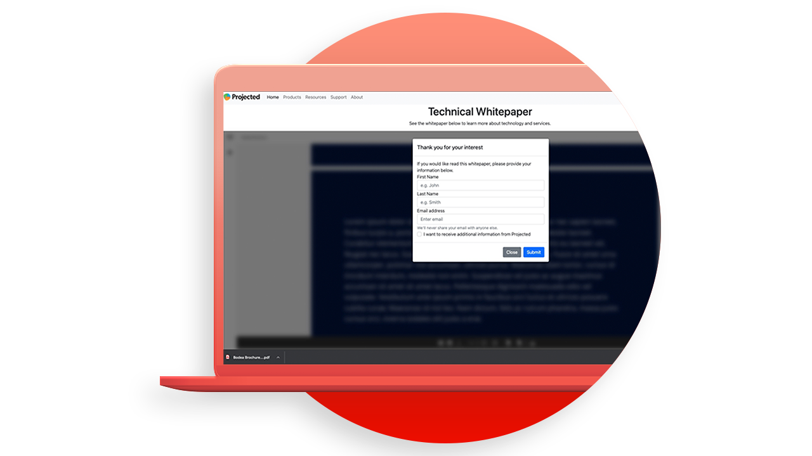

# Tutorials zur Adobe PDF Embed-API

Die PDF Embed-API ist eine kostenlose JavaScript-API, mit der Sie High-Fidelity-PDF einbetten, die Zusammenarbeit ermöglichen und Analysen anzeigen können.

<table style="table-layout:fixed">
<tr>
 <td>
   
    

   <a href="controlpdfexperience.md"><strong>Steuern Sie Ihr PDF-Online-Erlebnis, und sammeln Sie Analysen</strong></a>
    

    <em>Erfahren Sie, wie Sie die Adobe PDF Embed-API verwenden, um das Erscheinungsbild zu steuern, die Zusammenarbeit zu ermöglichen und Analysen über die Interaktion des Benutzers mit PDF zu sammeln, einschließlich der auf einer Seite verbrachten Zeit und der Suchvorgänge</em>
    2 
  </td>
  <td>
   
    

   <a href="https://experienceleague.adobe.com/docs/adobe-developers-live-events/events/2021/oct2021/pdf-embed-api.html"><strong>PDF im Web wie ein Profi anprangern</strong></a>
    

    <em>Sehen Sie sich an, wie Sie die kostenlose Adobe PDF Embed-API verwenden können, um die Verwendung von PDF in Ihrer Website zu vereinfachen</em>
    2 
  </td>
  <td>
    
    

     
  </td>
</tr>
</table>
