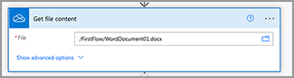
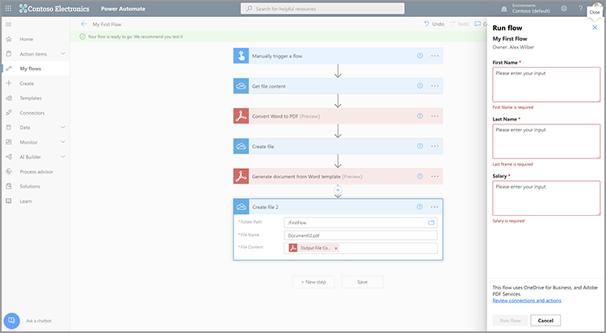

# Erstellen Sie Ihren ersten Flow in Microsoft Power Automate

Erfahren Sie, wie Sie Ihren ersten Flow in [Microsoft Power Automate](https://flow.microsoft.com) mithilfe des Connectors für [Adobe PDF Services](https://us.flow.microsoft.com/en-us/connectors/shared_adobepdftools/adobe-pdf-services/) erstellen.

In diesem praktischen Tutorial lernen Sie Folgendes:

* Word-Dokumente in PDF konvertieren
* Zusammenführen von PDF-Dokumenten zu einer PDF
* Protect eines PDF-Dokuments mit einem Kennwort

## Vorbereitung

### Was Sie benötigen

* **Anmeldeinformationen für Testversion oder Produktion für Adobe PDF Services**
Weitere Informationen zum Abrufen und Konfigurieren von Anmeldeinformationen in Microsoft Power Automate [finden Sie hier](https://experienceleague.adobe.com/en/docs/acrobat-services-learn/tutorials/pdfservices/getting-credentials-power-automate).
* **Microsoft Power Automate mit Premium-Connectors**
Erfahren Sie hier, wie Sie die Lizenzierungsstufe für Power Automate [überprüfen](https://docs.microsoft.com/en-us/power-platform/admin/power-automate-licensing/types).
* **OneDrive**
Der OneDrive-Speicheranschluss wird in diesem Tutorial verwendet, aber jeder Speicheranschluss kann ersetzt werden.

### Beispieldateien

Es gibt zwei [Beispieldateien](assets/sample-assets.zip), die Sie entpacken und auf OneDrive hochladen müssen:

* WordDocument01.docx
* WordDocument02.docx

### Abrufen von Anmeldedaten

Zum Durchführen dieses Tutorials benötigen Sie Ihre in Microsoft Power Automate für Adobe PDF Services bereits konfigurierten Anmeldeinformationen. Wenn Sie diesen Schritt nicht abgeschlossen haben, lesen Sie die [Anweisungen hier](https://experienceleague.adobe.com/en/docs/acrobat-services-learn/tutorials/pdfservices/getting-credentials-power-automate).

## Teil 1: Erstellen eines neuen Textflusses und Konvertieren von Word in PDF

### Textfluss erstellen

In diesem Teil erstellen Sie einen neuen Textfluss in [Microsoft Power Automate](https://flow.microsoft.com) mit einem sofortigen Textfluss, fügen Parameter hinzu, rufen Ihre Dateien von OneDrive ab und konvertieren sie in PDF.

1. Navigieren Sie zu [Microsoft Power Automate](https://flow.microsoft.com) und melden Sie sich mit Ihren Anmeldedaten an.
1. Wählen Sie in der Seitenleiste **[!UICONTROL Erstellen]**.

   

1. Wählen Sie **[!UICONTROL Instant Flow]** aus.
1. Geben Sie Ihrem Flow einen Namen.
1. Wählen Sie unter *Auswählen, wie dieser Flow ausgelöst werden soll* die Option **[!UICONTROL Einen Flow manuell auslösen]**.
1. Wähle **[!UICONTROL Erstellen]** aus.

### Dateiinhalte von Dateien abrufen

Rufen Sie als Nächstes den Dateiinhalt der Beispieldateien ab.

>[!PREREQUISITES]
>
>Wenn Sie die [Beispieldateien](assets/sample-assets.zip) nicht in OneDrive hochgeladen haben, entpacken Sie sie und laden Sie sie hoch.


1. Wählen Sie in [Power Automate](https://flow.microsoft.com) **[!UICONTROL + Neuer Schritt]** aus.
1. Suchen Sie in der Suchleiste nach *OneDrive*.
1. Wählen Sie Ihr geschäftliches oder persönliches OneDrive-Konto aus, indem Sie **[!UICONTROL OneDrive for Business]** oder **[!UICONTROL OneDrive]** auswählen.
1. Suchen Sie in der Suchleiste nach *Dateiinhalt abrufen*.
1. Wählen Sie im Feld **[!UICONTROL Datei]** das Ordnersymbol aus, um zur Datei *WordDocument01.docx* in OneDrive zu navigieren.

   

### Datei auf PDF konvertieren

Nachdem Sie den Dateiinhalt fertig haben, können Sie das Dokument zum PDF konvertieren.

1. Wählen Sie in [Power Automate](https://flow.microsoft.com) **[!UICONTROL + Neuer Schritt]** aus.
1. Suchen Sie in der Suchleiste nach *Adobe PDF Services*.
1. Wählen Sie **[!UICONTROL Adobe PDF Services]** aus.
1. Suchen Sie in der Suchleiste nach *Word in PDF konvertieren*.
1. Benennen Sie Ihre Datei in **[!UICONTROL Dateiname]** wie gewünscht, aber sie muss mit *.docx* enden. Diese Erweiterung ist für die Konvertierung von Dokumenten von Word in PDF erforderlich.
1. Setzen Sie den Cursor in das Feld **[!UICONTROL Dateiinhalt]**.
1. Wählen Sie im Bereich **[!UICONTROL Dynamischer Inhalt]** die Option **[!UICONTROL Dateiinhalt]** aus.

   

### Speichern Sie die Datei auf OneDrive

Wenn das Dokument generiert wurde, speichern Sie die Datei wieder in OneDrive.

1. Wählen Sie in [Microsoft Power Automate](https://flow.microsoft.com) **[!UICONTROL + Neuer Schritt]** aus.
1. Suchen Sie in der Suchleiste nach *OneDrive*.
1. Wählen Sie Ihr geschäftliches oder persönliches OneDrive-Konto aus, indem Sie **[!UICONTROL OneDrive for Business]** oder **[!UICONTROL OneDrive]** auswählen.
1. Suchen Sie in der Suchleiste nach *Dateiinhalt abrufen*.
1. Suchen Sie in der Suchleiste nach *Datei erstellen*.
1. Wählen Sie **[!UICONTROL Datei erstellen]**.
1. Wählen Sie im Feld **[!UICONTROL Ordnerpfad]** das Ordnersymbol aus, um anzugeben, wo die Datei in OneDrive gespeichert werden soll.
1. Benennen Sie Ihre Datei in **[!UICONTROL Dateiname]** wie gewünscht, aber sie muss mit *.docx* enden. Diese Erweiterung ist für die Konvertierung von Dokumenten von Word in PDF erforderlich.
1. Verwenden Sie im Feld **[!UICONTROL Dateiinhalt]** den Bereich **[!UICONTROL Dynamischer Inhalt]**, um die Variable &quot;PDF-Dateiinhalt&quot; einzufügen.

### Flow testen

1. Wählen Sie oben links **[!UICONTROL Unbenannt]** aus, um den Textfluss umzubenennen.
1. Wähle **[!UICONTROL Speichern]** aus.
1. Wählen Sie **[!UICONTROL Test]** aus.
1. Wählen Sie **[!UICONTROL Manuell]** und anschließend **[!UICONTROL Speichern und testen]** aus.
1. Klicken Sie auf **[!UICONTROL Weiter]**.
1. Wählen Sie **[!UICONTROL Textfluss ausführen]**.

Im OneDrive-Ordner sollte jetzt die konvertierte PDF angezeigt werden.


## Teil 2: Dynamisches Dokument aus Vorlage generieren

Dieser nächste Teil baut auf Teil 1 auf und verwendet die Vorlage *Dokument aus Word generieren*, um Daten dynamisch in Ihrem Dokument zusammenzuführen.

### Dokumentvorlage überprüfen

Öffnen Sie *WordDocument02_.docx* aus den Beispieldateien in OneDrive. Das Word-Dokument enthält verschiedene Text-Tags, die Stellen darstellen, an denen Daten in das Dokument eingefügt werden.

### Parameter für Auslöser hinzufügen

Damit dynamische Daten in das Dokument übertragen werden, müssen Sie einige Parameter für den Trigger erstellen, um Werte anzugeben.

1. Wählen Sie beim Bearbeiten des Textflusses **[!UICONTROL Einen Textfluss manuell auslösen]**, um die Aktion zu erweitern.
1. Wählen Sie **[!UICONTROL Eingabe hinzufügen]**.
1. Wählen Sie **[!UICONTROL Text]** aus.
1. Benennen Sie das Feld &quot;*Vorname*&quot;.

Wiederholen Sie die Schritte 2-4, um die folgenden Felder hinzuzufügen:

* Nachname
* Gehalt


### Dateiinhalt einer Vorlage abrufen

Um ein Dokument zu generieren, müssen Sie zunächst den Dateiinhalt der Word-Vorlage abrufen.

1. Wählen Sie in Power Automate + **[!UICONTROL Neuer Schritt]**.
1. Suchen Sie in der Suchleiste nach *OneDrive*.
1. Wählen Sie Ihr geschäftliches oder persönliches OneDrive-Konto aus, indem Sie **[!UICONTROL OneDrive for Business]** oder **[!UICONTROL OneDrive]** auswählen.
1. Suchen Sie in der Suchleiste nach *Dateiinhalt abrufen*.
1. Wählen Sie im Feld **[!UICONTROL Datei]** das Ordnersymbol aus, um zur Datei *WordDocument02.docx* in OneDrive zu navigieren.


### Dokument aus Vorlage generieren

1. Wählen Sie in Power Automate **[!UICONTROL + Neuer Schritt]**.
1. Suchen Sie in der Suchleiste nach *Adobe PDF Services*.
1. Wählen Sie **[!UICONTROL Adobe PDF Services]** aus.
1. Wählen Sie die Aktion **[!UICONTROL Dokument aus Word-Vorlage generieren]** aus.
1. Benennen Sie die Datei im Feld &quot;**[!UICONTROL Vorlagendateiname]**&quot; wie gewünscht, jedoch muss sie mit &quot;*.docx*&quot; enden.

#### Daten zusammenführen

Mit der Aktion *Dokument aus Word-Vorlage generieren* können Sie mithilfe von dynamischem Inhalt Daten aus einer beliebigen Variablen in Ihrem Dokument zusammenführen, die sich zuvor im Textfluss befanden.

Kopieren Sie die folgenden JSON-Daten in das Feld **Daten zusammenführen**:

```
{
    "FirstName": "",
    "LastName": "",
    "Salary": ""
}
```

1. Setzen Sie den Cursor in das Feld zwischen den beiden Anführungszeichen für den Wert *FirstName*.
1. Fügen Sie mithilfe des Bereichs **[!UICONTROL Dynamischer Inhalt]** den Wert *Vorname* aus dem manuell auslösenden Flow-Vorgang ein.

   

1. Wiederholen Sie die Schritte 7-8 für die Felder **[!UICONTROL LastName]** und **[!UICONTROL Salary]**.
1. Verwenden Sie im Feld **[!UICONTROL Vorlagendateiinhalt]** den Bereich **[!UICONTROL Dynamischer Inhalt]**, um den Wert **[!UICONTROL Dateiinhalt]** aus dem Schritt *Dateiinhalt abrufen* einzufügen.


>[!TIP]
>
>Die Aktion *Dokument aus Word-Vorlage generieren* verwendet die Adobe-API für die Dokumentenerzeugung. Wenn Sie mehr über das Erstellen von Vorlagen erfahren möchten, finden Sie hier einige Ressourcen:
>
>* [Weitere Informationen zur Generierung von Adobe-Dokumenten](https://developer.adobe.com/document-services/apis/doc-generation/)
>* [Tagger für die Generierung von Adobe-Dokumenten für Microsoft Word](https://appsource.microsoft.com/en-US/product/office/WA200002654)
>* [API-Dokumentation zur Dokumentenerzeugung für Adobe](https://developer.adobe.com/document-services/docs/overview/document-generation-api/)

### Speichern Sie die Datei auf OneDrive

Sobald das Dokument generiert wurde, können Sie die Datei wieder in OneDrive speichern.

1. Wählen Sie in Power Automate **+ [!UICONTROL Neuer Schritt]**.
1. Suchen Sie in der Suchleiste nach *OneDrive*.
1. Wählen Sie Ihr geschäftliches oder persönliches OneDrive-Konto aus, indem Sie **[!UICONTROL OneDrive for Business]** oder **[!UICONTROL OneDrive]** auswählen.
1. Suchen Sie in der Suchleiste nach *Datei erstellen*.
1. Wählen Sie **[!UICONTROL Datei erstellen]**.
1. Wählen Sie im Feld **[!UICONTROL Ordnerpfad]** das Ordnersymbol aus, um anzugeben, wo die Datei in OneDrive gespeichert werden soll.
1. Legen Sie im Feld &quot;**[!UICONTROL Dateiname]**&quot; den Namen der Datei fest. Da es sich bei der Ausgabe um eine PDF handelt, muss der Dateiname mit der Erweiterung .pdf enden.
1. Verwenden Sie den Bereich &quot;**[!UICONTROL Dynamischer Inhalt]**&quot;, um die Variable &quot;PDF-Dateiinhalt&quot; in das Feld &quot;**[!UICONTROL Dateiinhalt]**&quot; einzufügen.

### Flow testen



1. Wähle **[!UICONTROL Speichern]** aus.
1. Wählen Sie **[!UICONTROL Test]** aus.
1. Wählen Sie **[!UICONTROL Manuell]** und anschließend **[!UICONTROL Speichern und testen]** aus.
1. Klicken Sie auf **[!UICONTROL Weiter]**.
1. Geben Sie Werte für *Vorname*, *Nachname* und *Gehalt* ein.
1. Wählen Sie **[!UICONTROL Textfluss ausführen]**.

Im OneDrive-Ordner wird jetzt eine aus dem Word-Dokument generierte PDF angezeigt. Wenn Sie das PDF-Dokument in OneDrive öffnen, sehen Sie, dass die Daten in den Text-Tag-Speicherorten zusammengeführt werden.


## Teil 3: PDF in einem Programm kombinieren

Nachdem Sie nun ein Word-Dokument erstellt und in eine PDF konvertiert haben, können Sie als Nächstes mehrere PDF-Dokumente kombinieren.

>[!NOTE]
>
>In den vorherigen Aktionen haben Sie eine Kopie des Dokuments als Datei in OneDrive gespeichert. Um Tools wie Merge-PDF verwenden zu können, müssen Sie die Datei nicht auf OneDrive speichern. Stattdessen können Sie die Ausgabe direkt von einer Aktion an die nächste übergeben, was besser ist, als nach jeder Aktion in OneDrive zu speichern. Zu Demonstrationszwecken speichern Sie diese Dateien jedoch auf OneDrive.

### Schritt &quot;Zusammenführen-PDF hinzufügen&quot;

1. Wählen Sie beim Bearbeiten des Ablaufs **[!UICONTROL + Nächster Schritt]** aus, um am Ende des Ablaufs eine Aktion hinzuzufügen.
1. Suchen Sie in der Suchleiste nach *Adobe PDF Services*.
1. Wählen Sie **[!UICONTROL Adobe PDF Services]** aus.
1. Wählen Sie die Aktion **[!UICONTROL PDF zusammenführen]** aus.
1. Geben Sie im Feld &quot;**[!UICONTROL Name der PDF-Zusammenführungsdatei]**&quot; den gewünschten Dateinamen ein (z. B. *CombinedDocument.pdf*).
1. Verwenden Sie im Feld &quot;**[!UICONTROL Dateiinhalt -1]**&quot; das Bedienfeld &quot;**[!UICONTROL Dynamischer Inhalt]**&quot;, um den Wert &quot;*PDF Dateiinhalt*&quot; aus dem Schritt &quot;**[!UICONTROL Word in PDF konvertieren]**&quot; einzufügen.
1. Um das nächste Dokument hinzuzufügen, wählen Sie **+ [!UICONTROL Neues Element hinzufügen]**.
1. Verwenden Sie im Feld **[!UICONTROL Dateiinhalt - 2]** den Bereich **[!UICONTROL Dynamischer Inhalt]**, um den Wert **[!UICONTROL Ausgabedateinhalt]** aus dem Schritt *Dokument aus Word-Vorlage generieren* einzufügen.


### Speichern einer zusammengeführten PDF auf OneDrive

Nachdem das Dokument kombiniert wurde, können Sie es wieder in OneDrive speichern.

1. Wählen Sie in Power Automate **+ [!UICONTROL Neuer Schritt]**.
1. Suchen Sie in der Suchleiste nach *OneDrive*.
1. Wählen Sie Ihr geschäftliches oder persönliches OneDrive-Konto aus, indem Sie **[!UICONTROL OneDrive for Business]** oder **[!UICONTROL OneDrive]** auswählen.
1. Suchen Sie in der Suchleiste nach *Datei erstellen*.
1. Wählen Sie **[!UICONTROL Datei erstellen]**.
1. Wählen Sie im Feld **[!UICONTROL Ordnerpfad]** das Ordnersymbol aus, um anzugeben, wo die Datei in OneDrive gespeichert werden soll.
1. Legen Sie im Feld &quot;**[!UICONTROL Dateiname]**&quot; den Namen der Datei fest. Da es sich bei der Ausgabe um eine PDF handelt, muss der Dateiname mit .pdf enden.
1. Verwenden Sie im Feld **[!UICONTROL Dateiinhalt]** den Bereich **[!UICONTROL Dynamischer Inhalt]**, um den Wert *PDF Dateiinhalt* aus dem Schritt **[!UICONTROL PDF zusammenführen]** einzufügen.

   

### Flow testen

1. Wähle **[!UICONTROL Speichern]** aus.
1. Wählen Sie **[!UICONTROL Test]** aus.
1. Wählen Sie **[!UICONTROL Manuell]** und anschließend **[!UICONTROL Speichern und testen]** aus.
1. Klicken Sie auf **[!UICONTROL Weiter]**.
1. Geben Sie Werte für *Vorname*, *Nachname* und *Gehalt* ein.
1. Wählen Sie **[!UICONTROL Textfluss ausführen]**.

Im OneDrive-Ordner wird die zusammengeführte PDF mit den Seiten aus dem ersten und zweiten Dokument angezeigt.

## Teil 4: Protect PDF-Dokument

Nach dem Generieren Ihres Dokuments können Sie es vor der Bearbeitung schützen, indem Sie vor dem Speichern in OneDrive einen zusätzlichen Schritt hinzufügen.

### PDF schützen

1. Wählen Sie beim Bearbeiten Ihres Flows in Power Automate zwischen der Aktion **[!UICONTROL PDF zusammenführen]** und der Aktion **[!UICONTROL Datei erstellen 3]** **+** aus.

   

1. Wählen Sie **[!UICONTROL Aktion hinzufügen]**.
1. Suchen Sie in der Suchleiste nach *Adobe PDF Services*.
1. Wählen Sie **[!UICONTROL Adobe PDF Services]** aus.
1. Wählen Sie die Aktion &quot;**[!UICONTROL Protect PDF&quot; aus der Ansicht &quot;]**&quot; aus.
1. Legen Sie im Feld &quot;**[!UICONTROL Dateiname]**&quot; den Namen auf den gewünschten Namen fest, sofern er mit der Erweiterung &quot;.pdf&quot; endet.
1. Setzen Sie das Feld **[!UICONTROL Kennwort]** auf das angegebene Kennwort, um das Dokument zu öffnen.
1. Verwenden Sie im Feld &quot;**[!UICONTROL Dateiinhalt]**&quot; das Bedienfeld &quot;**[!UICONTROL Dynamischer Inhalt]**&quot;, um den Wert &quot;*PDF Dateiinhalt*&quot; aus dem Schritt &quot;**[!UICONTROL PDF zusammenführen]**&quot; einzufügen.

### Speichern auf OneDrive aktualisieren

Sobald das Dokument geschützt ist, können Sie die Datei wieder in OneDrive speichern. In diesem Beispiel aktualisieren Sie die bereits vorhandene **Aktion Datei 3** erstellen mit einem neuen *Dateiinhalt*-Wert.

1. Wählen Sie den Cursor im Feld **[!UICONTROL Dateiinhalt]** in der Aktion **[!UICONTROL Datei 3]** erstellen aus.
1. Verwenden Sie den Bereich **[!UICONTROL Dynamischer Inhalt]**, um den Wert *PDF-Dateiinhalt* aus dem Schritt **Protect-PDF aus Sicht** einzufügen.

### Flow testen

1. Wähle **[!UICONTROL Speichern]** aus.
1. Wählen Sie **[!UICONTROL Test]** aus.
1. Wählen Sie **[!UICONTROL Manuell]** und anschließend **[!UICONTROL Speichern und testen]** aus.
1. Klicken Sie auf **[!UICONTROL Weiter]**.
1. Geben Sie Werte für *Vorname*, *Nachname* und *Gehalt* ein.
1. Wählen Sie **[!UICONTROL Textfluss ausführen]**.

Im OneDrive-Ordner wird die kombinierte PDF angezeigt, auf der Sie jetzt aufgefordert werden, ein Kennwort einzugeben, um das Dokument anzuzeigen.

## Nächste Schritte

In diesem Tutorial haben Sie ein Word-Dokument in einen PDF konvertiert, ein Dokument auf der Grundlage von Daten generiert, Dokumente zusammengeführt und mit einem Kennwort geschützt. Um mehr zu erfahren, erkunden Sie einige der anderen Aktionen, die im Adobe PDF Services-Connector in Microsoft Power Automate verfügbar sind:

* Sehen Sie sich die in Microsoft Power Automate verfügbaren vorgefertigten Vorlagen an.
* Erfahren Sie von [Artikeln](https://medium.com/adobetech/tagged/microsoft-power-automate) im Adobe Tech Blog.
* Überprüfen Sie die [Dokumentation](https://developer.adobe.com/document-services/docs/overview/document-generation-api/) auf die Adobe-API für die Dokumentenerzeugung.
