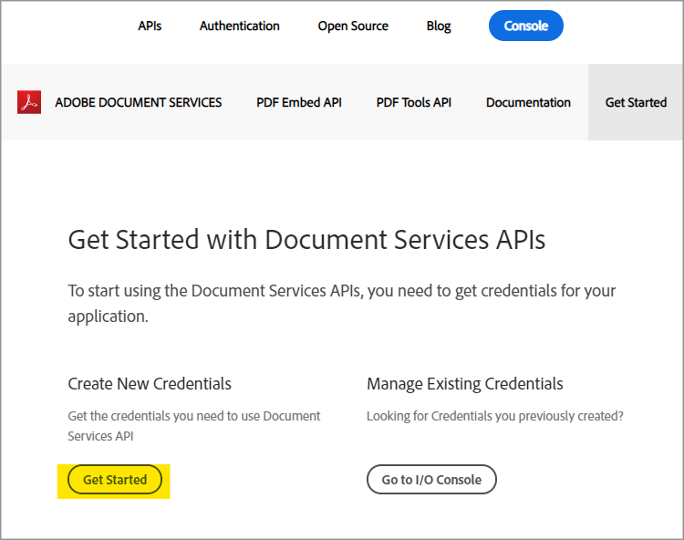

# Erstellen Sie mit der PDF Services-API und Node.js in wenigen Minuten eine PDF von HTML oder MS Office


Die Digitalisierung von Dokumenten-Workflows war noch nie so einfach. Mit der neuen Adobe PDF Services-API, die Entwicklern eine freie Auswahl an leistungsstarken PDF-Manipulationsdiensten bietet, um die Anforderungen komplizierter Geschäftsarbeitsabläufe zu erfüllen, haben sie die Wahl zwischen mehreren leistungsstarken Workflows. Komplizierte Architekturen, Implementierungsstrategien und die Beschleunigung der Technologie können mit diesen jederzeit verfügbaren Cloud-basierten Web Services optimiert werden.

In der PDF Services API stehen mehrere Services zur Verfügung, um PDF zu erstellen und zu bearbeiten oder von PDF in MS Office und andere Formate zu exportieren.

* Erstellen Sie eine PDF-Datei aus statischem oder dynamischem HTML, MS Word, PowerPoint, Excel und anderen Formaten
* Export PDF in MS Word, PowerPoint und Excel
* OCR zum Erkennen von Text in PDF-Dateien und Aktivieren der Dokumentsuche
* Protect PDF mit Kennwort beim Öffnen von Dokumenten
* PDF von Seiten oder PDF von Dokumenten zu einer einzigen PDF kombinieren
* PDF komprimieren, um die Größe für die Freigabe per E-Mail oder online zu reduzieren
* Linearisieren, um eine PDF für die schnelle Anzeige im Web zu optimieren
* Organisieren von PDF-Seiten mit Einfüge-, Ersetzungs-, Neuanordnungs-, Lösch- und Drehservices

Entwickler können in nur wenigen Minuten mit der Ausführung von Beispieldateien beginnen, die für den Zugriff auf alle verfügbaren Webdienste bereitgestellt werden. Hier erfährst du, wie es geht.

## Abrufen von Anmeldedaten und Herunterladen von Beispieldateien

Der erste Schritt besteht darin, eine Zugangsberechtigung (API-Schlüssel) zu erhalten, um die Verwendung zu entsperren. [Für die kostenlose Testversion hier anmelden](https://www.adobe.com/go/dcsdks_credentials) und klicken Sie auf &quot;Jetzt loslegen&quot;, um Ihre neuen Anmeldeinformationen zu erstellen.



Es ist wichtig, ein &quot;persönliches Konto&quot; auszuwählen, um sich für die kostenlose Testversion anzumelden:


Im nächsten Schritt wählen Sie den PDF Services API-Dienst aus und fügen dann einen Namen und eine Beschreibung für Ihre Anmeldeinformationen hinzu.

Es gibt ein Kontrollkästchen für &quot;Personalisiertes Codebeispiel erstellen&quot;. Wählen Sie diese Option aus, damit Ihre neuen Anmeldeinformationen automatisch zu Ihren Beispieldateien hinzugefügt werden. Der manuelle Schritt wird dabei übersprungen.

Wählen Sie als Nächstes &quot;Node.js&quot; als Ihre Sprache aus, um die spezifischen &quot;Node.js&quot;-Beispiele zu erhalten, und klicken Sie auf die Schaltfläche &quot;Credentials erstellen&quot;.


Sie erhalten eine ZIP-Datei namens PDFToolsSDK-Node.jsSamples.zip, die Sie herunterladen und in Ihrem lokalen Dateisystem speichern können.

## Hinzufügen Ihrer Anmeldeinformationen zu den Codebeispielen

Wenn Sie die Option &quot;Personalisiertes Codebeispiel erstellen&quot; ausgewählt haben, müssen Sie Ihre Client-ID nicht manuell den Codebeispieldateien hinzufügen. Sie können den nächsten Schritt überspringen und direkt zum Abschnitt &quot;Ausführen von Codebeispielen&quot; weiter unten wechseln.

Wenn Sie die Option &quot;Personalisiertes Codebeispiel erstellen&quot; nicht ausgewählt haben, müssen Sie die Client-ID (API-Schlüssel) aus der Adobe.io-Konsole kopieren:


Entpacken Sie den Inhalt von PDFToolsSDK-Node.jsSamples.zip.

Wechseln Sie zum Stammverzeichnis im Ordner adobe-dc-pdf-tools-sdk-node-samples .

Öffnen Sie pdftools-api-credentials.json mit einem beliebigen Texteditor oder einer IDE.

Fügen Sie die Anmeldeinformationen in das Feld für die Client-ID im Code ein:

```javascript
{
 "client_credentials": {
  "client_id": "abcdefghijklmnopqrstuvwxyz",
```

Speichern Sie die Datei und fahren Sie mit dem nächsten Schritt fort, um die Codebeispiele auszuführen.

## Ausführen des ersten Codebeispiels

Wechseln Sie an der Eingabeaufforderung zum Stammverzeichnis unter dem Ordner adobe-dc-pdf-tools-sdk-node-samples .

Geben Sie npm install ein:

C:\Temp\PDFToolsAPI\adobe-dc-pdf-tools-sdk-node-samples>npm-Installation

Jetzt können Sie die Beispieldateien ausführen.

Erstellen Sie für Ihr erstes Beispiel eine PDF:

Führen Sie noch in der Eingabeaufforderung das Beispiel zum Erstellen einer PDF mit dem folgenden Befehl aus:

C:\Temp\PDFToolsAPI\adobe-dc-pdf-tools-sdk-node-samples>node src/createpdf/create-pdf-from-docx.js

Beispielausgabe:


Die PDF wird an dem in der Ausgabe angegebenen Speicherort erstellt, der standardmäßig das Verzeichnis pdfServicesSdkResult ist.

## Ressourcen und nächste Schritte

* Weitere Hilfe und Unterstützung finden Sie in der Adobe [[!DNL Acrobat Services] API](https://community.adobe.com/t5/document-cloud-sdk/bd-p/Document-Cloud-SDK?page=1&amp;sort=latest_replies&amp;filter=all) Community-Forum

PDF Services-API [Dokumentation](https://www.adobe.com/go/pdftoolsapi_doc)

* [FAQ](https://community.adobe.com/t5/document-cloud-sdk/faq-for-document-services-pdf-tools-api/m-p/10726197) für PDF Services API-Fragen

* [Kontakt](https://www.adobe.com/go/pdftoolsapi_requestform) bei Fragen zur Lizenzierung und Preisgestaltung

* Verwandte Artikel:
  [Die neue PDF Services-API bietet noch mehr Funktionen für Dokumenten-Workflows](https://community.adobe.com/t5/document-services-apis/new-pdf-tools-api-brings-more-capabilities-for-document-services/m-p/11294170)

  [Juli-Version von [!DNL Adobe Acrobat Services]: PDF-Einbettungs- und PDF-Dienste](https://medium.com/adobetech/july-release-of-adobe-document-services-pdf-embed-and-pdf-tools-17211bf7776d)
