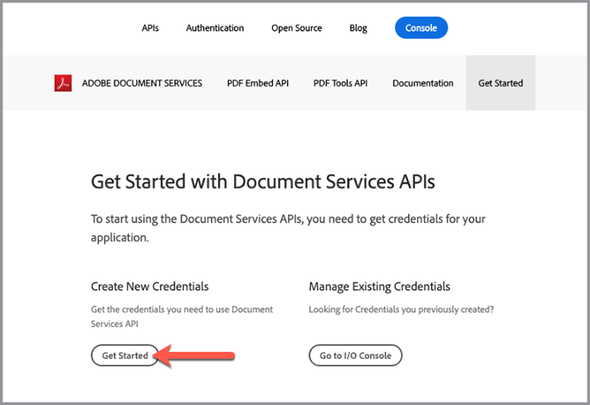
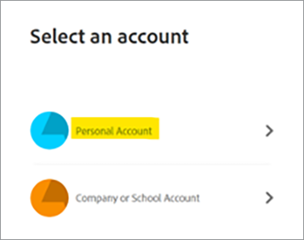

# Erste Schritte mit Adobe PDF Services API und Java

Entwickler können in nur wenigen Minuten mit der Ausführung von Beispieldateien beginnen, die für den Zugriff auf alle verfügbaren Webdienste bereitgestellt werden. Dieses Tutorial führt Sie durch alle Schritte zum Starten der Ausführung der Beispiele mit dem PDF Services Java SDK:

## Schritt 1: Abrufen von Anmeldedaten und Herunterladen von Beispieldateien

Der erste Schritt besteht darin, eine Zugangsberechtigung (API-Schlüssel) zu erhalten, um die Verwendung zu entsperren. [Melden Sie sich hier für die kostenlose Testversion an](https://www.adobe.io/apis/documentcloud/dcsdk/gettingstarted.html), und klicken Sie auf &quot;Jetzt loslegen&quot;, um Ihre neuen Anmeldeinformationen zu erstellen.

Es ist wichtig, ein &quot;persönliches Konto&quot; auszuwählen, um sich für die kostenlose Testversion anzumelden:

Im nächsten Schritt wählen Sie den PDF Services API-Dienst aus und fügen dann einen Namen und eine Beschreibung für Ihre Anmeldeinformationen hinzu.

Es gibt ein Kontrollkästchen für &quot;Personalisiertes Codebeispiel erstellen&quot;. Wählen Sie diese Option, wenn Ihre neuen Anmeldeinformationen automatisch zu Ihren Beispieldateien hinzugefügt werden sollen. Dadurch sparen Sie den manuellen Schritt des Hinzufügens zu Ihrem Projekt.

Wählen Sie als Nächstes Java als Ihre Sprache, um die Java-spezifischen Beispiele zu erhalten, und klicken Sie dann auf die Schaltfläche &quot;Credentials erstellen&quot;.

Sie erhalten eine ZIP-Datei namens PDFToolsSDK-JavaSamples.zip, die Sie herunterladen und in Ihrem lokalen Dateisystem speichern können.

## Schritt 2: Einrichten Ihrer Java-Umgebung

1. Installieren Sie [Java 8 oder höher](https://www.oracle.com/java/technologies/javase-downloads.html), falls Sie dies noch nicht getan haben.
1. Führen Sie `javac -version` aus, um Ihre Installation zu überprüfen.
1. Stellen Sie sicher, dass der JDK bin-Ordner in der PATH-Variablen enthalten ist (Methode variiert je nach Betriebssystem).
1. Installieren Sie [Maven](https://maven.apache.org/install.html) mit Ihrem bevorzugten Tool, falls Sie dies noch nicht getan haben.

Die personalisierten Beispiele bieten alles von vorkonfiguriertem Beispielcode, einer eingebetteten JSON-Datei mit Anmeldeinformationen und vorkonfigurierten Verbindungen bis hin zu Abhängigkeiten.

1. [&#x200B; Beispielprojekt &#x200B;](https://github.com/adobe/pdftools-java-sdk-samples) herunterladen.
1. Beispielprojekt mit Maven erstellen: mvn saubere Installation.
1. Testen Sie den Beispielcode in der Befehlszeile oder in der von Ihnen bevorzugten IDE.

## Abschließende Überlegungen

Die PDF Services API hilft Ihnen, manuelle Prozesse zu vermeiden, indem gängige Workflows automatisiert und der Verarbeitungsaufwand auf die Cloud verlagert wird. In einer Welt, in der jeder Browser das PDF anders behandelt, können Sie mithilfe der Adobe PDF Embed-API und der PDF Services-API optimierte, zuverlässige und vorhersehbare Prozesse erstellen, die unabhängig von der Plattform oder dem Gerät **jedes Mal** korrekt ausgeführt und angezeigt werden.

## Ressourcen und nächste Schritte

* Weitere Hilfe und Unterstützung finden Sie im Adobe [[!DNL Acrobat Services] APIs](https://community.adobe.com/t5/document-cloud-sdk/bd-p/Document-Cloud-SDK?page=1&sort=latest_replies&filter=all)-Community-Forum

* PDF Services-API [Dokumentation](https://www.adobe.com/go/pdftoolsapi_doc)

* [Häufige Fragen](https://community.adobe.com/t5/contentarchivals/contentarchivedpage/message-uid/10726197) zu PDF Services-API-Fragen

* [Wenden Sie sich an uns](https://www.adobe.com/go/pdftoolsapi_requestform), wenn Sie Fragen zur Lizenzierung und zu den Preisen haben

* Verwandte Artikel

  [Die neue PDF Services-API bietet noch mehr Funktionen für Dokumenten-Workflows](https://community.adobe.com/t5/acrobat-services-api-discussions/new-pdf-tools-api-brings-more-capabilities-for-document-services/m-p/11294170)

  [Juli-Version von  [!DNL Adobe Acrobat Services]: PDF Embed- und PDF-Services](https://medium.com/adobetech/july-release-of-adobe-document-services-pdf-embed-and-pdf-tools-17211bf7776d)
