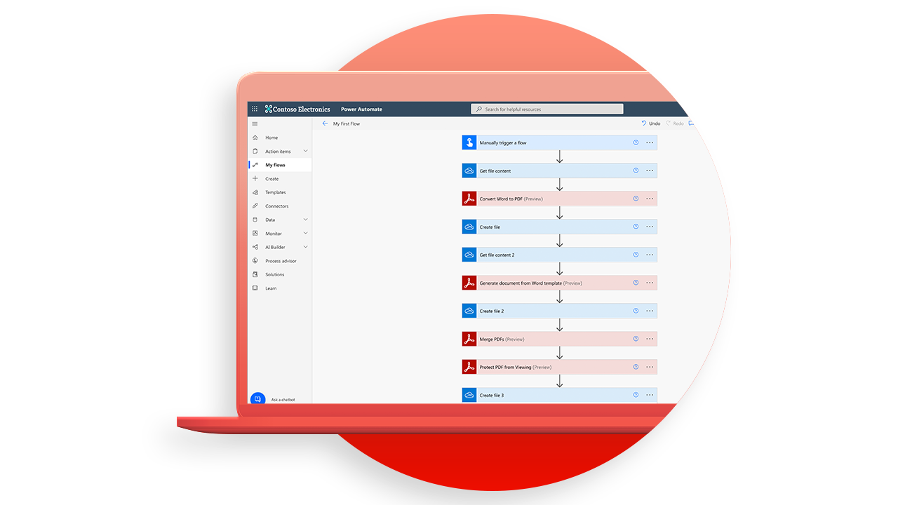

# API-Tutorials zu Adobe PDF Services

<table style="table-layout:fixed">
<tr>
 <td>
   
    

   <a href="https://experienceleague.adobe.com/docs/adobe-developers-live-events/events/2021/oct2021/pdf-services-api.html"><strong>Einführung in PDF Services API</strong></a>
    

    <em>Die PDF Services API von Adobe ermöglicht Entwicklern das Erstellen, Kombinieren, Exportieren und Extrahieren von Daten aus PDF über leistungsstarke und flexible Cloud-basierte APIs.</em>
     
  </td>
  <td>
   
    

   <a href="getting-credentials-power-automate.md"><strong>Abrufen von Anmeldedaten für [!DNL Microsoft Power Automate]</strong></a>
    

    <em>Hier erfahren Sie, wie Sie Anmeldeinformationen abrufen, um mit der Verwendung oder Testversion zu beginnen [!DNL Adobe PDF Services]</em>
     
  </td>
  <td>
   
    

   <a href="create-workflow-power-automate.md"><strong>Erstellen Sie Ihren ersten Arbeitsablauf in [!DNL Microsoft Power Automate]</strong></a>
    

    <em>Weitere Infos zur Verwendung von [!DNL Adobe PDF Services] Stecker in [!DNL Microsoft Power Automate]</em>
     
  </td>
  <td>
   
    

   <a href="createpdffromhtml.md"><strong>Erstellen einer PDF von HTML oder [!DNL MS Office] in wenigen Minuten mit PDF Services API und Node.js</strong></a>
    

    <em>[!DNL Adobe PDF Services API] die Entwicklern freie Auswahl zwischen mehreren leistungsstarken PDF-Manipulations-Services bietet, um die Anforderungen komplizierter Geschäftsabläufe zu erfüllen</em>
     
  </td>
</tr>
<tr>
  <td>
   
    

   <a href="exportpdf.md"><strong>Nutzung [!DNL PDF Services API] PDF exportieren nach [!DNL Word], [!DNL PowerPoint]und mehr</strong></a>
    

    <em>Erfahren Sie, wie Sie die [!DNL PDF Services API] Exportvorgang mithilfe von Beispieldateien für die Sprachen Node.js, Java und .Net</em>
     
  </td>
   <td>
   
    

   <a href="gettingstartedjava.md"><strong>Erste Schritte mit Adobe PDF Services API und Java</strong></a>
    

    <em>Entwickler können in nur wenigen Minuten mit der Ausführung von Beispieldateien beginnen, die für den Zugriff auf alle verfügbaren Webdienste bereitgestellt werden.</em>
     
  </td>
   <td>
   
    

   <a href="ocr.md"><strong>Verwenden [!DNL Adobe PDF Services API] OCR-PDF-Dateien</strong></a>
    

    <em>Mit OCR (Optical Character Recognition) können Sie gescannte PDF entsperren, um Text zu extrahieren und durchsuchbare Dateien zu erstellen</em>
     
  </td>
  <td>
   
    

   <a href="gettingstartednet.md"><strong>Erste Schritte mit [!DNL Adobe PDF Services API] und .NET</strong></a>
    

    <em>[!DNL Adobe PDF Services API] die Entwicklern freie Auswahl zwischen mehreren leistungsstarken PDF-Manipulations-Services bietet, um die Anforderungen komplizierter Geschäftsabläufe zu erfüllen</em>
     
  </td>
</tr>
</table>
