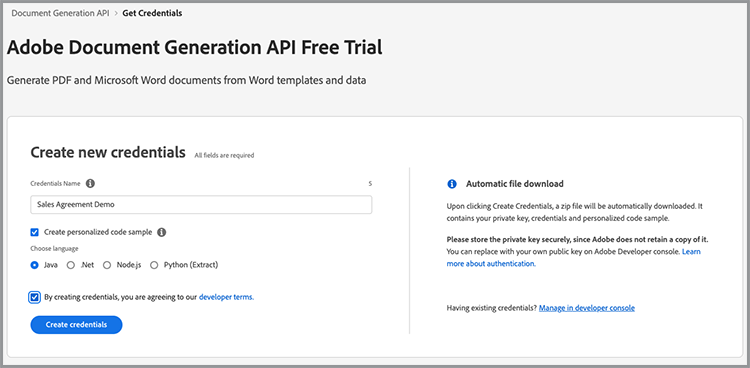
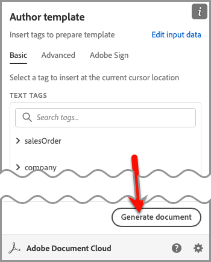

# Schnellere Vertriebsprozesse.


Vom Whitepaper über Verträge bis hin zu Verträgen und Vereinbarungen - während der gesamten Customer Journey sind zahlreiche Dokumente erforderlich. In diesem Tutorial erfahren Sie, wie [[!DNL Adobe Acrobat Services]](https://developer.adobe.com/document-services/) während der gesamten Customer Journey Dokumentenerlebnisse integrieren kann, um den Vertrieb zu beschleunigen.

## Verträge und Kundenaufträge aus Daten generieren

Vertriebsvereinbarungen, Verträge und andere Dokumente können je nach Kriterium stark variieren. Ein Verkaufsvertrag kann beispielsweise nur bestimmte Bedingungen basierend auf einem bestimmten Kriterium enthalten, z. B. die Tatsache, dass er sich in einem bestimmten Land oder Staat befindet, oder bestimmte Produkte als Teil des Vertrags. Das manuelle Erstellen dieser Dokumente oder die Verwaltung vieler verschiedener Vorlagenvarianten kann die Rechtskosten für die manuelle Überprüfung von Änderungen erheblich erhöhen.

Mit der [Adobe-API zur Dokumentenerzeugung](https://developer.adobe.com/document-services/apis/doc-generation/) können Sie Daten aus Ihrem CRM oder einem anderen Datensystem übernehmen, um Verkaufsdokumente basierend auf diesen Daten dynamisch zu generieren.

## Zugangsdaten abrufen

Registrieren Sie sich zunächst für kostenlose Adobe PDF Services-Anmeldedaten:

1. Navigieren Sie zu [hier](https://documentcloud.adobe.com/dc-integration-creation-app-cdn/main.html), um Ihre Anmeldeinformationen zu registrieren.
1. Melden Sie sich mit Ihrer Adobe ID an.
1. Legen Sie Ihren Anmeldenamen fest (z. B. Verkaufsvereinbarungsdemo).

   

1. Wählen Sie eine Sprache aus, in der Sie den Beispielcode herunterladen möchten (z. B. &quot;Node.js&quot;).
1. Aktivieren Sie diese Option, um **[!UICONTROL Entwicklerbedingungen]** zuzustimmen.
1. Wählen Sie **[!UICONTROL Anmeldeinformationen erstellen]** aus.
Eine Datei wird mit einer ZIP-Datei auf Ihren Computer heruntergeladen, die die Beispieldateien pdfservices-api-credentials.json und private.key für die Authentifizierung enthält.

   

1. Wählen Sie **[!UICONTROL Microsoft Word-Add-In abrufen]** oder gehen Sie zu [AppSource](https://appsource.microsoft.com/en-cy/product/office/WA200002654), um die Installation durchzuführen.

   >[!NOTE]
   >
   >Für die Installation des Word-Add-Ins benötigen Sie die Berechtigung zum Installieren von Add-Ins in Microsoft 365. Wenn Sie keine Berechtigung haben, wenden Sie sich an Ihren Microsoft 365-Administrator.

## Ihre Daten

Wenn Sie Daten aus einem bestimmten Datensystem abrufen, müssen Sie diese Daten als JSON-Daten ausgeben oder ein eigenes Schema generieren. In diesem Szenario wird der folgende vordefinierte Beispieldatensatz verwendet:

```
{
    "salesOrder": {
        "comment": "Make sure to call 555-555-1234 when you arrive. The front door is broken."
    },
    "company": {
        "name":"Home Services Co.",
        "address": {
            "city": "Homestead",
            "state": "NY",
            "zip": "14623",
            "streetAddress": "123 Demohome Street"
        }
    },
    "customer": {
        "address": {
            "city": "Seattle",
            "state": "WA",
            "zip": "98052",
            "streetAddress": "20341 Whitworth Institute 405 N. Whitworth"
        },
        "email": "mailto:jane-doe@xyz.edu",
        "jobTitle": "Professor",
        "name": "Jane Doe",
        "telephone": "(425) 123-4567",
        "url": "http://www.janedoe.com"
    },
    "tax": {
        "state":"WA",
        "rate": 0.08
    },
    "referencesOrder": [
        {
            "description": "Carpet Cleaning Service - 3BR 2BA",
            "totalPaymentDue": {
                "price": 359.54
            },
            "orderedItem": {
                "description": "Carpet Cleaning Service"
            }
        },
        {
            "description": "Home Cleaning Service - 3BR 2BA",
            "totalPaymentDue": {
                "price": 299.99
            },
            "orderedItem": {
                "description": "House Cleaning Service"
            }
        }
    ]
}
```

## Einfache Tags zu Ihrem Dokument hinzufügen

In diesem Szenario wird ein Verkaufsauftragsdokument verwendet, das [hier heruntergeladen werden kann](https://github.com/benvanderberg/adobe-document-generation-samples/blob/main/SalesOrder/Exercise/SalesOrder_Base.docx?raw=true).


1. Öffnen Sie das Beispieldokument *SalesOrder.docx* in Microsoft Word.
1. Wenn das Plug-In für die Dokumentenerzeugung installiert ist, wählen Sie im Menüband die Option **[!UICONTROL Dokumentenerzeugung]** aus. Wenn die Dokumentgenerierung nicht in Ihrem Menüband angezeigt wird, befolgen Sie diese Anweisungen.
1. Wählen Sie **[!UICONTROL Erste Schritte]**.
1. Kopieren Sie die oben geschriebenen JSON-Beispieldaten in das Feld *JSON-Daten*.

   

Navigieren Sie dann zum Fenster &quot;Dokumentenerzeugung - Tags&quot;, um Tags im Dokument zu platzieren.

1. Wählen Sie den Text aus, der ersetzt werden soll (z. B. *FIRMENNAME*).
1. Suchen Sie im Bereich *Dokumentengenerierungs-Tagger* nach &quot;name&quot;.
1. Wählen Sie in der Liste der Tags den Namen unter Firma aus.
1. Wählen Sie **[!UICONTROL Text einfügen]**.

   

   Dieser Prozess platziert ein Tag mit dem Namen &quot;`{{company.name}}`&quot;, da sich das Tag unter dem Pfad in der JSON befindet.

   ```
   {
   …
   "company": {
       "name":"Home Services Co.",
       …
   },
   …
   }
   ```

Wiederholen Sie diese Aktionen für einige der zusätzlichen Tags im Dokument, z. B. STRASSE, STADT, STAAT, PLZ usw.

## Generiertes Dokument in der Vorschau anzeigen

Direkt in Microsoft Word können Sie eine Vorschau Ihres generierten Dokuments auf der Grundlage der Beispiel-JSON-Daten anzeigen.

1. Wählen Sie im Bereich &quot;*Dokumentengenerierungs-Tagger*&quot; die Option &quot;**[!UICONTROL Dokument generieren]**&quot;. Wenn Sie zum ersten Mal aufgefordert werden, sich mit Ihrer Adobe ID anzumelden, Wählen Sie **[!UICONTROL Anmelden]** aus und schließen Sie die Eingabeaufforderungen ab, um sich mit Ihren Anmeldeinformationen anzumelden.

   

1. Wählen Sie **[!UICONTROL Dokument anzeigen]**.

   

1. Ein Browserfenster wird geöffnet, in dem Sie eine Vorschau der Dokumentergebnisse anzeigen können.

   

Sie können die Tags im Dokument sehen, die durch die Daten aus den ursprünglichen Beispieldaten ersetzt wurden.


## Hinzufügen einer Tabelle zu einer Vorlage

Fügen Sie in diesem nächsten Szenario einer Tabelle im Dokument eine Produktliste hinzu.

1. Setzen Sie den Cursor an die Stelle, an der die Tabelle platziert werden soll.
1. Wählen Sie im Bereich *Dokumentengenerierungs-Tagger* die Option **[!UICONTROL Erweitert]** aus.
1. Erweitern Sie **[!UICONTROL Tabellen und Listen]**.
1. Wählen Sie im Feld *Tabellendatensätze* die Option *referencesOrder* aus. Dabei handelt es sich um ein Array, das alle Produktelemente auflistet.
1. Geben Sie im Feld &quot;Spaltendatensätze auswählen&quot; ein, um *Beschreibung* und *totalPaymentDue.price* einzuschließen.
1. Wählen Sie **[!UICONTROL Tabelle einfügen]**.

   

Bearbeiten Sie die Tabelle, um sie wie jede andere Tabelle in Microsoft Word an Stile, Größen und andere Parameter anzupassen.

## Numerische Berechnung hinzufügen

Mit numerischen Berechnungen können Sie Summen und andere Berechnungen auf der Grundlage einer Datensammlung, z. B. eines Arrays, berechnen. Fügen Sie in diesem Szenario ein Feld hinzu, um die Zwischensumme zu berechnen.

1. Wählen Sie *$0.00* neben dem Titel der Zwischensumme aus.
1. Erweitern Sie im Bereich *[!UICONTROL Tagger für Dokumenterstellung]* **[!UICONTROL Numerische Berechnungen]**.
1. Wählen Sie unter *[!UICONTROL Berechnungstyp auswählen]* die Option **[!UICONTROL Aggregation]**.
1. Wählen Sie unter *[!UICONTROL Typ auswählen]* die Option **[!UICONTROL Summe]**.
1. Wählen Sie unter *[!UICONTROL Datensätze auswählen]* **[!UICONTROL ReferencesOrder]** aus.
1. Wählen Sie unter *[!UICONTROL Element auswählen, um Aggregation durchzuführen]** **[!UICONTROL totalPaymentsDue.price]** aus.
1. Wählen Sie **[!UICONTROL Berechnung einfügen]**.

Dieser Prozess fügt ein Berechnungs-Tag ein, das die Summe der Werte bereitstellt. Mit JSONata-Berechnungen können komplexere Berechnungen durchgeführt werden. Beispiel:

* Zwischensumme: `${{expr($sum(referencesOrder.totalPaymentDue.price))}}`
Berechnet die Summe von referencesOrder.totalPaymentDue.price.

* Umsatzsteuer: `${{expr($sum(referencesOrder.totalPaymentDue.price)*0.08)}}`
Berechnet den Preis und multipliziert mit 8%, um die Steuer zu berechnen.

* Fälliger Gesamtbetrag: `${{expr($sum(referencesOrder.totalPaymentDue.price)*1.08)}}`
Berechnet den Preis und multipliziert ihn mit 1,08, um die Zwischensumme + Steuer zu berechnen.

## Hinzufügen von bedingten Begriffen

Mit bedingten Abschnitten können Sie nur dann einen Satz oder Absatz einfügen, wenn eine bestimmte Bedingung erfüllt ist. In diesem Szenario ist nur ein Abschnitt enthalten, wenn er einem bestimmten Status entspricht.

1. Suchen Sie im Dokument nach dem Abschnitt *CALIFORNIA PRIVACY STATEMENTS*.
1. Wählen Sie den Abschnitt mit dem Cursor aus.

   

1. Wählen Sie im *[!UICONTROL Tagger für Dokumenterstellung]* die Option **[!UICONTROL Erweitert]**.
1. Erweitern Sie **[!UICONTROL Bedingten Inhalt]**.
1. Suchen Sie im Feld *[!UICONTROL Datensätze auswählen]* nach **[!UICONTROL customer.address.state]** und wählen Sie diese aus.
1. Wählen Sie im Feld *[!UICONTROL Operator auswählen]* die Option **=** aus.
1. Geben Sie im Feld *[!UICONTROL Wert]* *CA* ein.
1. Wählen Sie **[!UICONTROL Bedingung einfügen]**.

Der Abschnitt &quot;Kalifornien&quot; wird nur im generierten Dokument angezeigt, wenn customer.address.state = CA.

Wählen Sie als Nächstes den Abschnitt WASHINGTON PRIVACY STATEMENTS und wiederholen Sie die oben genannten Schritte, indem Sie den Wert CA durch WA ersetzen.

## Dynamisches Bild hinzufügen.

Mit der API zur Dokumentenerzeugung können Sie Bilder dynamisch aus Daten einfügen. Dies ist nützlich, wenn Sie verschiedene Untermarken haben und Logos, Porträtbilder oder Bilder ändern möchten, um sie für eine bestimmte Branche relevanter zu machen.

Bilder können über eine URL im Daten- oder base64-Inhalt übergeben werden. Im folgenden Beispiel wird eine URL verwendet.

1. Platzieren Sie den Cursor an der Stelle, an der Sie ein Bild einfügen möchten.
1. Wählen Sie im Bereich *[!UICONTROL Dokumentengenerierungs-Tagger]* die Option **[!UICONTROL Erweitert]** aus.
1. Erweitern Sie **[!UICONTROL Bilder]**.
1. Wählen Sie im Feld *[!UICONTROL Tags auswählen]* die Option **[!UICONTROL Logo]**.
1. Geben Sie im Feld *[!UICONTROL Optionaler alternativer Text]* eine Beschreibung (d. h. ein Logo) ein. Dieser Vorgang fügt einen Bildplatzhalter ein, der wie folgt aussieht:

   

Sie möchten das Bild jedoch dynamisch für ein Bild festlegen, das bereits im Layout enthalten ist. Dazu haben Sie folgende Möglichkeiten:

1. Klicken Sie mit der rechten Maustaste auf das eingefügte Platzhalterbild.

   

1. Wählen Sie **[!UICONTROL Alt-Text bearbeiten]** aus.
1. Kopieren Sie im Bedienfeld den Text, der wie folgt aussieht:
   `{ "location-path": "logo", "image-props": { "alt-text": "Logo" }}`
1. Wähle ein anderes Bild in deinem Dokument aus, das dynamisch sein soll.

   

1. Klicken Sie mit der rechten Maustaste auf das Bild und wählen Sie **[!UICONTROL Alt-Text bearbeiten]**.
1. Fügen Sie den Wert in das Fenster ein.

Bei diesem Vorgang wird das Bild durch ein Bild ersetzt, das sich in der Logovariablen in den Daten befindet.

## Tags für Acrobat Sign hinzufügen

Mit Adobe Acrobat Sign können Sie elektronische Signaturen für Ihre Dokumente erfassen. Acrobat Sign bietet eine einfache Möglichkeit, Felder innerhalb der Weboberfläche zu ziehen und abzulegen. Sie können jedoch auch die Unterschrift und andere Feldplatzierungen mithilfe eines Text-Tags steuern. Mit dem Adobe-Tagger für die Dokumentgenerierung können Sie diese Text-Tag-Felder ganz einfach platzieren.

1. Navigieren Sie zu der Stelle, an der im Beispieldokument eine Signatur erforderlich ist.
1. Setze den Cursor an die Stelle, an der die Unterschrift nötig ist.
1. Wählen Sie im Bereich *[!UICONTROL Tagger für Dokumenterstellung für]* für Adobe die Option **[!UICONTROL Adobe Sign]** aus.
1. Legen Sie im Feld *[!UICONTROL Anzahl der Empfänger angeben]* die Anzahl der Empfänger fest (in diesem Beispiel ist es eins).
1. Wählen Sie im Feld *[!UICONTROL Empfänger]* die Option **[!UICONTROL Unterzeichner-1]** aus.
1. Wählen Sie im Typ *[!UICONTROL Feld]* die Option **[!UICONTROL Signatur]** aus.
1. Wählen Sie **[!UICONTROL Adobe Sign-Text-Tag einfügen]**.

Ein Tag wird in das Dokument eingefügt.


Acrobat Sign bietet verschiedene andere Feldtypen, die Sie einfügen können, z. B. Datumsfelder.

1. Wählen Sie im Typ *Feld* die Option **[!UICONTROL Datum]** aus.
1. Bewegen Sie den Cursor über die Datumsposition im Dokument.
1. Wählen Sie **[!UICONTROL Adobe Sign-Text-Tag einfügen]**.


## Vereinbarung generieren

Sie haben Ihr Dokument jetzt mit Tags versehen und können fortfahren. Im nächsten Abschnitt wird erläutert, wie Sie mithilfe der API-Beispiele für die Dokumentenerzeugung für &quot;Node.js&quot; ein Dokument generieren, diese funktionieren jedoch in allen Sprachen.

Öffnen Sie den pdfservices-node-sdk-samples-master , der beim Registrieren Ihrer Anmeldeinformationen heruntergeladen wurde. Die Dateien pdfservices-api-credentials.json und private.key sollten in diese Dateien aufgenommen werden.

1. Öffnen Sie ein Terminal, um Abhängigkeiten mithilfe von npm install zu installieren.
1. Kopieren Sie die Beispieldatei data.json in den Ressourcenordner.
1. Kopieren Sie die Word-Vorlage in den Ressourcenordner.
1. Erstellen Sie eine neue Datei mit dem Namen generate-salesOrder.js im Stammverzeichnis des Ordners mit den Beispielen.

```
const PDFServicesSdk = require('@adobe/pdfservices-node-sdk');
const fs = require('fs');
const path = require('path');

var dataFileName = path.join('resources', '<INSERT JSON FILE');
var outputFileName = path.join('output', 'salesOrder_'+Date.now()+".pdf");
var inputFileName = path.join('resources', '<INSERT DOCX>');

//Loads credentials from the file that you created.
const credentials =  PDFServicesSdk.Credentials
    .serviceAccountCredentialsBuilder()
    .fromFile("pdfservices-api-credentials.json")
    .build();

// Setup input data for the document merge process
const jsonString = fs.readFileSync(dataFileName),
jsonDataForMerge = JSON.parse(jsonString);

// Create an ExecutionContext using credentials
const executionContext = PDFServicesSdk.ExecutionContext.create(credentials);

// Create a new DocumentMerge options instance
const documentMerge = PDFServicesSdk.DocumentMerge,
documentMergeOptions = documentMerge.options,
options = new documentMergeOptions.DocumentMergeOptions(jsonDataForMerge, documentMergeOptions.OutputFormat.PDF);

// Create a new operation instance using the options instance
const documentMergeOperation = documentMerge.Operation.createNew(options)

// Set operation input document template from a source file.
const input = PDFServicesSdk.FileRef.createFromLocalFile(inputFileName);
documentMergeOperation.setInput(input);

// Execute the operation and Save the result to the specified location.
documentMergeOperation.execute(executionContext)
.then(result => result.saveAsFile(outputFileName))
.catch(err => {
    if(err instanceof PDFServicesSdk.Error.ServiceApiError
        || err instanceof PDFServicesSdk.Error.ServiceUsageError) {
        console.log('Exception encountered while executing operation', err);
    } else {
        console.log('Exception encountered while executing operation', err);
    }
});
```

1. Ersetzen Sie `<INSERT JSON FILE>` durch den Namen der JSON-Datei in /resources.
1. Ersetzen Sie `<INSERT DOCX>` durch den Namen der DOCX-Datei.
1. Verwenden Sie zum Ausführen den Knoten generate-salesOrder.js mit Terminal.

Die Ausgabedatei sollte sich im Ordner /output befinden, wobei das Dokument ordnungsgemäß generiert wird.

## Weitere Optionen

Nachdem das Dokument generiert wurde, können Sie weitere Aktionen ausführen, z. B.:

* Sicheres Dokument mit einem Kennwort
* PDF komprimieren, wenn große Bilder vorhanden sind
* Elektronische Unterschriften im Dokument erfassen

Weitere Informationen zu einigen der anderen verfügbaren Aktionen finden Sie in den Skripts im Ordner &quot;/src&quot; in den Beispieldateien. Weitere Informationen erhalten Sie auch in der Dokumentation der verschiedenen Aktionen.

## Zusätzliche Anwendungsfälle

[!DNL Adobe Acrobat Services] kann dazu beitragen, viele Teile eines Vertriebszyklus mit digitalen Dokumenten-Workflows zu optimieren:

* Mit der Adobe PDF Embed-API könnt ihr Whitepaper und andere Inhalte in Websites einbetten und gleichzeitig Analysen für die Zuschauer erfassen
* Mit Acrobat Sign elektronische Signaturen in generierten Vereinbarungen erfassen
* Extrahieren von Vereinbarungsdaten aus PDF-Dokumenten mithilfe der Adobe PDF Extract-API

## Weiterbildung

Möchten Sie mehr erfahren? Sehen Sie sich einige zusätzliche Möglichkeiten an, [!DNL Adobe Acrobat Services] zu verwenden:

* Weitere Informationen von [Dokumentation](https://developer.adobe.com/document-services/docs/overview/)
* Weitere Tutorials zu Adobe Experience League
* Verwenden Sie die Beispielskripte im Ordner /src, um zu sehen, wie Sie PDF
* Im [Adobe Tech Blog](https://medium.com/adobetech/tagged/adobe-document-cloud) finden Sie aktuelle Tipps und Tricks.
* Abonnieren Sie [Paper Clips (den monatlichen Livestream)](https://www.youtube.com/playlist?list=PLcVEYUqU7VRe4sT-Bf8flvRz1XXUyGmtF), um mehr über die Automatisierung mit [!DNL Adobe Acrobat Services] zu erfahren.
=======
* Weitere Informationen von [Dokumentation](https://developer.adobe.com/document-services/docs/overview/)
* Weitere Tutorials zu Adobe Experience League
* Verwenden Sie die Beispielskripte im Ordner /src, um zu sehen, wie Sie PDF
* Im [Adobe Tech Blog](https://medium.com/adobetech/tagged/adobe-document-cloud) finden Sie aktuelle Tipps und Tricks.
* Abonnieren Sie [Paper Clips (den monatlichen Livestream)](https://www.youtube.com/playlist?list=PLcVEYUqU7VRe4sT-Bf8flvRz1XXUyGmtF), um mehr über die Automatisierung mit [!DNL Adobe Acrobat Services] zu erfahren.
