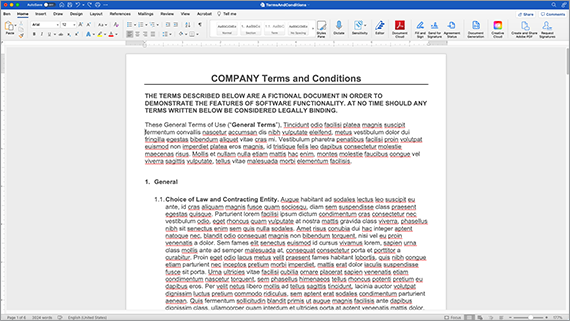

# Automatisierung von Workflows in Rechtsabteilungen.


Im Idealfall werden die Vertragsbedingungen ohne Änderungen akzeptiert. Oft müssen Vereinbarungen jedoch angepasst werden, was dann eine rechtliche Prüfung erfordert. Überprüfungen aufgrund von Gesetzesvorgaben verursachen erhebliche Kosten und verlangsamen die Vertragserstellung. Durch die Verwendung vordefinierter Vorlagen, die basierend auf der genehmigten Sprache geändert werden, können Teams in Rechtsabteilungen Vertragsbedingungen leichter verwalten und sicherer durchführen.

In diesem Tutorial lernen Sie, wie Sie eine rechtsgültige Vereinbarung zwischen zwei Bundesstaaten abschließen. Um diese Änderungen zu berücksichtigen, wird eine Vereinbarungsvorlage mit bedingten Abschnitten erstellt, die nur enthalten sind, wenn bestimmte Kriterien erfüllt sind. Das generierte Dokument kann entweder ein Word- oder ein PDF-Dokument sein. Sie können auch einige Möglichkeiten kennenlernen, wie Sie Ihr Dokument mit der Adobe PDF Services-API oder der Acrobat Sign schützen können.

## Zugangsdaten abrufen

Registrieren Sie sich zunächst für kostenlose Adobe PDF Services-Anmeldedaten:

1. Navigieren [hier](https://documentcloud.adobe.com/dc-integration-creation-app-cdn/main.html) , um Ihre Anmeldeinformationen zu registrieren.
1. Melden Sie sich mit Ihrer Adobe ID an.
1. Legen Sie Ihren Benutzernamen fest.

   

1. Wählen Sie eine Sprache, in der Sie den Beispielcode herunterladen können (z. B. &quot;Node.js&quot;).
1. Aktivieren, um zuzustimmen **[!UICONTROL Entwicklerbedingungen]**.
1. Auswählen **[!UICONTROL Anmeldeinformationen erstellen]**.
Eine Datei wird mit einer ZIP-Datei auf Ihren Computer heruntergeladen, die die Beispieldateien pdfservices-api-credentials.json und private.key für die Authentifizierung enthält.

   

1. Auswählen **[!UICONTROL Microsoft Word-Add-in]** oder gehen Sie zu [AppSource](https://appsource.microsoft.com/en-cy/product/office/WA200002654) zu installieren.

   >[!NOTE]
   >
   >Für die Installation des Word-Add-Ins benötigen Sie die Berechtigung zum Installieren von Add-Ins in Microsoft 365. Wenn Sie keine Berechtigung haben, wenden Sie sich an Ihren Microsoft 365-Administrator.

## Ihre Daten

In diesem Szenario werden Informationen übergeben, um das Dokument zu generieren und zu informieren, ob bestimmte Abschnitte einbezogen werden sollten oder nicht:

```
{
    "customer": {
        "name": "Home Services Company",
        "street": "123 Any Street",
        "city": "Anywhere",
        "state": "CA",
        "zip": "12345",
        "country":"USA",
        "signer": {
            "email": "johnnyechostone@gmail.com",
            "firstName": "John",
            "lastName": "Echostone"
        }
    },
    "company": {
        "name": "Projected Consultants",
        "signer": {
            "email": "maryburostone@gmail.com",
            "firstName": "Mary",
            "lastName": "Burostone"
        }
    },
    "conditions": {
        "includeGeneralTerms": true,
        "includeConsumerDiscloure": true
    }
}
```

In den Daten finden sich Informationen über den Kunden, seinen Namen, den Unterzeichner, den Status usw. Darüber hinaus gibt es Abschnitte mit Informationen über das Unternehmen, das die Vereinbarung generiert, und Bedingungsflags, die verwendet werden, um bestimmte Abschnitte der Vereinbarung einzuschließen.

## Einfache Tags zu Ihrem Dokument hinzufügen

In diesem Szenario wird ein Dokument mit Nutzungsbedingungen verwendet, das heruntergeladen werden kann. [hier](https://github.com/benvanderberg/adobe-document-generation-samples/blob/main/Agreement/exercise/TermsAndConditions_Sample.docx?raw=true).



1. Öffnen Sie die *TermsAndConditions.docx* Beispieldokument in Microsoft Word.
1. Wenn die Option [Dokumenterstellung](https://appsource.microsoft.com/en-cy/product/office/WA200002654) -Plug-In installiert ist, wählen Sie **[!UICONTROL Dokumenterstellung]** in der Multifunktionsleiste. Wenn die Dokumentgenerierung nicht in Ihrem Menüband angezeigt wird, befolgen Sie diese Anweisungen.
1. Auswählen **[!UICONTROL Erste Schritte]**.
1. Kopieren Sie die oben beschriebenen JSON-Beispieldaten in das Feld JSON-Daten.

   

Navigieren Sie zur Registerkarte *Tagger für Dokumenterstellung* , um Tags im Dokument zu platzieren.

## Firmennamen einfügen

1. Wählen Sie den Text aus, den Sie ersetzen möchten. In diesem Szenario ersetzen Sie das UNTERNEHMEN im ersten Abschnitt des Dokuments.
1. In *Tagger für Dokumenterstellung* nach &quot;name&quot;.
1. Wählen Sie unter Unternehmen *name*.

   

1. Auswählen **[!UICONTROL Text einfügen]**.

Dadurch wird ein Tag mit dem Namen `{{company.name}}` da sich das Tag in der JSON-Datei unter diesem Pfad befindet.

```
{
    "company": {
        "name": "Projected Consultants",
        ...
    }
    ...
}
```

Wiederholen Sie diesen Schritt im ersten Abschnitt des KUNDEN-Texts. Wiederholen **Schritte 1-4**, wobei KUNDE durch &quot;Name&quot; unter Kunde ersetzt wird. Die Ausgabe sollte `{{customer.name}}`, der angibt, dass der Text von unterhalb des Kundenobjekts kommt.

Mit der Adobe-API für die Dokumentenerzeugung können Sie Tags auch in Ihre Kopf- und Fußzeilen und ganz am Ende der Stelle einfügen, an die die Titel für die Signaturen übergeben werden müssen.

Wiederholen Sie diesen Vorgang mit **Schritte 1-4** für den Text &quot;UNTERNEHMEN&quot; und &quot;KUNDE&quot; in der Fußzeile.


Schließlich müssen Sie **Wiederholen der Schritte 1-4** , um VORNAME UND NACHNAME im Abschnitt Kunde der Signaturseite durch die Tags für `{{customer.signer.firstName}}` und `{{customer.signer.lastName}}` bzw. Sie brauchen sich keine Sorgen zu machen, wenn das Tag lang ist und in die nächste Zeile umgebrochen wird, weil das Tag beim Generieren des Dokuments ersetzt wird.

Der Anfang Ihres Dokuments und die Fußzeile sollten ungefähr so aussehen:

* Anfangsabschnitt:


* Fußzeile:


* Signaturseite:


Nachdem die Tags im Dokument platziert wurden, können Sie eine Vorschau der generierten Vereinbarung anzeigen.

## Generiertes Dokument in der Vorschau anzeigen

Direkt in Microsoft Word können Sie eine Vorschau Ihres generierten Dokuments auf der Grundlage der Beispiel-JSON-Daten anzeigen.

1. In *Tagger für Dokumenterstellung*&quot; die Option **[!UICONTROL Dokument generieren]**.
1. Wenn Sie zum ersten Mal aufgefordert werden, sich mit Ihrer Adobe ID anzumelden, Auswählen **[!UICONTROL Anmelden]** und füllen Sie die Anweisungen zur Anmeldung mit Ihren Anmeldedaten aus.

   

1. Auswählen **[!UICONTROL Dokument anzeigen]**.

   

1. Ein Browserfenster wird geöffnet, in dem Sie eine Vorschau der Dokumentergebnisse anzeigen können.

   

## Fügen Sie für jeden Status bedingte Begriffe hinzu

Im nächsten Abschnitt legen Sie fest, dass nur bestimmte Abschnitte basierend auf bestimmten Eingabedatenkriterien einbezogen werden. Im Beispieldokument beziehen sich die Abschnitte 4 und 5 nur auf einen bestimmten Status. In diesem Szenario sollten nur die zustandsspezifischen Bedingungen einbezogen werden, wenn sich ein Kunde in diesem Zustand befindet. Außerdem sollte die Nummerierung in Microsoft Word diesen Abschnitt nicht enthalten, wenn er entfernt wird. Verwenden Sie die Funktion &quot;Bedingter Inhalt&quot; der Dokumentgenerierungs-API, um dies zu markieren.


1. Wählen Sie im Dokument den Abschnitt &quot;California Disclosure&quot; und alle Unteraufzählungszeichen aus.

   

1. In *[!UICONTROL Tagger für Dokumenterstellung]*&quot; die Option **[!UICONTROL Erweitert]**.
1. Erweitern **[!UICONTROL Bedingter Inhalt]**.
1. In *[!UICONTROL Datensätze auswählen]* ein, suchen und wählen Sie **[!UICONTROL customer.state]**.
1. In *[!UICONTROL Operator auswählen]* ein, wählen Sie **=**.
1. In *[!UICONTROL Wert]* Feld, Typ *CA*.
1. Auswählen **[!UICONTROL Bedingung einfügen]**.

Der Abschnitt ist jetzt mit einigen Tags umschlossen, die als Bedingungs-Tags bezeichnet werden. Nachdem Sie die Tags hinzugefügt haben, wurde das Bedingungs-Tag möglicherweise als nummerierte Zeile hinzugefügt. Sie können dies entfernen, indem Sie vor dem Tag einen Backspacing eingeben. Andernfalls wird das Tag so nummeriert, als wäre es beim Generieren des Dokuments nicht vorhanden. Der bedingte Abschnitt endet mit dem `` Tag.


**Wiederholen Sie die Schritte 1-7** für die *Offenlegung in Washington* Abschnitt, der das *CA* Wert mit *WA* darzustellen, dass der Abschnitt nur angezeigt wird, wenn der Status des Kunden Washington ist.


## Testen mit bedingten Abschnitten

Sobald Ihre bedingten Abschnitte eingerichtet sind, können Sie eine Vorschau Ihres Dokuments anzeigen, indem Sie **Dokument generieren**.

Beachten Sie beim Generieren des Dokuments, dass nur der Abschnitt enthalten ist, der die Datenkriterien erfüllt. Im folgenden Beispiel ist nur der Abschnitt &quot;Kalifornien&quot; enthalten, da der Status gleich CA war.


Eine weitere bemerkenswerte Änderung ist, dass die Nummerierung für den folgenden Abschnitt Nutzung von Diensten und Software die Nummer 5 hat. Dies bedeutet, dass die Nummerierung fortgesetzt wird, wenn der Abschnitt Washington weggelassen wird.


Um zu testen, ob sich die Vorlage korrekt verhält, wenn sich der Kunde im Bundesstaat Washington und nicht in Kalifornien befindet, ändern Sie die Beispieldaten für die Vorlage:

1. In *Tagger für Dokumenterstellung*&quot; die Option **[!UICONTROL Eingabedaten bearbeiten]**.

   

1. Auswählen **[!UICONTROL Bearbeiten]**.

1. Ändern Sie in den JSON-Daten *CA* bis *WA*.

   

1. Auswählen **[!UICONTROL Tags generieren]**.
1. Auswählen **[!UICONTROL Dokument generieren]** , um das Dokument neu zu generieren.

Beachten Sie, dass das Dokument nur den Abschnitt Washington State enthält.


## Hinzufügen eines bedingten Satzes

Wie bedingte Abschnitte können Sie auch bestimmte Sätze haben, die enthalten sind, wenn bestimmte Bedingungen erfüllt sind. In diesem Beispiel unterscheidet sich die Rückgaberichtlinie zwischen Kalifornien und Washington.

1. Wählen Sie in Abschnitt 3.1 den ersten Satz aus: &quot;Wenn Sie im US-Bundesstaat Washington kaufen, muss einer innerhalb von 30 Tagen nach der ursprünglichen Transaktion per E-Mail zurückgeschickt werden, um eine vollständige Rückerstattung zu erhalten.&quot;
1. In *[!UICONTROL Tagger für Dokumenterstellung]*&quot; die Option **[!UICONTROL Erweitert]**.
1. Erweitern **[!UICONTROL Bedingter Inhalt]**.
1. Unter *[!UICONTROL Inhaltstyp]*&quot; die Option **[!UICONTROL Ausdruck]**.
1. In *[!UICONTROL Datensätze auswählen]* ein, suchen und wählen Sie **[!UICONTROL customer.state]**.
1. In *[!UICONTROL Operator auswählen]* ein, wählen Sie **=**.
1. In *[!UICONTROL Wert]* Feld, Typ *CA*.
1. Auswählen **[!UICONTROL Bedingung einfügen]**.

Während der Name des Tags derselbe ist, besteht der Hauptunterschied zwischen Ausdruck und Abschnitt darin, dass eine Phrase den Abschnitt enthält und keine neuen Zeilen enthält. Das Bedingungs-Tag &quot;section&quot; und das Tag &quot;-end-section&quot; müssen sich im selben Absatz befinden.


## Tags für Acrobat Sign hinzufügen

Mit Acrobat Sign könnt ihr Verträge zur Unterzeichnung versenden oder in ein Web-Erlebnis einbetten, damit andere Personen sie einfach anzeigen und unterschreiben können. Mit dem Tagger zur Generierung von Adobe-Dokumenten in Microsoft Word können Sie Dokumente vor dem Senden mit Acrobat Sign mit Tags versehen, sodass Signaturen immer am richtigen Ort platziert werden. In diesem Szenario gibt es zwei Unterzeichner, die ein Dokument unterschreiben und datieren müssen.

1. Navigieren Sie zu der Stelle, an der der Kunde unterzeichnen muss.
1. Platzieren Sie den Cursor an der Stelle, an der die Signatur eingefügt werden soll.

   

1. In *[!UICONTROL Tagger für Dokumenterstellung]*&quot; die Option **[!UICONTROL Adobe Sign]**.
1. In *[!UICONTROL Anzahl der Empfänger angeben]* die Anzahl der Empfänger fest (in diesem Beispiel wird 2 verwendet).
1. In *[!UICONTROL Empfänger]* ein, wählen Sie **[!UICONTROL Unterzeichner-1]**.
1. In *[!UICONTROL Feld]* Typ, wählen Sie **[!UICONTROL Unterschrift]**.
1. Auswählen **[!UICONTROL Adobe Sign-Text-Tag einfügen]**.

   

>[!NOTE]
>
>Wenn die Option **Adobe Sign-Text-Tag einfügen** scheint zu fehlen, scrollen Sie nach unten.

Dadurch wird ein Signaturfeld an der Stelle platziert, an der der erste Unterzeichner unterzeichnen muss.


Platzieren Sie als Nächstes ein Datenfeld für den Unterzeichner, der beim Unterschreiben automatisch ausgefüllt wird.

1. Bewegen Sie den Cursor an die Stelle, an der das Datum platziert werden soll.

   

1. Setzen Sie den Feldtyp auf Datum.
1. Auswählen **[!UICONTROL Adobe Sign-Text-Tag einfügen]**.

Das platzierte Datumstag ist ziemlich lang: `{{Date 3_es_:signer1:date:format(mm/dd/yyyy):font(size=Auto)}}`. Das Acrobat Sign-Text-Tag muss in derselben Zeile bleiben, was sich von den Tags für die Dokumentgenerierung unterscheidet. Die `:format()` und `font()` Parameter sind optional. In diesem Fall können wir das Tag auf `{{Date 3_es_:signer1:date}}`.

Wiederholen Sie die Schritte über der *Unterschrift des Unternehmens* Abschnitt. Ändern Sie dazu das Feld Empfänger in **Unterzeichner 2**, andernfalls werden alle Signaturfelder derselben Person zugewiesen.

## Vereinbarung generieren

Sie haben Ihr Dokument jetzt mit Tags versehen und können fortfahren. In diesem nächsten Abschnitt erfahren Sie, wie Sie ein Dokument mithilfe der API-Beispiele für die Dokumentgenerierung für Node.js generieren. Diese Beispiele funktionieren in allen Sprachen.

Öffnen Sie die pdfservices-node-sdk-samples-master-Datei, die Sie bei der Registrierung Ihrer Anmeldedaten heruntergeladen haben. Diese Dateien enthalten die Dateien pdfservices-api-credentials.json und private.key .

1. Öffnen Sie Ihre **[!UICONTROL Terminal]** zum Installieren von Abhängigkeiten mit `npm install`.
1. Muster kopieren *data.json* in die *Ressourcen* -Ordner.
1. Kopieren Sie die von Ihnen erstellte Word-Vorlage in die Datei *Ressourcen* -Ordner.
1. Erstellen Sie eine neue Datei im Stammverzeichnis des Beispielordners mit dem Namen *generate-salesOrder.js*.

   ```
   const PDFServicesSdk = require('@adobe/pdfservices-node-sdk').
   const fs = require('fs');
   const path = require('path');
   
   var dataFileName = path.join('resources', '<INSERT JSON FILE');
   var outputFileName = path.join('output', 'salesOrder_'+Date.now()+".pdf");
   var inputFileName = path.join('resources', '<INSERT DOCX>');
   
   //Loads credentials from the file that you created.
   const credentials =  PDFServicesSdk.Credentials
      .serviceAccountCredentialsBuilder()
      .fromFile("pdfservices-api-credentials.json")
      .build();
   
   // Setup input data for the document merge process
   const jsonString = fs.readFileSync(dataFileName),
   jsonDataForMerge = JSON.parse(jsonString);
   
   // Create an ExecutionContext using credentials
   const executionContext = PDFServicesSdk.ExecutionContext.create(credentials);
   
   // Create a new DocumentMerge options instance
   const documentMerge = PDFServicesSdk.DocumentMerge,
   documentMergeOptions = documentMerge.options,
   options = new documentMergeOptions.DocumentMergeOptions(jsonDataForMerge, documentMergeOptions.OutputFormat.PDF);
   
   // Create a new operation instance using the options instance
   const documentMergeOperation = documentMerge.Operation.createNew(options)
   
   // Set operation input document template from a source file.
   const input = PDFServicesSdk.FileRef.createFromLocalFile(inputFileName);
   documentMergeOperation.setInput(input);
   
   // Execute the operation and Save the result to the specified location.
   documentMergeOperation.execute(executionContext)
   .then(result => result.saveAsFile(outputFileName))
   .catch(err => {
      if(err instanceof PDFServicesSdk.Error.ServiceApiError
         || err instanceof PDFServicesSdk.Error.ServiceUsageError) {
         console.log('Exception encountered while executing operation', err);
      } else {
         console.log('Exception encountered while executing operation', err);
      }
   });
   ```

1. Ersetzen `<JSON FILE>` mit dem Namen der JSON-Datei in /resources.
1. Ersetzen `<INSERT DOCX>` mit dem Namen der DOCX-Datei.
1. Zum Ausführen verwenden Sie **[!UICONTROL Terminal]** Knoten ausführen `generate-salesOrder.js`.

Die Ausgabedatei befindet sich im Ordner &quot;/output&quot;, wobei das Dokument ordnungsgemäß generiert wurde.

Sie können das Format ändern, indem Sie die Zeile unten ändern. Das DOCX-Format ist hilfreich, wenn dieses Dokument zur Bearbeitung in Word oder zur Vertragsüberprüfung versendet werden soll.

PDF:

```
options = new documentMergeOptions.DocumentMergeOptions(jsonDataForMerge,
documentMergeOptions.OutputFormat.PDF);
```

Word:

```
options = new documentMergeOptions.DocumentMergeOptions(jsonDataForMerge, documentMergeOptions.OutputFormat.DOCX);
```

Sie müssen auch den Namen der Ausgabedatei in .pdf oder .docx für PDF- bzw. DOCX-Ausgabeformate ändern:

```
var outputFileName = path.join('output', 'salesOrder_'+Date.now()+".docx");
```

## Vereinbarung zum Unterschreiben senden

[Adobe Acrobat Sign](https://www.adobe.com/de/sign.html) können Sie Vereinbarungen an einen oder mehrere Empfänger senden, damit diese Dokumente anzeigen und signieren können. Neben einer benutzerfreundlichen Oberfläche zum Senden eines Dokuments zum Signieren sind REST-APIs verfügbar, mit denen Sie Word-, PDF-, HTML- und andere Formate zum Signieren senden können.

Im folgenden Beispiel wird erläutert, wie Sie die REST API-Dokumentationsseite verwenden, um das zuvor generierte Dokument zu übernehmen und zum Signieren zu senden. Zunächst lernen Sie, wie Sie dies über die Acrobat Sign-Weboberfläche und dann über die REST-API tun können.

## Acrobat Sign-Konto anlegen

Wenn Sie kein Acrobat Sign-Konto haben, registrieren Sie sich für ein Entwicklerkonto und lesen Sie die Dokumentation. [hier](https://developer.adobe.com/adobesign-api/)und wählen Sie **Registrieren Sie sich für ein Entwicklerkonto**. Sie werden aufgefordert, ein Formular auszufüllen und eine Bestätigungs-E-Mail zu erhalten. Anschließend werden Sie zu einer Website weitergeleitet, auf der Sie Ihr Kennwort und Ihr Konto festlegen können. Dort können Sie sich dann bei Acrobat Sign anmelden.

## Vereinbarung über die Weboberfläche senden

1. Auswählen **[!UICONTROL Senden]** in der Navigationsleiste.

   

1. In *Empfänger* &quot; zwei E-Mail-Adressen an. Es empfiehlt sich, eine E-Mail-Adresse zu verwenden, die nicht mit Ihrem Acrobat Sign-Konto verknüpft ist.

   

1. Festlegen eines **[!UICONTROL Vereinbarungsname]** und **[!UICONTROL Nachricht]**.
1. Auswählen **[!UICONTROL Dateien hinzufügen]** und laden Sie die generierte Datei von Ihrem Computer hoch.
1. Wählen Sie die **[!UICONTROL Felder „Vorschau“ und „Unterschrift hinzufügen“]** aus.
1. Wählen Sie **[!UICONTROL Weiter]** aus.
1. Wenn Sie nach unten zur Signaturseite scrollen, können Sie die platzierten Signaturfelder basierend auf den Tags sehen.

   

1. Wählen Sie **[!UICONTROL Senden]** aus.
1. In deiner E-Mail wird eine Nachricht mit einem Link zum Anzeigen und Unterschreiben angezeigt.

   

1. Auswählen **[!UICONTROL Überprüfen und signieren]**.
1. Auswählen **[!UICONTROL Weiter]** Nutzungsbedingungen zu akzeptieren.
1. Auswählen **[!UICONTROL Start]** , um zu der Stelle zu wechseln, an der Sie unterschreiben müssen.

   

1. Auswählen **[!UICONTROL Zum Unterschreiben hier klicken]**.

   

1. Gib deine Unterschrift ein.

   

1. Auswählen **[!UICONTROL Anwenden]**.
1. Auswählen **[!UICONTROL Hier signieren]**.

Eine E-Mail wird an den nächsten Unterzeichner gesendet. Wiederholen Sie die Schritte 9-16, um den zweiten Unterzeichner anzuzeigen und zu signieren.

Sobald die Vereinbarung abgeschlossen ist, wird eine signierte Kopie der Vereinbarung per E-Mail an jede der Parteien gesendet. Darüber hinaus kann eine signierte Vereinbarung über die Acrobat Sign-Weboberfläche im **Verwalten** angezeigt.


Erfahren Sie als Nächstes, wie Sie dasselbe Szenario über die REST-API-Dokumentation durchführen.

## Zugangsdaten abrufen

1. Navigieren Sie zu [Acrobat Sign REST-Dokumentation](https://secure.na1.adobesign.com/public/docs/restapi/v6).
1. Erweitern *transientDocuments* und die [POST /transientDocuments](https://benprojecteddemo.na1.adobesign.com/public/docs/restapi/v6#!/transientDocuments/createTransientDocument).
1. Auswählen **[!UICONTROL OAUTH ACCESS-TOKEN]**.

   

1. Überprüfen Sie die OAUTH-Berechtigungen für *agreement_write*, *agreement_sign*, *widget_write* und *library_write*.
1. Auswählen **[!UICONTROL Autorisieren]**.
1. Sie werden über ein Popup aufgefordert, sich bei Ihrem Acrobat Sign-Konto anzumelden. Melden Sie sich mit Ihrem Administrator-Benutzernamen und -Kennwort an.
1. Sie werden aufgefordert, den Zugriff auf die REST-Dokumentation zuzulassen. Auswählen **[!UICONTROL Zugriff erlauben]**.

Anschließend wird dem **Autorisierung** ein.

Weitere Informationen zum Erstellen eines Autorisierungstokens für Acrobat Sign finden Sie [hier](https://opensource.adobe.com/acrobat-sign/developer_guide/helloworld.html).

## Temporäres Dokument hochladen

Da das Autorisierungstoken aus den vorherigen Schritten hinzugefügt wurde, müssen Sie ein Dokument hochladen, um den API-Aufruf durchzuführen:

1. In *Datei* &quot; das PDF-Dokument hoch, das in den vorherigen Schritten erstellt wurde.

   

1. Auswählen **[!UICONTROL Jetzt ausprobieren!]**.
1. In **[!UICONTROL Antworttext]**, kopieren Sie den *transientDocumentId* Wert.

Die *transientDocumentId* wird zum Verweisen auf ein Dokument verwendet, das vorübergehend in Acrobat Sign gespeichert ist, sodass es in nachfolgenden API-Aufrufen referenziert werden kann.

## Zum Signieren senden

Nachdem ein Dokument hochgeladen wurde, müssen Sie die Vereinbarung zur Signatur senden.

1. Erweitern Sie die Abschnitte &quot;Vereinbarung&quot; und &quot;POST&quot;.
1. Im Dialogfeld *AgreementInfo* das Feld mit der folgenden JSON-Datei ausfüllen:

   ```
   {
   "fileInfos": [
      {
         "transientDocumentId": "3AAABLblqZhAJeoswpyslef8_toTGT1WgBLk3TlhfJXy_uSLlKyre2hjF0-J1meBDn0PlShk0uQy6JghlqEoqXNnskq7YawteF6QWtHefP9wN2CW_Xbt0O9kq1tkpznG0a5-mEm4bYAV1FGOnD1mt_ooYdzKxm7KzTB11DLX2-81Zbe2Z1suy7oXiWNR3VSb-zMfIb5D4oIxF8BiNfN0q08RwT108FcB1bx4lekkATGld3nRbf8ApVPhB72VNrAIF0F1rAFBWTtfgvBKZaxrYSyZq73R_neMdvZEtxWTk5fii_bLVe7VdNZMcO55sofH61eQC_QIIsoYswZP4rw6dsTa68ZRgKUNs"
      }
   ],
   "name": "Terms and Conditions",
   "participantSetsInfo": [
      {
         "memberInfos": [
         {
            "email": "adobesigndemo+customer@outlook.com"
         }
         ],
         "order": 1,
         "role": "SIGNER"
      },
      {
         "memberInfos": [
            {
               "email": "adobesigndemo+company@outlook.com"
            }
         ],
         "order": 1,
         "role": "SIGNER"
         }
   ],
   "signatureType": "ESIGN",
   "state": "IN_PROCESS"
   }
   ```

1. Auswählen **[!UICONTROL Jetzt ausprobieren!]**.

**API für POST agreements** gibt eine ID für die Vereinbarung zurück. Um eine Vorlage für das JSON-Modellschema abzurufen, wählen Sie **Minimales Modellschema**. Eine vollständige Liste der Parameter finden Sie im **Vollständiges Modellschema** Abschnitt.

## Überprüfen des Vereinbarungsstatus

Sobald Sie über eine Vereinbarungs-ID verfügen, können Sie einen Vereinbarungsstatus senden.

1. Erweitern **[!UICONTROL GET /agreements/{agreementId}]**.
1. Da Sie möglicherweise zusätzlichen OAUTH-Bereich benötigen, wählen Sie **[!UICONTROL OAUTH-ACCESS-TOKEN]** erneut aus.
1. Kopieren Sie die agreementId aus der vorherigen API-Aufrufantwort in das agreementId-Feld.
1. Auswählen **[!UICONTROL Jetzt ausprobieren!]**.

Sie haben jetzt Informationen zu dieser Vereinbarung.

```
{
    "id": "CBJCHBCAABAAc6LyP4SVuKXP_pNstzIzyripanRdz4IB",
    "name": "Terms and Conditions",
    "groupId": "CBJCHBCAABAAoyMb1yIgczAGhBuJeHf99mglPtM7ElEu",
    "type": "AGREEMENT",
    "participantSetsInfo": [
      {
        "id": "CBJCHBCAABAAzZE-IcHHkt05-AVbxas4Jz7DUl3oEBO6",
        "memberInfos": [
          {
            "email": "adobesigndemo+customer@outlook.com",
            "id": "CBJCHBCAABAAyWgMMReqbxUFM7ctI5xz16c2kOmEy-IQ",
            "securityOption": {
              "authenticationMethod": "NONE"
            }
          }
        ],
        "role": "SIGNER",
        "order": 1
      },
      {
        "id": "CBJCHBCAABAAaRHz3gY2W0w5n_6pj1GMMuZAfhBihc1j",
        "memberInfos": [
          {
            "email": "adobesigndemo+company@outlook.com",
            "id": "CBJCHBCAABAAOZQwjPwJXFiX8YDKPYtzMpftsmxYrIo9",
            "securityOption": {
              "authenticationMethod": "NONE"
            }
          }
        ],
        "role": "SIGNER",
        "order": 1
      }
    ],
    "senderEmail": "adobesigndemo+new@outlook.com",
    "createdDate": "2022-03-22T02:59:36Z",
    "lastEventDate": "2022-03-22T02:59:41Z",
    "signatureType": "ESIGN",
    "locale": "en_US",
    "status": "OUT_FOR_SIGNATURE",
    "documentVisibilityEnabled": true,
    "hasFormFieldData": false,
    "hasSignerIdentityReport": false,
    "documentRetentionApplied": false
  }
```

Die effizientere Methode, um Benachrichtigungen zu erhalten, wenn Aktualisierungen geändert werden, ist über Webhooks, über die Sie mehr erfahren können [hier](https://opensource.adobe.com/acrobat-sign/developer_guide/webhookapis.html.

## Signiertes Dokument speichern

Sobald das Dokument signiert wurde, kann es mit der Datei GET /agreements/combinedDocument abgerufen werden.

1. Erweitern **[!UICONTROL GET /agreements/{agreementId}/combinedDocument]**.
1. Festlegen **[!UICONTROL agreementId]** in der *agreementId* aus dem vorherigen API-Aufruf bereitgestellt.
1. Auswählen **[!UICONTROL Jetzt ausprobieren!]**.

Zusätzliche Parameter zum Anhängen eines Audit-Berichts oder unterstützender Dokumente können mithilfe der Parameter attachSupportingDocuments und attachAuditReport festgelegt werden.

Im Dialogfeld **Antworttext**, kann es dann auf Ihren Computer heruntergeladen und dort gespeichert werden, wo Sie möchten.

## Weitere Optionen

Neben dem Generieren und Senden zum Unterschreiben sind weitere Aktionen verfügbar.

Wenn das Dokument beispielsweise nicht signiert ist, bietet die Adobe PDF Services-API viele Möglichkeiten, Dokumente nach der Generierung der Vereinbarung zu transformieren, z. B.:

* Sicheres Dokument mit einem Kennwort
* PDF komprimieren, wenn große Bilder vorhanden sind
* Weitere Informationen zu anderen verfügbaren Aktionen finden Sie in den Skripts im Ordner &quot;/src&quot; in den Beispieldateien für die Adobe PDF Services-API. Weitere Informationen erhalten Sie auch in der Dokumentation der verschiedenen Aktionen, die verwendet werden können.

Darüber hinaus bietet Acrobat Sign verschiedene zusätzliche Funktionen wie:

* Einbetten des Signiererlebnisses in eine Anwendung
* Methoden zur Identitätsüberprüfung für Unterzeichner hinzufügen
* E-Mail-Benachrichtigungseinstellungen konfigurieren
* Einzelne separate Dokumente als Teil einer Vereinbarung herunterladen

## Weiterbildung

Möchten Sie mehr erfahren? Weitere Möglichkeiten zur Verwendung [!DNL Adobe Acrobat Services]:

* Weitere Informationen von [Dokumentation](https://developer.adobe.com/document-services/docs/overview/)
* Weitere Tutorials zu Adobe Experience League
* Verwenden Sie die Beispielskripts im Ordner /src, um zu sehen, wie Sie PDF verwenden können.
* Folgen [Adobe Tech Blog.](https://medium.com/adobetech/tagged/adobe-document-cloud) für aktuelle Tipps und Tricks
* Abonnieren [Paper Clips (der monatliche Livestream)](https://www.youtube.com/playlist?list=PLcVEYUqU7VRe4sT-Bf8flvRz1XXUyGmtF) Informationen zur Automatisierung mit [!DNL Adobe Acrobat Services].
