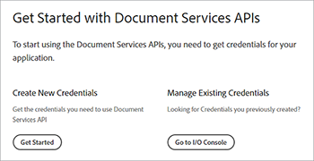

# Veröffentlichung digitaler Dokumente.


Elektronische Dokumente gibt es überall - tatsächlich gibt es weltweit wahrscheinlich [Billionen PDF](https://itextpdf.com/en/blog/technical-notes/do-you-know-how-many-pdf-documents-exist-world), und diese Zahl steigt täglich. Durch Einbetten des PDF-Viewers in Ihre Webseiten ermöglichen Sie es Anwendern, Dokumente anzuzeigen, ohne dass Sie Ihren HTML oder CSS-Code neu gestalten oder den Zugriff auf Ihre Website behindern müssen.

Sehen wir uns ein beliebtes Szenario an. Ein Unternehmen veröffentlicht [Whitepaper auf seiner Website](https://developer.adobe.com/document-services/use-cases/content-publishing/digital-content-publishing).
, um den Kontext für ihre Anwendungen und Services bereitzustellen. Der Marketing-Experte der Website möchte besser verstehen, wie Anwender mit ihren PDF-basierten Inhalten interagieren, und diese in ihre Website und ihr Branding einbinden. Sie haben sich entschieden, die Whitepaper als [gated content](https://whatis.techtarget.com/definition/gated-content-ungated-content#:~:text=Gated%20content%20is%20online%20materials,about%20their%20jobs%20and%20organizations.) zu veröffentlichen und zu kontrollieren, wer sie herunterladen kann.

## Lernziel.

In diesem praktischen Tutorial lernen Sie, wie Sie eingebettete PDF-Dokumente mithilfe der [Adobe PDF Embed-API](https://developer.adobe.com/document-services/apis/pdf-embed) in Webseiten anzeigen. Diese ist kostenlos und einfach zu verwenden. In diesen Beispielen werden einige Formate von JavaScript, Node.js, Express.js, HTML und CSS verwendet. Sie können den vollständigen Projektcode auf [GitHub](https://www.google.com/url?q=https://github.com/marcelooliveira/EmbedPDF/tree/main/pdf-app&amp;sa=D&amp;source=editors&amp;ust=1617129543031000&amp;usg=AOvVaw2rzSwYuJ_JI7biVIgbNMw1) anzeigen.

## Relevante APIs und Ressourcen

* [PDF Embed-API](https://www.adobe.com/devnet-docs/dcsdk_io/viewSDK/index.html)

* [PDF Services-API](https://opensource.adobe.com/pdftools-sdk-docs/release/latest/index.html)

* [Projektcode](https://www.google.com/url?q=https://github.com/marcelooliveira/EmbedPDF/tree/main/pdf-app&amp;sa=D&amp;source=editors&amp;ust=1617129543031000&amp;usg=AOvVaw2rzSwYuJ_JI7biVIgbNMw1)

## Erstellen einer Knoten-Webanwendung

Als Erstes erstellst du eine Website mit &quot;Node.js&quot; und &quot;Express&quot;. Sie enthält eine gut aussehende Vorlage und mehrere PDF zum Herunterladen.

Laden Sie zuerst [Node.js](https://nodejs.org/en/download/) herunter und installieren Sie es.

Um ein Projekt vom Typ &quot;Node.js&quot; einfach mit einer minimalen Webanwendungsstruktur zu erstellen, installieren Sie das Anwendungsgeneratortool `` `express-generator` ``.

```
npm install express-generator -g
```

Erstellen Sie als Nächstes die neue Express-App mit dem Namen pdf-app und wählen Sie sie als Ansichts-Engine aus.

```
express pdf-app --view=ejs
```

Wechseln Sie nun zum Verzeichnis \\pdf-app und installieren Sie alle Projektabhängigkeiten.

```
cd pdf-app
npm install
```

Starten Sie dann den lokalen Webserver und führen Sie die Anwendung aus.

```
npm start
```

Öffnen Sie schließlich die Website unter <http://localhost:3000>.


Sie haben jetzt eine einfache Website.

## Rendern von Whitepaper-Daten

Um Whitepaper auf der Website bereitzustellen, werden die Whitepaper-Daten definiert und auf der Website vorbereitet, damit diese Dokumente angezeigt werden können. Erstellen Sie zunächst einen neuen Ordner \\data im Stammverzeichnis des Projekts. Die Informationen zu verfügbaren Whitepapern stammen aus einer neuen Datei mit dem Namen [data.json](https://github.com/marcelooliveira/EmbedPDF/blob/main/pdf-app/data/data.json), die in den Datenordner gelegt wird.

Um der Web-Applikation ein ansprechendes und ansprechendes Aussehen zu verleihen, installieren Sie die Front-End-Bibliotheken [Bootstrap](https://getbootstrap.com/) und [Font Awesome](https://fontawesome.com/).

```
npm install bootstrap
npm install font-awesome
```

Öffnen Sie die Datei &quot;app.js&quot;, und schließen Sie diese Verzeichnisse als Quellen für statische Dateien ein. Platzieren Sie sie hinter der vorhandenen Zeile &quot;`` `express.static` ``&quot;.

```
app.use(express.static(path.join(__dirname, '/node_modules/bootstrap/dist')));
app.use(express.static(path.join(__dirname, '/node_modules/font-awesome')));
```

Wenn Sie die PDF-Dokumente einschließen möchten, erstellen Sie einen Ordner mit dem Namen \\pdfs unter dem Ordner \\public des Projekts. Anstatt die PDF und die Miniaturansichten selbst zu erstellen, können Sie sie aus diesem [GitHub-Repository-Ordner](https://github.com/marcelooliveira/EmbedPDF/tree/main/pdf-app/public) in die Ordner \\pdfs und \\image kopieren.

Der Ordner \\public\\pdfs enthält jetzt die PDF-Dokumente:


Der Ordner \\public\\images sollte Miniaturansichten der PDF-Dokumente enthalten:


Öffnen Sie nun die Datei \\routen\\index.js, die die Logik für das Routing der Startseite enthält. Um die Whitepaper-Daten aus der Datei data.json zu verwenden, müssen Sie das Modul Node.js laden, das für den Zugriff auf das Dateisystem und die Interaktion mit diesem verantwortlich ist. Deklarieren Sie dann die `fs`-Konstante in der ersten Zeile der Datei \\route\\index.js wie folgt:

```
const fs = require('fs');
```

Lesen und analysieren Sie dann die Datei data.json und speichern Sie sie in der Variable papers :

```
let rawdata = fs.readFileSync('data/data.json');
let papers = JSON.parse(rawdata);
```

Ändern Sie nun die Zeile, um die Rendermethode für die Indexansicht aufzurufen, und übergeben Sie die Papiersammlung als Modell für die Indexansicht.

```
res.render('index', { title: 'Embedding PDF', papers: papers });
```

Um die Sammlung von Whitepapern auf der Homepage zu rendern, öffnen Sie die Datei \\views\\index.ejs und ersetzen Sie den vorhandenen Code durch den Code aus der [Indexdatei](https://github.com/marcelooliveira/EmbedPDF/blob/main/pdf-app/views/index.ejs) Ihres Projekts.

Führen Sie NPM Start jetzt erneut aus und öffnen Sie <http://localhost:3000>, um Ihre Sammlung verfügbarer Whitepaper anzuzeigen.


Im nächsten Abschnitt wird die Website erweitert und die [PDF Embed-API](https://developer.adobe.com/document-services/apis/pdf-embed) verwendet, um die PDF-Dokumente auf der Webseite anzuzeigen. Die PDF Embed-API kann kostenlos verwendet werden. Sie müssen lediglich eine API-Zugangsberechtigung erhalten.

## Abrufen einer PDF Embed-API-Zugangsberechtigung

Um eine kostenlose PDF Embed-API-Zugangsberechtigung zu erhalten, besuchen Sie die Seite [Erste Schritte](https://www.adobe.io/apis/documentcloud/dcsdk/gettingstarted.html), nachdem Sie sich für ein neues Konto angemeldet oder sich bei Ihrem bestehenden Konto angemeldet haben.

Klicken Sie auf **Neue Anmeldeinformationen erstellen** und dann auf **Erste Schritte:**



An dieser Stelle werden Sie aufgefordert, sich für ein kostenloses Konto zu registrieren, wenn Sie kein Konto haben.

Wählen Sie **PDF Embed API**, und geben Sie dann Ihren Anmeldeinformationsnamen und Ihre Anwendungsdomäne ein. Verwenden Sie die Domäne **localhost**, da Sie die Webanwendung lokal testen.


Klicken Sie auf die Schaltfläche **Anmeldeinformationen erstellen**, um auf Ihre PDF-Anmeldeinformationen zuzugreifen und die Client-ID (API-SCHLÜSSEL) abzurufen.


Erstellen Sie im Projekt &quot;Node.js&quot; im Stammordner der Anwendung eine Datei mit dem Namen .ENV und deklarieren Sie die Umgebungsvariable für Ihre PDF Embed-Client-ID mit dem Wert der API KEY-Anmeldedaten aus dem vorherigen Schritt.

```
PDF_EMBED_CLIENT_ID=**********************************************
```

Später verwenden Sie diese Client-ID, um auf die PDF Embed-API zuzugreifen. Installieren Sie das dotenv -Paket, um mithilfe des Codes Node.js auf diese Umgebungsvariable zuzugreifen.

```
npm install dotenv
```

Öffnen Sie nun die Datei app.js und fügen Sie die folgende Zeile oben in der Datei hinzu, damit Node.js das dotenv-Modul laden kann:

```
require('dotenv').config();
```

## Anzeigen von PDF in der Web-App

Verwenden Sie jetzt die PDF Embed-API, um PDF auf der Site anzuzeigen. Öffnen Sie die Live-Demo [PDF Embed-API](https://documentcloud.adobe.com/view-sdk-demo/index.html#/view/FULL_WINDOW/Bodea%20Brochure.pdf).


Im linken Bereich können Sie den Einbettungsmodus auswählen, der am besten zu Ihren Website-Anforderungen passt:

* **Volles Fenster**: Die PDF deckt den gesamten Webseitenbereich ab.

* **Größe des Containers**: Die PDF wird innerhalb der Webseite seitenweise in einem DIV mit begrenzter Größe angezeigt.

* **In-Line**: Die gesamte PDF wird in einem DIV-Element auf der Webseite angezeigt.

* **Lightbox**: Die PDF wird als Ebene über Ihrer Webseite angezeigt.

Es wird empfohlen, den In-Line-Einbettungsmodus für Whitepaper und den Codegenerator später zu verwenden, um eine PDF in die Anwendung einzubetten.

## Erstellen einer Inline-Einbettungsmodusseite

Um einen PDF-Viewer in Ihre Webseite einzubetten und alle Seiten gleichzeitig anzuzeigen, erstellen Sie eine neue Seite mithilfe des Inline-Einbettungsmodus.

Erstellen Sie mit der EJS-Ansichts-Engine eine neue Ansicht in der Datei \\views\\in-line.ejs.

```
<! html DOCTYPE >
<html>
<head>
<title>
<%= title %>
</title>
<link rel='stylesheet' href='/stylesheets/style.css' />
<link rel='stylesheet' href='/css/bootstrap.min.css'/>
<link rel='stylesheet' href='/css/font-awesome.min.css' />
<style type="text/css">
p {
font-family: 'Gill Sans', 'Gill Sans MT', Calibri, 'Trebuchet MS', sans-serif
}
</style>
</head>
<body class="m-0">
<div>
<main>
<div class="row">
<div class="col-sm-3"></div>
<div class="col-sm-6">
<h3>
<p class="text-center">Grow your business, establish your brand,<br
/>
```

Stellt eure Kunden an die erste Stelle.

```
</p>
</h3>
<div>
<p class="text-center">Lorem ipsum dolor sit amet, consectetur adipiscing elit, sed do<br />
eiusmod tempor incididunt ut labore et dolore</p>
</div>
</div>
</main>
<footer>
<div class="row">
<div class="col-sm-3"></div>
<div class="col-sm-6">
<p class="text-center">Bodea Inc. Your trusted partner since 2008</p>
</div>
</div>
</footer>
</div>
</div>
</body>
</html>
```

Ändern Sie dann \\views\\index.ejs , um eine Schaltfläche zum Öffnen der Inline-Ansicht zu erstellen.

```
<div class="card-body">
<h5 class="card-title">
<span>
<%= paper.title %>
</span>
</h5>
<p>
<a class="btn btn-sm btn btn-danger" href="/in-line/<%=
paper.id %>">
<span type="button"></span>
<span class="fa fa-file-pdf-o"></span>&nbsp;View Document</button>
</a>
</p>
</div>
```

Öffnen Sie die Datei app.js und deklarieren Sie einen neuen Router nach der indexRouter-Deklaration:

```
var indexRouter = require('./routes/index');
var inLineRouter = require('./routes/in-line');
```

Fügen Sie dann diesen Code nach app.use(&#39;/&#39;, indexRouter); hinzu, um die Inline-Einbettungsmodusansicht mit ihrem Router zu verknüpfen:

```
app.use('/', indexRouter);
app.use('/in-line', inLineRouter);
```

Erstellen Sie nun unter \\route eine neue Datei in-line.js, um eine neue Routerlogik zu erstellen. Schließen Sie Express ein, ein Knotenmodul, das ein Backend für Webanwendungen aktiviert.

```
var express = require('express');
const fs = require('fs');
var router = express.Router();
```

Erstellen Sie als Nächstes einen Endpunkt, der GET-Anforderungen für eine bestimmte Whitepaper-ID behandelt und die Ansicht &quot;in-line.ejs&quot; rendert.

```
router.all('/:id', function(req, res, next) {
let rawdata = fs.readFileSync('data/data.json');
let papers = JSON.parse(rawdata);
let paper = papers.filter(p => p.id == parseInt(req.params.id))[0];
res.render('in-line', { title: paper.title, paper: paper });
});
module.exports = router;
```

Sehen Sie sich die [Live-Demo](https://documentcloud.adobe.com/view-sdk-demo/index.html#/view/FULL_WINDOW/Bodea%20Brochure.pdf) noch einmal an, um den PDF Embed-API-Code automatisch zu generieren. Klicken Sie im linken Bereich auf **In-Line**:


Klicken Sie auf **Code generieren**, um den HTML-Code anzuzeigen, der erforderlich ist, um einen PDF-Viewer für die Größe eines Containers anzuzeigen.


Klicken Sie auf **Code kopieren** und fügen Sie den Code in die Datei in-line.ejs ein.

```
<div>
<p class="text-center">Lorem ipsum dolor sit amet, consectetur adipiscing elit, sed do<br />
eiusmod tempor incididunt ut labore et dolore</p>
</div>
<div class="row align-items-center border border-primary">
<div id="adobe-dc-view" style="width: 800px;"></div>
<script src="https://documentcloud.adobe.com/view-sdk/main.js"></script>
<script type="text/javascript">
document.addEventListener("adobe_dc_view_sdk.ready", function(){
var adobeDCView = new AdobeDC.View({clientId: "<YOUR_CLIENT_ID>", divId: "adobe-dc-view"});
adobeDCView.previewFile({
content:{location: {url: "https://documentcloud.adobe.com/view-sdk-demo/PDFs/Bodea Brochure.pdf"}},
metaData:{fileName: "Bodea Brochure.pdf"}
}, {embedMode: "IN_LINE"});
});
</script>
</div>
```

Die Dokumentparameter sind jedoch weiterhin hartcodiert. Ersetzen wir sie durch die Syntax der EJS-Klammer (\&lt;%= someValue %\>), um die Seite entsprechend den Daten des Whitepaper-Modells zu rendern.

```
<div id="adobe-dc-view" style="width: 800px;"></div>
<script src="https://documentcloud.adobe.com/view-sdk/main.js"></script>
<script type="text/javascript">
document.addEventListener("adobe_dc_view_sdk.ready", function () {
var adobeDCView = new AdobeDC.View({ clientId: "<%=process.env.PDF_EMBED_CLIENT_ID %>", divId: "adobe-dc-view" });
adobeDCView.previewFile({
content: { location: { url: "<%= paper.pdf %>" } },
metaData: { fileName: "<%= paper.fileName %>" }
}, {
embedMode: "IN_LINE"
});
});
</script>
```

Führen Sie nun die Anwendung mit dem Befehl npm start aus und öffnen Sie die Website unter <http://localhost:3000>.


Wählen Sie als Letztes ein Whitepaper aus, und klicken Sie auf **Dokument anzeigen**, um eine neue Seite mit der eingebetteten In-Line-PDF zu öffnen:


Beachten Sie, dass jetzt die Optionen PDF herunterladen und PDF drucken verfügbar sind.


Sie möchten diese Flags am Backend steuern. Später können Sie Autorisierungskontrollen basierend auf der Benutzeridentität implementieren und den Zugriff gemäß Ihren Geschäftsregeln einschränken. Diese Komplexität ist hier nicht erforderlich. Ändern wir also einfach \\routen\\in-line.js, um die Eigenschaften authenticated und permissions in das Modellobjekt aufzunehmen.

```
let authenticated = false;
res.render('in-line', {
title: paper.title,
paper: paper,
authenticated: authenticated,
permissions: {
showDownloadPDF: true,
showPrintPDF: true,
showFullScreen: true
}
});
```

Ändern Sie dann \\views\\in-line.ejs, damit Ihre Webseite die Flag-Werte vom Backend rendern kann.

```
embedMode: "IN_LINE",
showDownloadPDF: <%= permissions.showDownloadPDF %>,
showPrintPDF: <%= permissions.showPrintPDF %>,
showFullScreen: <%= permissions.showFullScreen %>
Now, open the in-line.js route file and modify it to disallow the printing, downloading, and full-screen controls.
permissions: {
showDownloadPDF: false,
showPrintPDF: false,
showFullScreen: false
}
```

Führen Sie die Anwendung dann erneut aus, um zu sehen, wie sich diese Änderung im PDF-Viewer widerspiegelt.


## Erstellen von geschützten Inhalten

Nach dem Endbenutzerszenario möchte der Marketer für die Website des Unternehmens besser verstehen, wie Benutzer mit ihren PDF-basierten Inhalten interagieren, und den Inhalt mit dem Rest ihrer Website und Marke integrieren.

Unser Schwerpunkt liegt auf der Einbettung von PDF, daher erstellen Sie keine Benutzerauthentifizierungsfunktion. Implementieren Sie stattdessen einfach eine einfache, gefälschte Paywall mithilfe eines Webformulars, das einige Benutzerinformationen akzeptiert, und zeigt dann das PDF-Dokument an, sobald der Benutzer das Formular sendet.

Ersetzen Sie die Datei \\route\\in-line.js durch den folgenden Inhalt, um dem Ansichtsmodell Benutzerinformationen bereitzustellen:

```
var express = require('express');
const fs = require('fs');
var router = express.Router();
router.all('/:id', function(req, res, next) {
let rawdata = fs.readFileSync('data/data.json');
let papers = JSON.parse(rawdata);
let paper = papers.filter(p => p.id == parseInt(req.params.id))[0];
let authenticated = false;
let user = {};
if (req.body.firstName) {
user = {
firstName: req.body.firstName,
lastName: req.body.lastName,
jobTitle: req.body.jobTitle,
email: req.body.email,
};
authenticated = true;
}
res.render('in-line', {
title: paper.title,
paper: paper,
user: user,
authenticated: authenticated,
permissions: {
showDownloadPDF: false,
showPrintPDF: false,
showFullScreen: false
}
});
});
module.exports = router;
```

Ersetzen Sie dann den Inhalt \\views\\in-line.ejs durch den Code unten. Das Benutzerdatenformular oder der PDF-Viewer wird angezeigt, je nachdem, ob es sich um einen authentifizierten Benutzer handelt.

```
<!DOCTYPE html>
<html>
<head>
<title>
<%= title %>
</title>
<link rel='stylesheet' href='/css/bootstrap.min.css'/>
<link rel='stylesheet' href='/css/font-awesome.min.css' />
<style type="text/css">
p {
font-family: 'Gill Sans', 'Gill Sans MT', Calibri, 'Trebuchet MS', sans-serif
}
</style>
</head>
<body class="m-0">
<% if (authenticated) { %>
<header class="bg-dark text-white">
<div class="text-right mr-4">Hello, <%= user.firstName %> <%= user.lastName%></div>
</header>
<% } %>
<div>
<main>
<div class="row">
<div class="col-sm-3"></div>
<div class="col-sm-6">
<h3>
<p class="text-center">Grow your business, establish your brand,<br
/>
```

Stellt eure Kunden an die erste Stelle.

```
</p>
</h3>
<div>
<p class="text-center">Lorem ipsum dolor sit amet, consectetur adipiscing elit, sed do<br />
eiusmod tempor incididunt ut labore et dolore</p>
</div>
<% if (!authenticated) { %>
<div class="row">
<form method="POST" class="center-panel text offset-md-3 col-md-6 border">
<fieldset class="offset-md-1">
<legend>Submit your info to<br/>access the whitepaper</legend>
<p><input name="firstName" placeholder="first name"/></p>
<p><input name="lastName" placeholder="last name"/></p>
<p><input name="jobTitle" placeholder="job title"/></p>
<p><input name="email" placeholder="email"/></p>
<p><button type="submit" class="btn btn-sm btn btn-primary">Submit</button></p>
</fieldset>
</form>
</div>
<% } %>
<% if (authenticated) { %>
<div class="row align-items-center border border-primary">
<div id="adobe-dc-view" style="width: 800px;"></div>
<script src="https://documentcloud.adobe.com/view-sdk/main.js"></script>
<script type="text/javascript">
document.addEventListener("adobe_dc_view_sdk.ready", function () {
var adobeDCView = new AdobeDC.View({ clientId: "<%=process.env.PDF_EMBED_CLIENT_ID %>", divId: "adobe-dc-view" });
adobeDCView.previewFile({
content: { location: { url: "<%= paper.pdf %>" } },
metaData: { fileName: "<%= paper.fileName %>" }
}, {
embedMode: "IN_LINE",
showDownloadPDF: <%= permissions.showDownloadPDF %>,
showPrintPDF: <%= permissions.showPrintPDF %>,
showFullScreen: <%= permissions.showFullScreen %>
});
});
</script>
<% } %>
</div>
</div>
</main>
<footer>
<div class="row">
<div class="col-sm-3"></div>
<div class="col-sm-6">
<p class="text-center">Bodea Inc. Your trusted partner since 2008</p>
</div>
</div>
</footer>
</div>
</div>
</body>
</html>
```


Site-Besucher können jetzt nur noch auf PDF zugreifen, nachdem sie ihre Informationen übermittelt haben:


## Aktivieren von Ereignissen

Sehen wir uns an, wie Sie PDF Viewer-Ereignisse ganz einfach mit Ihrer Anwendung integrieren können, um Analysedaten für Marketer zu erfassen. Um den Viewer mithilfe der PDF EmbedAPI zu erweitern, fügen Sie die folgenden Codezeilen hinzu, nachdem Sie die adobeDCView-Variable deklariert und bevor Sie die previewFile-Methode aufrufen:

```
var adobeDCView = new AdobeDC.View({ clientId: "<%=process.env.PDF_EMBED_CLIENT_ID %>", divId: "adobe-dc-view" });
adobeDCView.registerCallback(
AdobeDC.View.Enum.CallbackType.EVENT_LISTENER,
function(event) {
console.log(event);
},
{ enablePDFAnalytics: true }
);
```

Führen Sie die Anwendung jetzt erneut aus und öffnen Sie die Entwicklertools Ihres Webbrowsers, um die Ereignisdaten anzuzeigen.


Sie können diese Daten an [Adobe Analytics](https://developer.adobe.com/document-services/docs/overview/pdf-embed-api) oder andere Analysetools senden.

## Nächste Schritte

Mit [!DNL Acrobat Services]-APIs können Entwickler Probleme bei der digitalen Veröffentlichung mithilfe eines PDF-zentrierten Workflows einfach lösen. Sie haben gesehen, wie Sie eine Beispiel-Node-Web-App erstellen, um eine Sammlung von Whitepapern anzuzeigen. Erwerben Sie dann eine [kostenlose API-Zugangsberechtigung](https://www.adobe.io/apis/documentcloud/dcsdk/gettingstarted.html) und erstellen Sie eingeschränkten Zugriff auf die Whitepaper, die in einem von vier [Einbettungsmodi](https://documentcloud.adobe.com/view-sdk-demo/index.html#/view/FULL_WINDOW/Bodea%20Brochure.pdf) angezeigt werden können.

Durch Zusammenführen dieses Workflows kann der [hypothetische Marketingspezialist](https://developer.adobe.com/document-services/use-cases/content-publishing/digital-content-publishing) Kontaktinformationen für Leads sammeln und im Austausch gegen Whitepaper-Downloads Statistiken darüber anzeigen, wer mit den PDF interagiert. Sie können diese Funktionen in Ihre Website einbinden, um Benutzerinteraktionen zu fördern und zu überwachen.

Wenn Sie ein Angular- oder React-Entwickler sind, können Sie [zusätzliche Beispiele](https://github.com/adobe/pdf-embed-api-samples) ausprobieren, in denen die Integration der PDF Embed-API in React- und Angular-Projekte erläutert wird.

Mit Adobe könnt ihr durchgängige Kundenerlebnisse mit innovativen Lösungen entwickeln. [Adobe PDF Embed-API](https://developer.adobe.com/document-services/apis/pdf-embed/) ist kostenlos. Probieren Sie die Adobe PDF Services-API mit [pay-as-you-gopr](https://developer.adobe.com/document-services/pricing/main) [icing](https://developer.adobe.com/document-services/pricing/main) aus, um herauszufinden, was Sie sonst noch tun können.

[Starten Sie noch heute ](https://www.adobe.io/apis/documentcloud/dcsdk/gettingstarted.html) mit [!DNL Adobe Acrobat Services] APIs.
