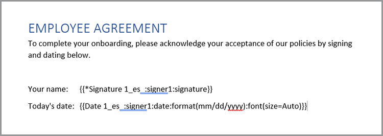

# Modernisierung des Mitarbeiter-Onboarding.


In einem großen Unternehmen kann das Onboarding von Mitarbeitern ein großer und langsamer Prozess sein. In der Regel gibt es eine Mischung aus individueller Dokumentation und Standardmaterial, das von einem neuen Mitarbeiter präsentiert und signiert werden muss. Diese Mischung aus maßgeschneidertem Material und Standardmaterial erfordert mehrere Schritte - und nimmt den Beteiligten wertvolle Zeit. [!DNL Adobe Acrobat Services] und Acrobat Sign können diesen Ansatz modernisieren und automatisieren, sodass Ihre Personalabteilung für wichtigere Aufgaben entlastet wird. Schauen wir uns an, wie das erreicht wird.

## Was sind [!DNL Adobe Acrobat Services]?

[[!DNL Adobe Acrobat Services]](https://developer.adobe.com/document-services/homepage) sind eine Reihe von APIs, die sich auf die Arbeit mit Dokumenten beziehen (und nicht nur PDF). Im Großen und Ganzen lässt sich dieses Leistungsspektrum in drei Hauptkategorien unterteilen:

* Zuerst die Tools von [PDF Services](https://developer.adobe.com/document-services/apis/pdf-services/). Dies sind &quot;nützliche&quot; Methoden für die Arbeit mit PDF und anderen Dokumenten. Die Services umfassen Dinge wie das Konvertieren von und zu PDF, das Durchführen von OCR und Optimierung, Zusammenführen und Aufteilen von PDF usw. Sie ist die Toolbox der Dokumentverarbeitungsfunktionen.
* Die [PDF Extract-API](https://developer.adobe.com/document-services/apis/pdf-extract/) verwendet leistungsstarke KI-/ML-Techniken, um eine PDF zu analysieren und unglaublich viele Details zum Inhalt zurückzugeben. Dazu gehören Text-, Styling- und Positionsinformationen sowie Tabellendaten im CSV-/XLS-Format, die ebenfalls abgerufen werden können.
* Mit der [API zur Dokumentenerzeugung](https://developer.adobe.com/document-services/apis/doc-generation/) können Entwickler Microsoft Word als &quot;Vorlage&quot; verwenden, mit ihren Daten (aus beliebigen Quellen) mischen und dynamische personalisierte Dokumente (PDF und Word) generieren.

Entwickler können sich [anmelden](https://documentcloud.adobe.com/dc-integration-creation-app-cdn/main.html) und alle diese Dienste mit einer kostenlosen Testversion ausprobieren. Die [!DNL Acrobat Services]-Plattform verwendet eine REST-basierte API, unterstützt aber auch SDKs für Knoten, Java, .NET und Python (momentan nur Extract).

Obwohl es sich nicht um eine API handelt, können Entwickler auch die kostenlose [PDF Embed-API](https://developer.adobe.com/document-services/apis/pdf-embed/) verwenden, die ein konsistentes und flexibles Anzeigeerlebnis für Dokumente auf Ihren Webseiten bietet.

## Was ist Acrobat Sign?

[Acrobat Sign](https://www.adobe.com/de/sign.html) ist der weltweit führende Anbieter elektronischer Signaturdienste. Sie können Dokumente mit verschiedenen Arbeitsabläufen zum Unterschreiben senden, einschließlich mehrerer Unterschriften. Acrobat Sign unterstützt auch Workflows, die Signaturen und zusätzliche Informationen erfordern. Alle diese Funktionen werden von einem leistungsstarken Dashboard mit einem flexiblen Authoring-System unterstützt.

Wie bei [!DNL Acrobat Services] verfügt Acrobat Sign über eine [kostenlose Testversion](https://www.adobe.com/sign.html#sign_free_trial), mit der Entwickler den Signiervorgang sowohl über das Dashboard als auch mit einer benutzerfreundlichen REST-basierten API testen können.

## Ein Onboarding-Szenario

Betrachten wir ein Szenario aus der realen Welt, das zeigt, wie die Dienste der Adobe helfen können. Wenn ein neuer Mitarbeiter in ein Unternehmen eintritt, benötigt er maßgeschneiderte Informationen für seine Rolle. Darüber hinaus benötigen sie auch unternehmensweites Material. Schließlich müssen sie durch Signieren der Dokumente nachweisen, dass sie die Unternehmensrichtlinien akzeptieren. Lassen Sie uns dies in konkrete Schritte unterteilen:

* Zunächst ist ein individuelles Anschreiben erforderlich, das den neuen Mitarbeiter nach seinem Namen begrüßt. Der Brief sollte Informationen über den Namen, die Rolle, das Gehalt und den Standort des Mitarbeiters enthalten.
* Der benutzerdefinierte Brief muss mit einer PDF kombiniert werden, die grundlegende, unternehmensweite Informationen enthält (denken Sie an verschiedene HR-Richtlinien, Vorteile usw.).
* Es muss ein endgültiges Dokument eingefügt werden, in dem die Unterschrift und das Datum des Mitarbeiters angefordert werden.
* Alle oben genannten Dokumente sollten als ein Dokument präsentiert werden, das dem Mitarbeiter zum Unterschreiben gesendet wird.

Ich zeige Ihnen, wie das geht.

## Dynamische Dokumente generieren

Mit der [Dokumentenerzeugung](https://developer.adobe.com/document-services/apis/doc-generation/)-API von Adobe können Entwickler dynamische Dokumente mithilfe von Microsoft Word und einer einfachen Vorlagensprache als Grundlage für die Generierung von PDF- und Word-Dokumenten erstellen. Hier ist ein Beispiel dafür, wie das funktioniert.

Beginnen wir mit einem Word-Dokument, das hartcodierte Werte enthält. Das Dokument kann beliebig formatiert werden, z. B. mit Grafiken, Tabellen usw. Hier ist das erste Dokument.


Die Dokumentgenerierung funktioniert, indem einem Word-Dokument &quot;Token&quot; hinzugefügt werden, die durch Ihre Daten ersetzt werden. Diese Token können zwar manuell eingegeben werden, es gibt jedoch ein [Microsoft Word-Add-in](https://developer.adobe.com/document-services/docs/overview/document-generation-api/wordaddin/), das die Arbeit erleichtert. Das Öffnen bietet ein Werkzeug, mit dem Autoren Tags oder Datensätze definieren können, die in Ihrem Dokument verwendet werden können.


Sie können entweder JSON-Informationen aus einer lokalen Datei hochladen, in JSON-Text kopieren oder mit den Anfangsdaten fortfahren. Auf diese Weise können Sie Ihre Tags ad hoc entsprechend Ihren besonderen Anforderungen definieren. In diesem Beispiel wird nur ein Tag für Name, Rolle, Gehalt und Position benötigt. Dies erfolgt mithilfe der Schaltfläche **Tag erstellen**:


Nach dem Definieren des ersten Tags können Sie weitere erforderliche Mengen definieren:


Wenn die Tags definiert sind, wählen Sie den Text in Ihrem Dokument aus und ersetzen ihn ggf. durch die Tags. In diesem Beispiel werden Tags für Name, Rolle und Gehalt hinzugefügt.


Die Dokumentgenerierung unterstützt nicht nur einfache Tags, sondern auch logische Ausdrücke. Der zweite Absatz des Dokuments enthält Text, der nur für Personen in Louisiana gilt. Sie können einen bedingten Ausdruck hinzufügen, indem Sie auf der Registerkarte &quot;Erweitert&quot; des Dokument-Taggers eine Bedingung definieren. Im Folgenden wird beschrieben, wie Sie eine einfache Gleichheitsbedingung definieren. Beachten Sie jedoch, dass auch numerische Vergleiche und andere Vergleichstypen unterstützt werden.


Diese können Sie dann einfügen und um den Absatz legen:


Wählen Sie &quot;**Dokument generieren**&quot; aus, um zu testen, wie dies funktioniert. Beim ersten Mal müssen Sie sich dafür mit einer Adobe ID anmelden. Nach der Anmeldung wird die Standard-JSON-Datei angezeigt, die manuell bearbeitet werden kann.


Es wird eine PDF generiert, die dann angezeigt oder heruntergeladen werden kann.


Mit dem Dokument-Tagger können Sie schnell entwerfen und testen. Sobald Sie fertig sind und in der Produktion sind, können Sie einen der SDKs verwenden, um diesen Prozess zu automatisieren. Der tatsächliche Code unterscheidet sich zwar je nach den spezifischen Anforderungen, aber hier ist ein Beispiel dafür, wie dieser Code in Node.js aussieht:

```js
 const PDFServicesSdk = require('@adobe/pdfservices-node-sdk');

const credentials =  PDFServicesSdk.Credentials
    .serviceAccountCredentialsBuilder()
    .fromFile("pdfservices-api-credentials.json")
    .build();

// Data would be dynamic...
let data = {
    "name":"Raymond Camden",
    "role":"Lead Developer",
    "salary":9000,
    "location":"Louisiana"
}

// Create an ExecutionContext using credentials.
const executionContext = PDFServicesSdk.ExecutionContext.create(credentials);

// Create a new DocumentMerge options instance.
const documentMerge = PDFServicesSdk.DocumentMerge,
    documentMergeOptions = documentMerge.options,
    options = new documentMergeOptions.DocumentMergeOptions(jsonDataForMerge, documentMergeOptions.OutputFormat.PDF);

// Create a new operation instance using the options instance.
const documentMergeOperation = documentMerge.Operation.createNew(options);

// Set operation input document template from a source file.
const input = PDFServicesSdk.FileRef.createFromLocalFile('documentMergeTemplate.docx');
documentMergeOperation.setInput(input);

// Execute the operation and Save the result to the specified location.
documentMergeOperation.execute(executionContext)
    .then(result => result.saveAsFile('documentOutput.pdf'))
    .catch(err => {
        if(err instanceof PDFServicesSdk.Error.ServiceApiError
            || err instanceof PDFServicesSdk.Error.ServiceUsageError) {
            console.log('Exception encountered while executing operation', err);
        } else {
            console.log('Exception encountered while executing operation', err);
        }
    });
```

Kurz gesagt, der Code richtet Anmeldeinformationen ein, erstellt ein Vorgangsobjekt und legt die Eingabe und Optionen fest, und ruft dann den Vorgang auf. Schließlich wird das Ergebnis als PDF gespeichert. (Die Ergebnisse können auch als Word ausgegeben werden.)

Die Dokumentgenerierung unterstützt viel komplexere Anwendungsfälle, einschließlich der Möglichkeit, vollständig dynamische Tabellen und Bilder zu erstellen. Weitere Informationen finden Sie in der [Dokumentation](https://developer.adobe.com/document-services/docs/overview/document-generation-api/).

## Ausführen von PDF

Die [PDF Services-API](https://developer.adobe.com/document-services/apis/pdf-services/) bietet eine große Anzahl von &quot;Utility&quot;-Vorgängen für die Arbeit mit PDF. Dazu gehören:

* PDF aus Office-Dokumenten erstellen
* Exportieren von PDF in Office-Dokumente
* PDF kombinieren und aufteilen
* Anwenden von OCR auf PDF
* PDF-Schutz festlegen, entfernen und ändern
* Löschen, Einfügen, Neuanordnen und Drehen von Seiten
* Optimierung von PDF durch Komprimierung oder Linearisierung
* Abrufen von PDF-Eigenschaften

In diesem Fall muss das Ergebnis des Aufrufs zum Generieren von Dokumenten mit einer Standard-PDF zusammengeführt werden. Diese Operation ist mit den SDKs recht einfach. Hier ist ein Beispiel für in Node.js:

```js
const PDFServicesSdk = require('@adobe/pdfservices-node-sdk');
 
// Initial setup, create credentials instance.
const credentials = PDFServicesSdk.Credentials
    .serviceAccountCredentialsBuilder()
    .fromFile("pdfservices-api-credentials.json")
    .build();
 
// Create an ExecutionContext using credentials and create a new operation instance.
const executionContext = PDFServicesSdk.ExecutionContext.create(credentials),
    combineFilesOperation = PDFServicesSdk.CombineFiles.Operation.createNew();
 
// Set operation input from a source file.
const combineSource1 = PDFServicesSdk.FileRef.createFromLocalFile('documentOutput.pdf'),
      combineSource2 = PDFServicesSdk.FileRef.createFromLocalFile('standardCorporate.pdf');

combineFilesOperation.addInput(combineSource1);
combineFilesOperation.addInput(combineSource2);
 
// Execute the operation and Save the result to the specified location.
combineFilesOperation.execute(executionContext)
    .then(result => result.saveAsFile('combineFilesOutput.pdf'))
    .catch(err => {
        if (err instanceof PDFServicesSdk.Error.ServiceApiError
            || err instanceof PDFServicesSdk.Error.ServiceUsageError) {
            console.log('Exception encountered while executing operation', err);
        } else {
            console.log('Exception encountered while executing operation', err);
        }
    });
```

Dieser Code nimmt die beiden PDF, führt sie zusammen und speichert das Ergebnis in einer neuen PDF. Einfach und einfach! Beispiele für mögliche Aktionen finden Sie in [docs](https://developer.adobe.com/document-services/docs/overview/pdf-services-api/).

## Der Signiervorgang

Am Ende des Onboarding-Prozesses muss der Mitarbeiter eine Vereinbarung unterzeichnen, in der er bestätigt, dass er alle darin definierten Richtlinien gelesen hat und damit einverstanden ist. [Acrobat Sign](https://www.adobe.com/de/sign.html) unterstützt viele verschiedene Workflows und Integrationen, einschließlich eines automatisierten Workflows über eine [API](https://opensource.adobe.com/acrobat-sign/developer_guide/index.html). Im Großen und Ganzen lässt sich der letzte Abschnitt des Szenarios wie folgt abschließen:

Zunächst müssen Sie das Dokument entwerfen, das das zu unterzeichnende Formular enthält. Hierfür gibt es mehrere Möglichkeiten, einschließlich eines visuellen Designs im Adobe Sign-Benutzer-Dashboard. Eine weitere Möglichkeit besteht darin, die Tags mit dem Add-in &quot;Word für die Dokumentgenerierung&quot; einzufügen. In diesem Beispiel werden eine Signatur und ein Datum angefordert.



Dieses Dokument kann als PDF gespeichert werden und mit derselben Methode wie oben beschrieben mit allen Dokumenten verbunden werden. Bei diesem Prozess wird ein einheitliches Paket erstellt, das eine personalisierte Begrüßung, eine standardmäßige Unternehmensdokumentation und eine zum Unterschreiben geeignete Abschlussseite enthält.

Die Vorlage kann in das Acrobat Sign-Dashboard hochgeladen und dann für neue Vereinbarungen verwendet werden. Über die REST-API kann dieses Dokument dann an einen potenziellen Mitarbeiter gesendet werden, um dessen Signatur anzufordern.


## Jetzt selbst erleben

Alles, was in diesem Artikel beschrieben wird, kann jetzt getestet werden. Die [!DNL Adobe Acrobat Services]-API [kostenlose Testversion](https://documentcloud.adobe.com/dc-integration-creation-app-cdn/main.html) stellt Ihnen derzeit 1.000 kostenlose Anfragen über einen Zeitraum von sechs Monaten zur Verfügung. Mit der [kostenlosen Testversion von Acrobat Sign](https://www.adobe.com/sign.html#sign_free_trial) können Sie Vereinbarungen mit Wasserzeichen zu Testzwecken senden.

Hast du Fragen? Das [Supportforum](https://community.adobe.com/t5/document-services-apis/ct-p/ct-Document-Cloud-SDK) wird täglich von Adobe-Entwicklern und Supportmitarbeitern überwacht. Um weitere Anregungen zu erhalten, sollten Sie sich die nächste [Paper Clips](https://www.youtube.com/playlist?list=PLcVEYUqU7VRe4sT-Bf8flvRz1XXUyGmtF)-Episode ansehen. Es gibt regelmäßige Live-Meetings mit Nachrichten, Demos und Gesprächen mit Kunden.
