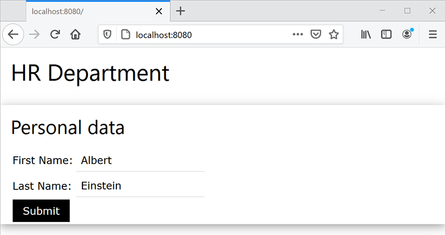

# HR-Dokumenten-Workflows auf Java


Viele Unternehmen benötigen Dokumentationen über Neueinstellungen, z. B. Arbeitsplatzvereinbarungen für Mitarbeiter im Homeoffice. Bisher haben Unternehmen diese Dokumente physisch in Formularen verwaltet, die schwer zu verwalten und zu speichern sind. Beim Umstieg auf elektronische Dokumente ist das PDF von Dateien die ideale Wahl, da sie sicherer und weniger veränderbar sind als andere Dateitypen. Außerdem unterstützen sie digitale Signaturen.

## Lernziel.

In diesem praktischen Tutorial lernen Sie, wie Sie ein webbasiertes HR-Formular implementieren, das eine Arbeitsplatzvereinbarung auf PDF mit Sign-off in einer einfachen Java Spring MVC-Anwendung speichert.

## Relevante APIs und Ressourcen

* [PDF Services-API](https://opensource.adobe.com/pdftools-sdk-docs/release/latest/index.html)

* [Adobe Sign-API](https://www.adobe.io/apis/documentcloud/sign.html)

* [Projektcode](https://github.com/dawidborycki/adobe-sign)

## API-Zugangsberechtigungen generieren

Registrieren Sie sich zunächst für die kostenlose Testversion der Adobe PDF Services-API. Wechseln Sie zur [Adobe](https://www.adobe.io/apis/documentcloud/dcsdk/gettingstarted.html?ref=getStartedWithServicesSDK) [Website](https://www.adobe.io/apis/documentcloud/dcsdk/gettingstarted.html?ref=getStartedWithServicesSDK) und klicken Sie unter *Neue Anmeldeinformationen erstellen* auf die Schaltfläche *Erste Schritte*. Die kostenlose Testversion bietet 1.000 Dokumenttransaktionen, die über einen Zeitraum von sechs Monaten genutzt werden können. Wählen Sie auf der nächsten Seite (siehe unten) den Dienst aus (PDF Services API), legen Sie den Namen der Anmeldeinformationen fest (z. B. HRDocumentWFCredentials) und geben Sie eine Beschreibung ein.

Wählen Sie die Sprache aus (Java für dieses Beispiel) und aktivieren Sie *Personalisierte Codebeispiele erstellen*. Der letzte Schritt stellt sicher, dass die Codebeispiele bereits die vorab ausgefüllte Datei pdftools-api-credentials.json enthalten, die Sie verwenden, zusammen mit dem privaten Schlüssel zur Authentifizierung Ihrer App innerhalb der API.

Klicken Sie schließlich auf die Schaltfläche *Anmeldeinformationen erstellen*. Dadurch werden die Anmeldedaten generiert und die Beispiele werden automatisch heruntergeladen.


Öffnen Sie die heruntergeladenen Beispiele, um sicherzustellen, dass die Anmeldedaten funktionieren. Hier verwenden Sie IntelliJ IDEA. Wenn Sie den Quellcode öffnen, fragt die integrierte Entwicklungsumgebung (IDE) nach dem Buildmodul. Maven wird in diesem Beispiel verwendet, aber du kannst auch mit Gradle arbeiten, je nach deinen Vorlieben.

Führen Sie als Nächstes das `mvn clean install`-Maven-Ziel aus, um die JAR-Dateien zu erstellen.

Führen Sie schließlich das Beispiel &quot;CombinePDF&quot; aus, wie unten gezeigt. Der Code generiert die PDF im Ausgabeordner.


## Erstellen der Spring MVC-Anwendung

Nachdem Sie die Anmeldeinformationen eingegeben haben, erstellen Sie die Anwendung. Im folgenden Beispiel wird Spring Initializer verwendet.

Konfigurieren Sie zunächst die Projekteinstellungen so, dass Java 8 und Jar Packaging verwendet werden (siehe Screenshot unten).


Zweitens fügen Sie Spring Web (aus dem Internet) und Thymeleaf (aus Vorlagen-Engines) hinzu:


Nachdem Sie das Projekt erstellt haben, rufen Sie die Datei &quot;pom.xml&quot; auf und ergänzen Sie den Abschnitt &quot;Abhängigkeiten&quot; mit &quot;pdftools-sdk&quot; und &quot;log4j-slf4j-impl&quot;:

```
<dependencies>
    <dependency>
        <groupId>org.springframework.boot</groupId>
        <artifactId>spring-boot-starter-thymeleaf</artifactId>
    </dependency>
    <dependency>
        <groupId>org.springframework.boot</groupId>
        <artifactId>spring-boot-starter-web</artifactId>
    </dependency>

    <dependency>
        <groupId>org.springframework.boot</groupId>
        <artifactId>spring-boot-starter-test</artifactId>
        <scope>test</scope>
    </dependency>

</dependencies>
```

Ergänzen Sie dann den Stammordner Ihres Projekts um zwei Dateien, die Sie mit dem Beispielcode heruntergeladen haben:

* pdftools-api-credentials.json

* private.key

## Rendern eines Webformulars

Um das Webformular zu rendern, ändern Sie die Anwendung mit dem Controller, der das Formular für personenbezogene Daten rendert, und bearbeiten Sie die Veröffentlichung des Formulars. Ändern Sie daher zunächst die Anwendung mit der Modellklasse PersonForm:

```
package com.hr.docsigning;
import javax.validation.constraints.NotNull;
import javax.validation.constraints.Size;

public class PersonForm {
    @NotNull
    @Size(min=2, max=30)
    private String firstName;

    @NotNull
    @Size(min=2, max=30)
    private String lastName;

    public String getFirstName() {
            return this.firstName;
    }


    public void setFirstName(String firstName) {
            this.firstName = firstName;
    }

    public String getLastName() {
           return this.lastName;
    }

    public void setLastName(String lastName) {
            this.lastName = lastName;
    }

    public String GetFullName() {
           return this.firstName + " " + this.lastName;
    }
}
```

Diese Klasse enthält zwei Eigenschaften: `firstName` und `lastName`. Verwenden Sie diese einfache Validierung auch, um zu überprüfen, ob sie zwischen zwei und 30 Zeichen lang sind.

Bei Verwendung der Modellklasse können Sie den Controller erstellen (siehe PersonController.java im Companion-Code):

```
package com.hr.docsigning;
import org.springframework.stereotype.Controller;
import org.springframework.validation.BindingResult;
import org.springframework.web.bind.annotation.GetMapping;
import org.springframework.web.bind.annotation.PostMapping;
import javax.validation.Valid;


@Controller
public class PersonController {
    @GetMapping("/")
    public String showForm(PersonForm personForm) {
        return "form";
    }
}
```

Der Controller verfügt nur über eine Methode: showForm. Es ist für das Rendern des Formulars mit der HTML-Vorlage in resources/templates/form.html verantwortlich:

```
<html>
<head>
    <link rel="stylesheet" href="https://www.w3schools.com/w3css/4/w3.css">
</head>
 
<body>
<div class="w3-container">
    <h1>HR Department</h1>
</div>
 
<form class="w3-panel w3-card-4" action="#" th:action="@{/}"
        th:object="${personForm}" method="post">
    <h2>Personal data</h2>
    <table>
        <tr>
            <td>First Name:</td>
            <td><input type="text" class="w3-input"
                placeholder="First name" th:field="*{firstName}" /></td>
            <td class="w3-text-red" th:if="${#fields.hasErrors('firstName')}"
                th:errors="*{firstName}"></td>
        </tr>
        <tr>
            <td>Last Name:</td>
            <td><input type="text" class="w3-input"
                placeholder="Last name" th:field="*{lastName}" /></td>
            <td class="w3-text-red" th:if="${#fields.hasErrors('lastName')}"
                th:errors="*{lastName}"></td>
        </tr>
        <tr>
            <td><button class="w3-button w3-black" type="submit">Submit</button></td>
        </tr>
    </table>
</form>
</body>
</html>
```

Zum Rendern dynamischer Inhalte wird die Thymeleaf-Vorlagenwiedergabemaschine verwendet. Nach dem Ausführen der Anwendung sollte Folgendes angezeigt werden:


## Generieren der PDF mit dynamischem Inhalt

Generieren Sie jetzt das PDF-Dokument, das den virtuellen Vertrag enthält, indem Sie die ausgewählten Felder nach dem Rendern des Formulars für personenbezogene Daten dynamisch ausfüllen. Insbesondere müssen Sie die Personendaten in den vorab erstellten Vertrag einfügen.

Hier haben Sie der Einfachheit halber nur eine Kopfzeile, eine Unterkopfzeile und eine Zeichenfolge mit konstantem Lesen: &quot;Dieser Vertrag wurde für \&lt;vollständiger Name der Person\> vorbereitet.&quot;

Um dieses Ziel zu erreichen, beginnen Sie mit dem Beispiel [Erstellen einer PDF aus Dynamic HTML von Adobe](https://opensource.adobe.com/pdftools-sdk-docs/release/latest/howtos.html#create-a-pdf-from-dynamic-html). Wenn Sie diesen Beispielcode analysieren, sehen Sie, dass der Prozess der dynamischen HTML-Feldauffüllung wie folgt funktioniert.

Zuerst müssen Sie die HTML-Seite vorbereiten, die statischen und dynamischen Inhalt hat. Der dynamische Teil wird mit JavaScript aktualisiert. Das heißt, die PDF Services API injiziert das JSON-Objekt in Ihren HTML.

Die JSON-Eigenschaften werden dann mithilfe der JavaScript -Funktion abgerufen, die beim Laden des HTML-Dokuments aufgerufen wird. Diese JavaScript-Funktion aktualisiert die ausgewählten DOM-Elemente. Hier ist das Beispiel, in dem das span-Element mit den Daten der Person aufgefüllt wird (siehe src\\main\\resources\\contract\\index.html des Begleit-Codes):

```
<html>
<head>
    <link rel="stylesheet" href="https://www.w3schools.com/w3css/4/w3.css">
</head>
 
<body onload="updateFullName()">
    <script src="./json.js"></script>
    <script type="text/javascript">
        function updateFullName()
        {
            var document = window.document;
            document.getElementById("personFullName").innerHTML = String(
                window.json.personFullName);
        }
    </script>
 
    <div class="w3-container ">
        <h1>HR Department</h1>
 
        <h2>Contract details</h2>
 
        <p>This contract was prepared for:
            <strong><span id="personFullName"></span></strong>
        </p>
    </div>
</body>
</html>
```

Dann müssen Sie die HTML mit allen abhängigen JavaScript- und CSS-Dateien komprimieren. Die PDF Services API akzeptiert keine HTML-Dateien. Stattdessen wird eine ZIP-Datei als Eingabe benötigt. In diesem Fall speichern Sie die ZIP-Datei im Ordner src\\main\\resources\\contract\\index.zip.

Anschließend können Sie `PersonController` durch eine andere Methode ergänzen, die POST-Anforderungen behandelt:

```
@PostMapping("/")
public String checkPersonInfo(@Valid PersonForm personForm,
    BindingResult bindingResult) {
    if (bindingResult.hasErrors()) {
        return "form";
    }
 
    CreateContract(personForm);
 
    return "contract-actions";
}
```

Die obige Methode erstellt einen PDF-Vertrag unter Verwendung der angegebenen personenbezogenen Daten und rendert die Vertragsaktionenansicht. Letztere enthält Links zur generierten PDF und zum Signieren der PDF.

Sehen wir uns nun an, wie die `CreateContract`-Methode funktioniert (die vollständige Liste finden Sie unten). Die Methode basiert auf zwei Feldern:

* `LOGGER`, von log4j, zum Debuggen von Informationen zu Ausnahmen

* `contractFilePath`, der den Dateipfad zur generierten PDF enthält

Die `CreateContract`-Methode richtet die Anmeldeinformationen ein und erstellt die PDF von HTML. Verwenden Sie den `setCustomOptionsAndPersonData`-Helfer, um die Daten der Person im Vertrag zu übergeben und auszufüllen. Diese Methode ruft die Daten der Person aus dem Formular ab und sendet sie dann über das oben erläuterte JSON-Objekt an die generierte PDF.

Außerdem zeigt `setCustomOptionsAndPersonData`, wie das Erscheinungsbild des PDF durch Deaktivieren der Kopf- und Fußzeile gesteuert wird. Wenn Sie diese Schritte abgeschlossen haben, speichern Sie die PDF-Datei in output/contract.pdf und löschen schließlich die zuvor generierte Datei.

```
private static final Logger LOGGER = LoggerFactory.getLogger(PersonController.class);
private String contractFilePath = "output/contract.pdf"; 
private void CreateContract(PersonForm personForm) {
    try {
        // Initial setup, create credentials instance.
        Credentials credentials = Credentials.serviceAccountCredentialsBuilder()
                .fromFile("pdftools-api-credentials.json")
                .build();

        //Create an ExecutionContext using credentials 
       //and create a new operation instance.
        ExecutionContext executionContext = ExecutionContext.create(credentials);
        CreatePDFOperation htmlToPDFOperation = CreatePDFOperation.createNew();

        // Set operation input from a source file.
        FileRef source = FileRef.createFromLocalFile(
           "src/main/resources/contract/index.zip");
       htmlToPDFOperation.setInput(source);

        // Provide any custom configuration options for the operation
        // You pass person data here to dynamically fill out the HTML
        setCustomOptionsAndPersonData(htmlToPDFOperation, personForm);

        // Execute the operation.
        FileRef result = htmlToPDFOperation.execute(executionContext);

        // Save the result to the specified location. Delete previous file if exists
        File file = new File(contractFilePath);
        Files.deleteIfExists(file.toPath());

        result.saveAs(file.getPath());

    } catch (ServiceApiException | IOException | 
             SdkException | ServiceUsageException ex) {
        LOGGER.error("Exception encountered while executing operation", ex);
    }
}
 
private static void setCustomOptionsAndPersonData(
    CreatePDFOperation htmlToPDFOperation, PersonForm personForm) {
    //Set the dataToMerge field that needs to be populated 
    //in the HTML before its conversion
    JSONObject dataToMerge = new JSONObject();
    dataToMerge.put("personFullName", personForm.GetFullName());
 
    // Set the desired HTML-to-PDF conversion options.
    CreatePDFOptions htmlToPdfOptions = CreatePDFOptions.htmlOptionsBuilder()
        .includeHeaderFooter(false)
        .withDataToMerge(dataToMerge)
        .build();
    htmlToPDFOperation.setOptions(htmlToPdfOptions);
}
```

Beim Generieren des Vertrags können Sie auch die dynamischen, personenbezogenen Daten mit festen Vertragsbedingungen zusammenführen. Befolgen Sie dazu das Beispiel [PDF aus statischem HTML erstellen](https://opensource.adobe.com/pdftools-sdk-docs/release/latest/howtos.html#create-a-pdf-from-dynamic-html). Alternativ können Sie [zwei PDF zusammenführen](https://opensource.adobe.com/pdftools-sdk-docs/release/latest/howtos.html#create-a-pdf-from-static-html).

## Anzeigen der PDF-Datei zum Herunterladen

Sie können nun den Link zur generierten PDF für den Benutzer zum Herunterladen bereitstellen. Erstellen Sie dazu zunächst die Datei contract-actions.html (siehe resources/templates contract-actions.html des Begleit-Codes):

```
<html>
<head>
    <link rel="stylesheet" href="https://www.w3schools.com/w3css/4/w3.css">
</head>
 
<div class="w3-container ">
    <h1>HR Department</h1>
 
    <h2>Contract file</h2>
 
    <p>Click <a href="/pdf">here</a> to download your contract</p>
</div>
</body>
</html>
```

Anschließend implementieren Sie die `downloadContract`-Methode in der `PersonController`-Klasse wie folgt:

```
@RequestMapping("/pdf")
public void downloadContract(HttpServletResponse response)
{
    Path file = Paths.get(contractFilePath);
 
    response.setContentType("application/pdf");
    response.addHeader(
        "Content-Disposition", "attachment; filename=contract.pdf");

    try
    {
        Files.copy(file, response.getOutputStream());
        response.getOutputStream().flush();
    }
    catch (IOException ex) 
    {
        ex.printStackTrace();
    }
}
```

Nachdem Sie die App ausgeführt haben, erhalten Sie den folgenden Ablauf. Auf dem ersten Bildschirm wird das Formular für personenbezogene Daten angezeigt. Geben Sie zum Testen Werte zwischen zwei und 30 Zeichen ein:



Nach dem Klicken auf die Schaltfläche &quot;*Senden*&quot; wird das Formular überprüft und die PDF wird anhand der HTML generiert (resources/contract/index.html). In der Anwendung wird eine andere Ansicht (Vertragsdetails) angezeigt, in der Sie die PDF herunterladen können:


Die PDF sieht nach dem Rendern im Webbrowser wie folgt aus. Das heißt, die von Ihnen eingegebenen personenbezogenen Daten werden an die PDF weitergegeben:


## Ermöglichen von Signaturen und Sicherheit

Wenn die Vereinbarung fertig ist, kann Adobe Sign digitale Signaturen hinzufügen, die eine Genehmigung darstellen. Die Adobe Sign-Authentifizierung funktioniert etwas anders als OAuth. Im Folgenden wird erläutert, wie die Anwendung in Adobe Sign integriert wird. Dazu müssen Sie das Zugriffstoken für Ihre Anwendung vorbereiten. Anschließend schreiben Sie den Clientcode mit dem Adobe Sign Java SDK.

Um ein Autorisierungstoken zu erhalten, müssen Sie mehrere Schritte ausführen:

Registrieren Sie zunächst ein [Entwicklerkonto](https://acrobat.adobe.com/de/de/sign/developer-form.html).

Erstellen Sie die CLIENT-Anwendung im [Adobe Sign-Portal](https://www.adobe.io/apis/documentcloud/sign/docs.html#!adobedocs/adobe-sign/master/gstarted/create_app.md).

Konfigurieren Sie OAuth für die Anwendung wie [hier](https://www.adobe.io/apis/documentcloud/sign/docs.html#!adobedocs/adobe-sign/master/gstarted/configure_oauth.md) und [hier](https://secure.eu1.adobesign.com/public/static/oauthDoc.jsp) beschrieben. Notieren Sie sich Ihre Client-ID und Ihr Client-Geheimnis. Anschließend können Sie `https://www.google.com` als Umleitungs-URI und die folgenden Bereiche verwenden:

* user_login: self

* agreement_read: account

* agreement_write: account

* agreement_send: account

Bereiten Sie mithilfe Ihrer Client-ID anstelle von \&lt;CLIENT_ID\> eine URL wie folgt vor:

```
https://secure.eu1.adobesign.com/public/oauth?redirect_uri=https://www.google.com
&response_type=code
&client_id=<CLIENT_ID>
&scope=user_login:self+agreement_read:account+agreement_write:account+agreement_send:account
```

Geben Sie die obige URL in Ihren Webbrowser ein. Sie werden zu google.com umgeleitet und der Code wird in der Adressleiste als code=\&lt;IHR_CODE\> angezeigt, für
Beispiel:

```
https://www.google.com/?code=<YOUR_CODE>&api_access_point=https://api.eu1.adobesign.com/&web_access_point=https://secure.eu1.adobesign.com%2F
```

Notieren Sie sich die Werte für \&lt;YOUR_CODE\> und api_access_point.

Zum Senden einer HTTP-POST-Anforderung, die das Zugriffstoken bereitstellt, verwenden Sie die Client-ID \&lt;YOUR_CODE\> und die Werte api_access_point. Sie können [Postman](https://helpx.adobe.com/sign/kb/how-to-create-access-token-using-postman-adobe-sign.html) oder cURL verwenden:

```
curl --location --request POST "https://**api.eu1.adobesign.com**/oauth/token"
\\

\--data-urlencode "client_secret=**\<CLIENT_SECRET\>**" \\

\--data-urlencode "client_id=**\<CLIENT_ID\>**" \\

\--data-urlencode "code=**\<YOUR_CODE\>**" \\

\--data-urlencode "redirect_uri=**https://www.google.com**" \\

\--data-urlencode "grant_type=authorization_code"
```

Die Beispielantwort sieht wie folgt aus:

```
{
    "access_token":"3AAABLblqZhByhLuqlb-…",
    "refresh_token":"3AAABLblqZhC_nJCT7n…",
    "token_type":"Bearer",
    "expires_in":3600
}
```

Notieren Sie sich Ihr access_token. Sie benötigen sie, um Ihren Clientcode zu autorisieren.

## Verwenden des Adobe Sign Java SDK

Sobald Sie über das Zugriffstoken verfügen, können Sie REST API-Aufrufe an Adobe Sign senden. Um diesen Vorgang zu vereinfachen, verwenden Sie das Adobe Sign Java SDK. Der Quellcode ist im [Adobe-GitHub-Repository ](https://github.com/adobe-sign/AdobeSignJavaSdk) verfügbar.

Um dieses Paket in Ihre Anwendung zu integrieren, müssen Sie den Code klonen. Erstellen Sie dann das Maven-Paket (mvn-Paket) und installieren Sie die folgenden Dateien im Projekt (Sie finden sie im Companion-Code im Ordner adobe-sign-sdk ):

* target/swagger-java-client-1.0.0.jar

* target/lib/gson-2.8.1.jar

* target/lib/gson-fire-1.8.0.jar

* target/lib/hamcrest-core-1.3.jar

* target/lib/junit-4.12.jar

* target/lib/logging-interceptor-2.7.5.jar

* target/lib/okhttp-2.7.5.jar

* target/lib/okio-1.6.0.jar

* target/lib/swagger-annotations-1.5.15.jar

In IntelliJ IDEA können Sie diese Dateien als Abhängigkeiten mithilfe von *Projektstruktur* (Datei-/Projektstruktur) hinzufügen.

## PDF zum Unterschreiben senden

Sie können die Vereinbarung jetzt zur Signatur senden. Fülle dazu die Datei &quot;Contract-Details.html&quot; mit einem weiteren Hyperlink zur Anforderung &quot;Senden&quot; auf:

```
<html>
<head>
    <link rel="stylesheet" href="https://www.w3schools.com/w3css/4/w3.css">
</head>
 
<div class="w3-container ">
    <h1>HR Department</h1>
 
    <h2>Contract file</h2>
 
    <p>Click <a href="/pdf"> here</a> to download your contract</p>
 
    
</div>
</body>
</html>
```

Dann fügen Sie einen weiteren Controller hinzu, `AdobeSignController`, in dem Sie `sendContractMethod` implementieren (siehe Companion-Code). Die Methode funktioniert wie folgt:

Zuerst wird `ApiClient` zum Abrufen des API-Endpunkts verwendet.

```
ApiClient apiClient = new ApiClient();

//Default baseUrl to make GET /baseUris API call.
String baseUrl = "https://api.echosign.com/";
String endpointUrl = "/api/rest/v6";
apiClient.setBasePath(baseUrl + endpointUrl);

// Provide an OAuth Access Token as "Bearer access token" in authorization
String authorization = "Bearer ";

// Get the baseUris for the user and set it in apiClient.
BaseUrisApi baseUrisApi = new BaseUrisApi(apiClient);
BaseUriInfo baseUriInfo = baseUrisApi.getBaseUris(authorization);
apiClient.setBasePath(baseUriInfo.getApiAccessPoint() + endpointUrl);
```

Anschließend verwendet die Methode die Datei contract.pdf, um das temporäre Dokument zu erstellen:

```
// Get PDF file
String filePath = "output/";
String fileName = "contract.pdf";
File file = new File(filePath + fileName);
String mimeType = "application/pdf";
 
//Get the id of the transient document.
TransientDocumentsApi transientDocumentsApi =
    new TransientDocumentsApi(apiClient);
TransientDocumentResponse response = transientDocumentsApi.createTransientDocument(authorization,
    file, null, null, fileName, mimeType);
String transientDocumentId = response.getTransientDocumentId();
```

Als Nächstes müssen Sie eine Vereinbarung erstellen. Verwenden Sie dazu die Datei Contract.pdf und legen Sie den Vereinbarungsstatus auf IN_PROCESS fest, um die Datei sofort zu senden. Außerdem können Sie die elektronische Signatur auswählen:

```
// Create AgreementCreationInfo
AgreementCreationInfo agreementCreationInfo = new AgreementCreationInfo();
 
// Add file
FileInfo fileInfo = new FileInfo();
fileInfo.setTransientDocumentId(transientDocumentId);
agreementCreationInfo.addFileInfosItem(fileInfo);
 
// Set state to IN_PROCESS, so the agreement is be sent immediately
agreementCreationInfo.setState(AgreementCreationInfo.StateEnum.IN_PROCESS);
agreementCreationInfo.setName("Contract");
agreementCreationInfo.setSignatureType(AgreementCreationInfo.SignatureTypeEnum.ESIGN);
```

Als Nächstes fügen Sie Vereinbarungsempfänger wie folgt hinzu. Hier fügen Sie zwei Empfänger hinzu (siehe Abschnitte &quot;Mitarbeiter&quot; und &quot;Manager&quot;):

```
// Provide emails of recipients to whom agreement is be sent
// Employee
ParticipantSetInfo participantSetInfo = new ParticipantSetInfo();
ParticipantSetMemberInfo participantSetMemberInfo = new ParticipantSetMemberInfo();
participantSetMemberInfo.setEmail("");
participantSetInfo.addMemberInfosItem(participantSetMemberInfo);
participantSetInfo.setOrder(1);
participantSetInfo.setRole(ParticipantSetInfo.RoleEnum.SIGNER);
agreementCreationInfo.addParticipantSetsInfoItem(participantSetInfo);
 
// Manager
participantSetInfo = new ParticipantSetInfo();
participantSetMemberInfo = new ParticipantSetMemberInfo();
participantSetMemberInfo.setEmail("");
participantSetInfo.addMemberInfosItem(participantSetMemberInfo);
participantSetInfo.setOrder(2);
participantSetInfo.setRole(ParticipantSetInfo.RoleEnum.SIGNER);
agreementCreationInfo.addParticipantSetsInfoItem(participantSetInfo);
```

Senden Sie schließlich die Vereinbarung mithilfe der `createAgreement`-Methode aus dem Adobe Sign Java SDK:

```
// Create agreement using the transient document.
AgreementsApi agreementsApi = new AgreementsApi(apiClient);
AgreementCreationResponse agreementCreationResponse = agreementsApi.createAgreement(
    authorization, agreementCreationInfo, null, null);
 
System.out.println("Agreement sent, ID: " + agreementCreationResponse.getId());
```

Nach dem Ausführen dieses Codes erhalten Sie eine E-Mail (an die im Code als &quot;`<email_address>)`&quot; angegebene Adresse) mit der Anforderung zum Signieren der Vereinbarung. Die E-Mail enthält den Hyperlink, über den Empfänger zum Adobe Sign-Portal weitergeleitet werden, damit sie das Signieren durchführen können. Sie sehen das Dokument in Ihrem Adobe Sign-Entwicklerportal (siehe Abbildung unten) und können den Signaturprozess auch programmgesteuert mit der Methode [getAgreementInfo](https://github.com/adobe-sign/AdobeSignJavaSdk/blob/master/docs/AgreementsApi.md#getAgreementInfo) verfolgen.

Schließlich können Sie Ihren PDF auch mit der PDF Services-API mit einem Kennwort schützen, wie in diesen [Beispielen](https://github.com/adobe/pdfservices-java-sdk-samples/tree/master/src/main/java/com/adobe/pdfservices/operation/samples/protectpdf) gezeigt.


## Nächste Schritte

Wie Sie sehen, können Sie mithilfe der quickstarts ein einfaches Webformular implementieren, um eine genehmigte PDF in Java mit der Adobe PDF Services API zu erstellen. Adobe PDF APIs lassen sich nahtlos in vorhandene Client-Anwendungen integrieren.

Auf der Basis dieses Beispiels könnt ihr Formulare erstellen, die Empfänger per Remote-Zugriff und auf sichere Weise unterzeichnen können. Wenn mehrere Unterschriften benötigt werden, könnt ihr Formulare in einem Workflow sogar automatisch an mehrere Personen weiterleiten. Dein Mitarbeiter-Onboarding wurde verbessert, und deine Personalabteilung wird dich lieben.

Probieren Sie [[!DNL Adobe Acrobat Services]](https://www.adobe.io/apis/documentcloud/dcsdk/) aus, um Ihren Anwendungen heute eine Vielzahl von PDF-Funktionen hinzuzufügen.
