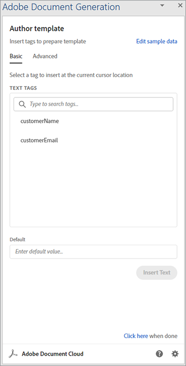
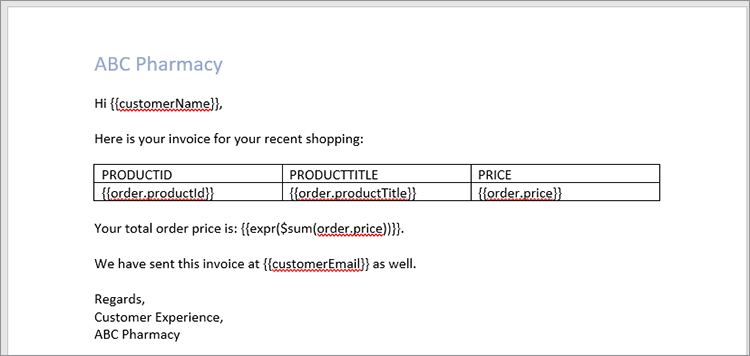

# Verarbeiten von Rechnungen


Es ist großartig, wenn das Geschäft boomt, aber die Produktivität leidet, wenn es an der Zeit ist, all diese Rechnungen vorzubereiten. Das manuelle Generieren von Rechnungen ist zeitaufwendig, und Sie laufen Gefahr, einen Fehler zu machen, Geld zu verlieren oder einen Kunden mit einem falschen Betrag zu verärgern.

Denken Sie beispielsweise an Danielle, die in der [Buchhaltung](https://developer.adobe.com/document-services/use-cases/financial/invoices) [&#x200B; eines medizinischen Versorgungsunternehmens arbeitet](https://developer.adobe.com/document-services/use-cases/financial/invoices). Es ist das Ende des Monats, also holt sie Informationen aus verschiedenen Systemen, überprüft ihre Richtigkeit noch einmal und formatiert die Rechnungen. Nach all der Arbeit ist sie endlich bereit, die Dokumente in PDF zu konvertieren (damit jeder sie sehen kann, ohne eine bestimmte Software zu kaufen) und jedem Kunden seine personalisierte Rechnung zu schicken.

Selbst wenn die monatliche Rechnungsstellung abgeschlossen ist, kann Danielle diesen Rechnungen einfach nicht entkommen. Manche Kunden haben nicht-monatliche Abrechnungszeiträume, daher erstellt sie immer eine Rechnung für jemanden. Gelegentlich bearbeitet ein Kunde seine Rechnung und unterbezahlt. Danielle verbringt dann Zeit mit der Fehlerbehebung dieser Rechnungsabweichung. Bei dieser Geschwindigkeit muss sie einen Assistenten einstellen, um mit der ganzen Arbeit Schritt zu halten!

Was Danielle braucht, ist eine Möglichkeit, Rechnungen schnell und präzise zu generieren, sowohl als Batch am Ende des Monats als auch ad hoc zu anderen Zeiten. Wenn sie diese Rechnungen vor Änderungen schützen könnte, müsste sie sich im Idealfall keine Gedanken mehr über die Fehlerbehebung bei nicht übereinstimmenden Beträgen machen.

## Lernziel.

In diesem Tutorial lernen Sie, wie Sie mit der Adobe-API für die Dokumentenerzeugung automatisch Rechnungen generieren, die PDF mit einem Kennwort schützen und jedem Kunden eine Rechnung ausstellen können. Dazu brauchst du nur ein wenig Wissen über Node.js, JavaScript, Express.js, HTML und CSS.

Der vollständige Code für dieses Projekt ist [&#x200B; auf GitHub &#x200B;](https://github.com/afzaal-ahmad-zeeshan/adobe-pdf-invoice-generation) verfügbar. Sie müssen das öffentliche Verzeichnis mit Ihrer Vorlage und den Ordnern für Rohdaten einrichten. In der Produktion müssen Sie die Daten von einer externen API abrufen. Sie können auch diese archivierte Version der Anwendung durchsuchen, die die Vorlagenressourcen enthält.

## Relevante APIs und Ressourcen

* [PDF Services-API](https://opensource.adobe.com/pdftools-sdk-docs/release/latest/index.html)

* [API für die Dokumentenerzeugung &#x200B;](https://developer.adobe.com/document-services/apis/doc-generation) für Adobe

* [Adobe Sign-API](https://developer.adobe.com/adobesign-api/)

* [Projektcode](https://github.com/afzaal-ahmad-zeeshan/adobe-pdf-invoice-generation)

## Vorbereiten der Daten

In diesem Tutorial wird nicht untersucht, wie die Daten aus Ihren Data Warehouses importiert werden. Ihre Kundenaufträge können in einer Datenbank, einer externen API oder in benutzerdefinierter Software vorhanden sein. Die Adobe-Dokumentenerzeugung-API erwartet ein JSON-Dokument, das die Rechnungsdaten enthält, z. B. Informationen aus Ihrem Customer Relationship Management (CRM) oder Ihrer E-Commerce-Plattform. In diesem Tutorial wird davon ausgegangen, dass die Daten bereits im JSON-Format vorliegen.

Verwenden Sie zur Vereinfachung die folgende JSON-Struktur für die Rechnungsstellung:

```
{ 
    "customerName": "John Doe", 
    "customerEmail": "john-doe@example.com", 
    "order": [ 
        { 
            "productId": 26, 
            "productTitle": "Bandages", 
            "price": 15.82 
        }, 
        { 
            "productId": 54, 
            "productTitle": "Masks", 
            "price": 25 
        }, 
        { 
            "productId": 76, 
            "productTitle": "Gloves", 
            "price": 7.59 
        } 
    ] 
} 
```

Das JSON-Dokument enthält die Kundendetails sowie Bestellinformationen. Verwenden Sie dieses strukturierte Dokument, um Ihre Rechnung aufzubauen und die Elemente im PDF-Format anzuzeigen.

## Rechnungsvorlage erstellen

Die Adobe-Dokumentenerzeugung-API erwartet, dass eine Microsoft Word-basierte Vorlage und ein JSON-Dokument ein dynamisches PDF- oder Word-Dokument erstellen. Erstellen Sie eine Microsoft Word-Vorlage für Ihre Fakturierungsanwendung und verwenden Sie das [kostenlose Add-in für Tagger für die Dokumentengenerierung](https://opensource.adobe.com/pdftools-sdk-docs/docgen/latest/wordaddin.html#add-in-demo), um die Vorlagen-Tags zu generieren. Installieren Sie das Add-in und öffnen Sie die Registerkarte in Microsoft Word.


Nachdem Sie den JSON-Inhalt wie oben gezeigt in das Add-In eingefügt haben, klicken Sie auf Tags generieren. Dieses Plug-in zeigt das Format des Objekts an. In Ihrer Basisvorlage können der Name und die E-Mail-Adresse des Kunden verwendet werden, die Bestellinformationen werden jedoch nicht angezeigt. Die Bestellinformationen werden später in diesem Tutorial erläutert.



Beginnen Sie in Ihrem Microsoft Word-Dokument mit dem Schreiben der Rechnungsvorlage. Lassen Sie den Cursor an der Stelle, an der Sie dynamische Daten einfügen müssen, und wählen Sie dann das Tag im Adobe-Add-in-Fenster aus. Klicken Sie auf **Text einfügen**, damit das Adobe-Add-In für die Dokumentgenerierung-Tags die Tags generieren und einfügen kann. Zur Personalisierung fügen wir den Namen und die E-Mail-Adresse des Kunden ein.

Nun zu den Daten, die sich mit jeder neuen Rechnung ändern. Wählen Sie die Registerkarte **Erweitert** des Add-Ins aus. Klicken Sie auf **Tabellen und Listen** , um die verfügbaren Optionen zum Generieren einer dynamischen Tabelle anzuzeigen, die auf den von einem Kunden bestellten Produkten basiert.

Wählen Sie im ersten Dropdown **Order** aus. Wählen Sie in der zweiten Dropdown-Liste die Spalten für diese Tabelle aus. In diesem Tutorial wählen Sie alle drei Spalten für das Objekt aus, in dem die Tabelle gerendert werden soll.


Die API für die Dokumentenerzeugung kann auch komplexe Vorgänge wie das Aggregieren von Elementen innerhalb eines Arrays ausführen. Wählen Sie auf der Registerkarte **Erweitert** die Option **Numerische Berechnungen** aus, und wählen Sie auf der Registerkarte **Aggregation** das Feld aus, auf das Sie die Berechnung anwenden möchten.


Klicken Sie auf die Schaltfläche **Berechnung** einfügen, um dieses Tag an der gewünschten Stelle im Dokument einzufügen. Der folgende Text wird nun in Ihrer Microsoft Word-Datei angezeigt:



Dieses Beispiel für eine Rechnung enthält Kundeninformationen, die bestellten Produkte und den fälligen Gesamtbetrag.

## Generieren einer Rechnung mithilfe der API für die Dokumentenerzeugung in Adobe

Verwenden Sie das Adobe PDF Services Node.js-SDK (Software Development Kit), um Microsoft Word- und JSON-Dokumente zusammenzuführen. Erstellen Sie eine Anwendung &quot;Node.js&quot;, um die Rechnung mithilfe der API &quot;Dokumentenerzeugung&quot; zu erstellen.

Die PDF Services-API umfasst den Dokumentengenerierungsdienst, sodass Sie für beide dieselben Anmeldeinformationen verwenden können. Profitieren Sie von einer [sechsmonatigen kostenlosen Testversion](https://developer.adobe.com/document-services/pricing/main) und zahlen Sie dann nur 0,05 US-Dollar pro Dokumenttransaktion.

Hier ist der Code zum Zusammenführen der PDF:

```
async function compileDocFile(json, inputFile, outputPdf) { 
    try { 
        // configurations 
        const credentials =  adobe.Credentials 
            .serviceAccountCredentialsBuilder() 
            .fromFile("./src/pdftools-api-credentials.json") 
            .build(); 

        // Capture the credential from app and show create the context 
        const executionContext = adobe.ExecutionContext.create(credentials); 
  
        // create the operation 
        const documentMerge = adobe.DocumentMerge, 
            documentMergeOptions = documentMerge.options, 
            options = new documentMergeOptions.DocumentMergeOptions(json, documentMergeOptions.OutputFormat.PDF);

        const operation = documentMerge.Operation.createNew(options); 
  
        // Pass the content as input (stream) 
        const input = adobe.FileRef.createFromLocalFile(inputFile); 
        operation.setInput(input); 
  
        // Async create the PDF 
        let result = await operation.execute(executionContext); 
        await result.saveAsFile(outputPdf); 
    } catch (err) { 
        console.log('Exception encountered while executing operation', err); 
    } 
} 
```

Dieser Code übernimmt Informationen aus dem Eingabe-JSON-Dokument und der Eingabefelddatei. Anschließend wird ein Vorgang zum Zusammenführen von Dokumenten erstellt, um die Dateien zu einem einzigen PDF-Bericht zusammenzuführen. Schließlich wird der Vorgang mit Ihren API-Zugangsberechtigungen ausgeführt. Wenn Sie noch nicht über diese verfügen, [erstellen Sie Anmeldeinformationen](https://opensource.adobe.com/pdftools-sdk-docs/release/latest/index.html#getting-credentials) (die Dokumentenerzeugung- und PDF-Services-API verwenden dieselben Anmeldeinformationen).

Verwenden Sie diesen Code im Express-Router, um die Dokumentanforderung zu bearbeiten:

```
// Create one report and send it back
try {
    console.log(\`[INFO] generating the report...\`);
    const fileContent = fs.readFileSync(\`./public/documents/raw/\${vendor}\`,
    'utf-8');
    const parsedObject = JSON.parse(fileContent);

    await pdf.compileDocFile(parsedObject,
    \`./public/documents/template/Adobe-Invoice-Sample.docx\`,
    \`./public/documents/processed/output.pdf\`);

    await pdf.applyPassword("p@55w0rd", './public/documents/processed/output.pdf',
    './public/documents/processed/output-secured.pdf');

    console.log(\`[INFO] sending the report...\`);
    res.status(200).render("preview", { page: 'invoice', filename: 'output.pdf' });
} catch(error) {
    console.log(\`[ERROR] \${JSON.stringify(error)}\`);
    res.status(500).render("crash", { error: error });
}
```

Sobald dieser Code ausgeführt wird, wird ein PDF-Dokument bereitgestellt, das die dynamisch generierte Rechnung enthält, die auf den angegebenen Daten basiert. Mit den JSON-Beispieldaten (siehe oben) lautet die Ausgabe dieses Codes:


Diese Rechnung enthält Ihre dynamischen Daten aus dem JSON-Dokument.

## Kennwortschutz für Rechnungen

Da sich Danielle, die Buchhalterin, Sorgen macht, dass Kunden die Rechnung ändern, wenden Sie ein Kennwort an, um die Bearbeitung einzuschränken. Die [PDF Services-API](https://opensource.adobe.com/pdftools-sdk-docs/release/latest/index.html) kann automatisch ein Kennwort auf Dokumente anwenden. Hier verwenden Sie das Adobe PDF Services SDK, um die Dokumente mit einem Kennwort zu schützen. Der Code lautet:

```
async function applyPassword(password, inputFile, outputFile) {
    try {
        // Initial setup, create credentials instance.
        const credentials = adobe.Credentials
        .serviceAccountCredentialsBuilder()
        .fromFile("./src/pdftools-api-credentials.json")
        .build();

        // Create an ExecutionContext using credentials
        const executionContext = adobe.ExecutionContext.create(credentials);
        // Create new permissions instance and add the required permissions
        const protectPDF = adobe.ProtectPDF,
        protectPDFOptions = protectPDF.options;
        // Build ProtectPDF options by setting an Owner/Permissions Password, Permissions,
        // Encryption Algorithm (used for encrypting the PDF file) and specifying the type of content to encrypt.
        const options = new protectPDFOptions.PasswordProtectOptions.Builder()
        .setOwnerPassword(password)
        .setEncryptionAlgorithm(protectPDFOptions.EncryptionAlgorithm.AES_256)
        .build();

        // Create a new operation instance.
        const protectPDFOperation = protectPDF.Operation.createNew(options);

        // Set operation input from a source file.
        const input = adobe.FileRef.createFromLocalFile(inputFile);
        protectPDFOperation.setInput(input);

        // Execute the operation and Save the result to the specified location.
        let result = await protectPDFOperation.execute(executionContext);

        result.saveAsFile(outputFile);
    } catch (err) {
        console.log('Exception encountered while executing operation', err);
    }
}
```

Wenn Sie diesen Code verwenden, wird Ihr Dokument mit einem Kennwort geschützt und eine neue Rechnung wird auf das System hochgeladen. Weitere Informationen zur Verwendung dieses Codes bzw. zum Ausprobieren finden Sie im [Codebeispiel &#x200B;](https://github.com/afzaal-ahmad-zeeshan/adobe-pdf-invoice-generation).

Wenn Sie die Rechnung fertig haben, möchten Sie sie möglicherweise automatisch per E-Mail an den Kunden senden. Es gibt mehrere Möglichkeiten, eine automatische E-Mail an Ihre Kunden auszuführen. Der schnellste Weg ist, eine E-Mail-API eines Drittanbieters zusammen mit einer Hilfsbibliothek wie [sendgrid-nodejs](https://github.com/sendgrid/sendgrid-nodejs) zu verwenden. Wenn Sie bereits Zugriff auf einen SMTP-Server haben, können Sie [nodemailer](https://www.npmjs.com/package/nodemailer) verwenden, um E-Mails über SMTP zu senden.

## Nächste Schritte

In diesem praktischen Tutorial haben Sie eine einfache App erstellt, die Danielle bei der Buchhaltung mit [Rechnungsstellung](https://developer.adobe.com/document-services/use-cases/financial/invoices) unterstützt. Mithilfe der PDF Services API und des SDK für die Dokumentenerzeugung haben Sie eine Microsoft Word-Vorlage mit Kundenbestellungsinformationen aus einem JSON-Dokument gefüllt und eine PDF-Rechnung erstellt. Anschließend wird jedes Dokument mit Kennwortschutzdiensten durch die [PDF Services-API](https://opensource.adobe.com/pdftools-sdk-docs/release/latest/index.html) mit einem Kennwort geschützt.

Da Danielle ihre Rechnungen automatisch erstellen kann und sich keine Sorgen über die Bearbeitung ihrer Rechnungen machen muss, braucht sie keinen Assistenten einzustellen, der sie bei allen manuellen Aufgaben unterstützt. Sie kann ihre zusätzliche Zeit nutzen, um Kosteneinsparungen in den Kreditorendateien zu finden.

Nachdem Sie nun gesehen haben, wie einfach dies ist, können Sie diese einfache App mit anderen Adobe-Tools erweitern, um Rechnungen auf Ihrer Website einzubetten. So können Kunden beispielsweise ihre Rechnungen oder ihren Kontostand jederzeit einsehen. Die [Adobe PDF Embed-API](https://developer.adobe.com/document-services/apis/pdf-embed) kann kostenlos verwendet werden. oder direkt an die Personalabteilung oder den Vertrieb wenden, um die Automatisierung von Verträgen und die Einholung elektronischer Unterschriften zu erleichtern.

Um alle Möglichkeiten zu erkunden und mit dem Erstellen Ihrer eigenen praktischen Anwendung zu beginnen, erstellen Sie ein kostenloses [[!DNL Adobe Acrobat Services]](https://www.adobe.io/apis/documentcloud/dcsdk/gettingstarted.html)-Konto, um noch heute loszulegen. Teste das Programm sechs Monate lang kostenlos. Danach kannst du [nach Bedarf bezahlen](https://developer.adobe.com/document-services/pricing/main)
bei nur 0,05 US-Dollar pro Dokumenttransaktion, je nachdem, wie Ihr Unternehmen skaliert.
