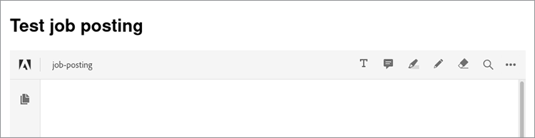

# Stellenausschreibung


Wenn ihr eine Website mit mehreren Benutzern betreibt, ist es wichtig, ein Erlebnis zu gestalten, das jedem ein reibungsloses Erlebnis gewährleistet.

Stellen Sie sich folgendes Szenario vor: Sie haben eine Website, auf der Arbeitgeber [Stellenausschreibungen hochladen](https://www.adobe.io/apis/documentcloud/dcsdk/job-posting.html). Für Arbeitssuchende ist es einfach, alle Dokumente im Zusammenhang mit einer Ausschreibung in einem einheitlichen Format anzuzeigen. Es ist jedoch für Arbeitgeber bequem, Informationen in jedem beliebigen Dateiformat anzuhängen. Um beiden Benutzertypen Komfort zu bieten, können Sie alle hochgeladenen Dokumente automatisch in PDF konvertieren und in die Veröffentlichung einbetten.

## Lernziel.

Dieses praktische Tutorial führt durch ein Beispiel in Node.js, in dem [!DNL Adobe Acrobat Services] und ihre [SDK &quot;Node.js&quot;](https://www.npmjs.com/package/@adobe/documentservices-pdftools-node-sdk) , um diese Funktionen einer Stellenausschreibung hinzuzufügen. So entsteht eine Website, die einfacher zu nutzen ist und für Arbeitgeber und Arbeitssuchende gleichermaßen attraktiver ist. Hier ist die [vollständig](https://github.com/contentlab-io/adobe_job_posting) [Projektschlüssel](https://github.com/contentlab-io/adobe_job_posting), falls Sie die Schritte beim Lesen nachvollziehen möchten.

Richten Sie zunächst eine einfache Express-basierte Web-Anwendung Node.js ein. [Express](https://expressjs.com/) ist ein minimalistisches Framework für Web-Anwendungen, das Funktionen wie Weiterleitung und Vorlage bietet. Der Code für die Anwendung finden Sie unter [GitHub](https://github.com/contentlab-io/adobe_job_posting). Installieren Sie außerdem die [PostgreSQL-Datenbank](https://www.postgresql.org/) und richten Sie es zum Speichern der PDF ein.

## relevant [!DNL Acrobat Services] APIs

* [PDF Embed-API](https://www.adobe.com/devnet-docs/dcsdk_io/viewSDK/index.html)

* [PDF Services API](https://opensource.adobe.com/pdftools-sdk-docs/release/latest/index.html)

## Erstellen von Adobe API-Zugangsberechtigungen

Zuerst müssen Sie [Zugangsdaten erstellen](https://www.adobe.com/go/dcsdks_credentials) für die Adobe PDF Embed-API (kostenlos) und die Adobe PDF Services-API (kostenlos für sechs Monate). [pay as you go](https://www.adobe.io/apis/documentcloud/dcsdk/pdf-pricing.html) für nur \$0.05 pro Dokumenttransaktion). Wenn Sie Anmeldeinformationen für die PDF Services-API erstellen, wählen Sie die Option &quot;Persönliches Codebeispiel erstellen&quot;. Speichern Sie die ZIP-Datei und extrahieren Sie pdftools-api-credentials.json und private.key in das Stammverzeichnis Ihres Node.js Express-Projekts.

Sie benötigen auch einen API-Schlüssel für die frei verfügbare Embed-API. Von [Projekte](https://console.adobe.io/projects)zu dem von Ihnen erstellten Projekt. Klicken Sie anschließend auf **Zu Projekt hinzufügen** und wählen Sie **API**. Klicken Sie abschließend auf **PDF Embed-API**.

Geben Sie die Domäne für die PDF Embed-API an. Der API-Schlüssel muss öffentlich sein (finden Sie ihn im vom Browser ausgeführten Code). Indem Sie eine Domäne angeben, stellen Sie sicher, dass eine andere Person in einer anderen Domäne den API-Schlüssel nicht verwenden kann.

Sie können &quot;localhost&quot; nicht als Domäne verwenden. Geben Sie eine Domäne an, z. B. &quot;testing.local&quot;, und bearbeiten Sie die Hostdatei auf Ihrem Computer, um diese Domäne zu 127.0.0.1, Ihrem Computer, umzuleiten. Anstatt die Anwendung dann auf localhost:3000 zu testen, können Sie sie auf testing.local:3000 testen. Wenn Sie fertig sind, finden Sie den API-Schlüssel für PDF Embed-API auf der Projektseite.

## Hinzufügen eines Upload-Formulars und eines Handlers

Mit einer funktionierenden Express-Anwendung und API-Anmeldedaten benötigen Sie außerdem ein Formular, mit dem Benutzer ihre Dokumente auf die Website hochladen können. Bearbeiten Sie dazu die Vorlage index.jade.

Erstellen Sie ein Eingabefeld für den Namen der hochgeladenen Stellenausschreibung und für ein Dokument, das weitere Informationen enthält.

Fügen Sie innerhalb des Inhaltsblocks der Vorlage das folgende Formular hinzu:

```
extends layout

block content
  h1= title

  form(action="/upload", enctype="multipart/form-data", method="POST")
    label Job posting name:&nbsp;
    input(type="text", name="name", required="required")
    br
    br
    label Describing document:&nbsp;
    input(type="file", name="attachment", required="required")
    br
    br
    input(type="submit", value="Submit job posting")
```

Als Nächstes fügen Sie der POST /upload einen Handler für die Aktionsanforderung hinzu. Fügen Sie dann eine Route für /upload zur Datei routes/index.js hinzu. Sie können eine neue Datei für diese Route erstellen, aber Sie müssen die Datei app.js aktualisieren, damit sie der neuen Datei entspricht. Innerhalb dieses Routenhandlers können Sie auf den angegebenen Namen und die hochgeladene Datei zugreifen.

```
router.post('/upload', async function (req, res, next) {
    const name = req.body.name;
    const fileContents = req.files.attachment.data;

    // code to work with the uploaded document
  });
```

Die Funktion ist asynchron, sodass Sie das await-Schlüsselwort in der Funktion verwenden können. Dies ist praktisch, wenn Sie die Methoden aufrufen, die API-Aufrufe ausführen.


## Verwenden der PDF Services API

Bevor Sie die PDF Services API verwenden, müssen Sie die folgenden Importe oben in der Routendatei hinzufügen:

```
const PDFToolsSdk = require('@adobe/documentservices-pdftools-node-sdk');
  const { Readable } = require('stream');
```

Direkt unter den Importen können Sie API-Zugangsberechtigungen laden und eine [Ausführungsinhalt](https://www.javascripttutorial.net/javascript-execution-context/). Da Sie einen Ausführungskontext für verschiedene Vorgänge wiederverwenden können, ist es sinnvoll, diesen nur einmal zu verwenden.

```
  const credentials = PDFToolsSdk.Credentials
  .serviceAccountCredentialsBuilder()
  .fromFile("pdftools-api-credentials.json")
  .build();

  const executionContext = PDFToolsSdk.ExecutionContext.create(credentials);
```

Kehren Sie jetzt zum Schreiben von Code im Anforderungshandler beim Kommentar im Fenster &quot; `router.post` -Block. Konvertieren Sie zunächst das Dokument in das PDF-Format.

```
  const createPdfOperation = PDFToolsSdk.CreatePDF.Operation.createNew();

  const input = PDFToolsSdk.FileRef.createFromStream(Readable.from(fileContents),
  req.files.attachment.mimetype);

  createPdfOperation.setInput(input);

  let result = await createPdfOperation.execute(executionContext);

  result.saveAsFile('output-pdf' + new Date().getTime() + '.pdf');
  return res.send('success!');
```

Die meisten Vorgänge führen die gleichen vier Schritte aus. Initialisieren Sie zunächst den Typ des Vorgangs mit der createNew-Methode der entsprechenden Klasse. Erstellen Sie dann die Eingabe für den Vorgang, nämlich FileRef. Nachfolgende Vorgänge können diesen Schritt überspringen, da das Ergebnis eines Vorgangs ebenfalls ein FileRef ist. Erstellen Sie für diesen ersten Vorgang einen FileRef-Wert aus den Bytes der hochgeladenen Datei. Drittens müssen Sie die Eingabe dem Vorgang zuweisen. Schließlich wird der Vorgang ausgeführt, wobei der Ausführungskontext als Parameter in der execute-Methode vorhanden ist. Diese Methode gibt ein Promise zurück, damit Sie auf das Ergebnis warten können.

Der Code speichert die zurückgegebene PDF in einer Datei und sendet eine einfache &quot;Erfolgsantwort&quot; an den Browser. Der Teil &quot;Datum&quot; des Dateinamens garantiert einen eindeutigen Dateinamen. Die Datei &quot;saveAsFile&quot; gibt einen Fehler zurück, wenn die Zieldatei vorhanden ist.

## Konvertieren von Bildern in Text und Komprimieren des PDF

Verwenden Sie jetzt die optische Zeichenerkennung (OCR), um Bilder in Text zu konvertieren und das Ergebnis dann zu komprimieren. Dazu verwenden Sie die OCR- und CompressPDF-Vorgänge, die dem CreatePDF-Vorgang ähneln. Fügen Sie Folgendes zur Routendatei hinzu: `router.post`:

```
  const name = req.body.name;
  const fileContents = req.files.attachment.data;

  const createPdfOperation = PDFToolsSdk.CreatePDF.Operation.createNew();
  const input = PDFToolsSdk.FileRef.createFromStream(Readable.from(fileContents),
  req.files.attachment.mimetype);
  createPdfOperation.setInput(input);

  let result = await createPdfOperation.execute(executionContext);

  const ocrOperation = PDFToolsSdk.OCR.Operation.createNew();
  ocrOperation.setInput(result);
  result = await ocrOperation.execute(executionContext);

  const compressPdfOperation = PDFToolsSdk.CompressPDF.Operation.createNew();
  compressPdfOperation.setInput(result);
  result = await compressPdfOperation.execute(executionContext);

  result.saveAsFile('output-pdf' + new Date().getTime() + '.pdf');
  return res.send('success!');
```

Sie müssen diesen Vorgang nur einmal durchführen, da das Ergebnis ein FileRef ist, den der Code an setInput übergeben kann.

Es gibt eine bessere Alternative als die Datei auf einer Festplatte zu speichern und eine übervereinfachte HTTP-Antwort zurückzugeben. Speichern Sie die PDF stattdessen in einer Datenbank und zeigen Sie eine Webseite an, auf der die PDF mithilfe der kostenlosen PDF Embed-API von Adobe eingebettet wird. Auf diese Weise ist die Stellenausschreibung oder Broschüre des Arbeitgebers auf der Website für Arbeitssuchende sichtbar, um sie zusammen mit Firmenlogos und anderen Gestaltungselementen zu finden und anzuzeigen.

## Speichern der PDF in einer Datenbank

Speichern Sie die PDF in einer PostgreSQL-Datenbank. Holen Sie sich das node-postgres Paket, um eine Verbindung mit Postgres in Node.js herzustellen. Installieren Sie das Paket &quot;stream-buffer&quot;, da Sie den Inhalt der PDF irgendwann in einem Puffer speichern müssen. FileRef funktioniert nur mit Streams. Verwenden Sie daher das Paket stream-buffer, um den Inhalt in einen Puffer zu schreiben.

```
npm install pg stream-buffers
```

Erstellen Sie nun eine Datenbanktabelle für Stellenausschreibungen. Sie benötigt eine Spalte für eine eindeutige Kennung, eine Spalte für einen Namen und eine Spalte für die angehängte PDF. Sie können eine Datenbanktabelle über die Postgres-Befehlszeilenschnittstelle (CLI) erstellen:

```
CREATE TABLE job_postings (id TEXT PRIMARY KEY, name TEXT NOT NULL, attachment
BYTEA NOT NULL);
```

Kehren Sie zu den Dateien &quot;Node.js&quot; zurück. Fügen Sie oben in der Datei einige Importe hinzu:

```
  const { Client } = require('pg');
  const streamBuffers = require('stream-buffers');
```

Um die PDF in der Datenbanktabelle zu speichern, ändern Sie die Upload-Funktion. Ersetzen Sie die letzten beiden Zeilen (saveAsFile und send) durch diesen Codeausschnitt:

```
  const pgClient = new Client();
  pgClient.connect();

  const id = Math.random().toString(36).substr(2, 6); // not securely random at all,
  but serves the purpose for this demo

  const writableStream = new streamBuffers.WritableStreamBuffer();
  writableStream.on("finish", async () => {    
    await pgClient.query("INSERT INTO job_postings VALUES ($1, $2, $3)", [
      id,
      name,
      writableStream.getContents()
    ]);
    res.redirect(`/job/${id}`);
  })
  result.writeToStream(writableStream);
```

Erstellen Sie zum Schreiben des Inhalts einen WritableStreamBuffer. Mit dem finish-Ereignis ist es an der Zeit, die SQL-Abfrage auszuführen. Das node-postgres-Paket konvertiert den Buffer-Parameter automatisch in das BYTEA-Format. Die Abfrage leitet den Benutzer zu /job/ um.{id}, einen Endpunkt, der später erstellt wird.

Für die PDF Embed-API benötigen Sie außerdem einen Endpunkt, der nur den PDF-Inhalt zurückgibt:

```
  router.get('/pdf/:id', async function (req, res, next) {
    const id = req.params.id;
 
    const pgClient = new Client();
    pgClient.connect();

  const pgResult = await pgClient.query("SELECT attachment FROM job_postings WHERE id
  = $1", [id]);
  const buffer = pgResult.rows[0].attachment;
  res.type('pdf');
    return res.send(buffer);
  });
```

## Einbetten der PDF

Erstellen Sie nun die Datei /job/{id} -Endpunkt, der eine Vorlage mit dem Namen der angeforderten Stellenausschreibung und einer eingebetteten PDF rendert.

```
router.get('/job/:id', async function(req, res, next) {
    const id = req.params.id;

    const pgClient = new Client();
    pgClient.connect();

    const pgResult = await pgClient.query("SELECT name FROM job_postings WHERE id =
  $1", [id]);
    const name = pgResult.rows[0].name;

    res.render('job', { pdf_url: `/pdf/${id}`, name });
  });
```

Erstellen Sie im Verzeichnis views/ eine Datei job.jade mit folgendem Inhalt:

```
  extends layout

  block content
    h1= name
    div(id='adobe-dc-view')
    script(src='https://documentcloud.adobe.com/view-sdk/main.js')
    script.
      window.embedUrl = "!{pdf_url}";
    script(src='/javascripts/embed-pdf.js')
```

Das erste Skript ist das View SDK der Adobe, mit dem sich die PDF ganz einfach einbetten lässt. Das zweite Skript ist ein Inline-One-Liner, der den Wert von window.embedUrl auf die URL der PDF festlegt, die vom Express-Routenhandler bereitgestellt wird. Erstellen Sie das dritte Skript selbst wie folgt:

```
  document.addEventListener("adobe_dc_view_sdk.ready", function () {
    var adobeDCView = new AdobeDC.View({ clientId: "YOUR API KEY HERE", divId:
   "adobe-dc-view" });
    adobeDCView.previewFile({
      content: { location: { url: '//' + window.location.host + window.embedUrl }
         },
      metaData: { fileName: "Job posting" }
    });
  });
```

Jetzt können Sie den gesamten Prozess des Hochladens eines Dokuments testen, indem Sie zur Seite /job/id umgeleitet werden und die eingebettete PDF anzeigen. Ihre Benutzer führen die gleichen Schritte aus, um eine Stellenausschreibung oder ein anderes Dokument zu Ihrer Website hinzuzufügen.



Wenn Sie eine Inline-Einbettung in Aktion anzeigen möchten, lesen Sie diese [Live-Demo](https://documentcloud.adobe.com/view-sdk-demo/index.html#/view/IN_LINE/Bodea%20Brochure.pdf).

## Nächste Schritte

In diesem praktischen Tutorial lernst du, wie du Node.js mit [!DNL Acrobat Services] , um eine hochgeladene [Stellenausschreibung](https://www.adobe.io/apis/documentcloud/dcsdk/job-posting.html) in verschiedenen Formaten auf eine PDF. Die resultierende PDF wurde dann in eine Webseite eingebettet. Diese Funktion können Sie nun auch in Ihre Website einbinden. So können Arbeitgeber Stellenbeschreibungen, Broschüren und mehr leichter hochladen und von Suchenden finden. Diese Funktionen helfen jedem, die nötigen Informationen zu erhalten, um seinen Traumjob zu finden.

[!DNL Acrobat Services] die wichtigsten Dokumentbearbeitungsfunktionen zu Ihrer Website oder App hinzufügen. Weitere Informationen zu den Möglichkeiten dieser APIs finden Sie in der folgenden Kurzanleitung:

* [PDF Embed-API](https://www.adobe.com/devnet-docs/dcsdk_io/viewSDK/index.html)

* [PDF Services API](https://opensource.adobe.com/pdftools-sdk-docs/release/latest/index.html)

Um Ihre Website um benutzerfreundliche Funktionen zur Dokumentenverarbeitung zu erweitern, [Für kostenlosen Test anmelden](https://www.adobe.io/apis/documentcloud/dcsdk/gettingstarted.html). Adobe PDF Embed-API ist immer kostenlos zu verwenden und Adobe PDF Services API ist für sechs Monate kostenlos, dann ist es nur \$0.05 pro Dokumenttransaktion, sodass Sie [pay as you go](https://www.adobe.io/apis/documentcloud/dcsdk/pdf-pricing.html) mit dem Wachstum eures Unternehmens.
