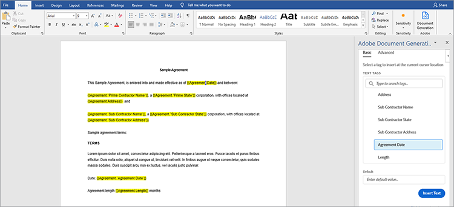

# Verwaltung von Rechtsverträgen


Die Digitalisierung bringt Herausforderungen mit sich. Heute verfügen die meisten Organisationen über viele Typen von [rechtsgültigen Verträgen](https://developer.adobe.com/document-services/use-cases/agreements-and-contracts/legal-contracts), die sie erstellen, bearbeiten, genehmigen und von verschiedenen Parteien signieren müssen. Diese Verträge erfordern häufig individuelle Anpassungen und ein einzigartiges Branding. Unternehmen müssen sie möglicherweise auch in einem geschützten Format speichern, sobald sie signiert wurden, um sie zu schützen. Um all diese Aufgaben zu erledigen, benötigen sie eine robuste Lösung zur Dokumentenerstellung und -verwaltung.

Viele Lösungen bieten eine gewisse Dokumentenerstellung, können aber keine Dateneingaben und bedingte Logik anpassen, wie z. B. Klauseln, die nur für bestimmte Szenarien gelten. Die manuelle Aktualisierung der Rechtsvorlagen eines Unternehmens ist eine Herausforderung und fehleranfällig, da diese Dokumente immer umfangreicher werden. Die Notwendigkeit, diese Prozesse zu automatisieren, ist beträchtlich.

## Lernziel.

In diesem praktischen Tutorial lernen Sie die Funktionen von [[!DNL Adobe Acrobat Services] APIs](https://developer.adobe.com/document-services/apis/doc-generation) bei der Generierung benutzerdefinierter Eingabefelder in Dokumenten kennen. Erfahren Sie außerdem, wie Sie diese generierten Dokumente ganz einfach in ein geschütztes portables Dokumentformat (PDF) konvertieren können, um Datenmanipulation zu verhindern.

In diesem Tutorial lernen Sie, wie Verträge in PDF umgewandelt werden. Damit Sie die Schritte effektiv nachvollziehen können, sollten [Microsoft Word](https://www.microsoft.com/en-us/download/office.aspx) und [Node.js](https://nodejs.org/) auf Ihrem PC installiert sein. Es wird außerdem empfohlen, die Syntax &quot;Node.js&quot; und &quot;[ES6&quot;](https://www.w3schools.com/js/js_es6.asp)&quot; zu verstehen.

## Relevante APIs und Ressourcen

* [API für die Dokumentenerzeugung ](https://developer.adobe.com/document-services/apis/doc-generation) für Adobe

* [PDF Embed-API](https://www.adobe.com/devnet-docs/dcsdk_io/viewSDK/index.html)

* [Adobe Sign-API](https://developer.adobe.com/adobesign-api/)

* [Projektcode](https://github.com/agavitalis/adobe_legal_contracts.git)

## Erstellen von Vorlagendokumenten

Sie können mithilfe der Microsoft Word-Anwendung oder durch Herunterladen der [Word-Mustervorlagen](https://developer.adobe.com/document-services/apis/doc-generation#sample-blade) von Adobe rechtliche Dokumente erstellen. Trotzdem ist es nicht einfach, die Eingaben anzupassen und diese Dokumente digital zu signieren, ohne einige Hilfstools wie das [Add-in zum Erzeugen von Adobe-Dokumenten](https://developer.adobe.com/document-services/docs/overview/document-generation-api/wordaddin) für Microsoft Word zu verwenden.

Der Tagger für die Dokumentgenerierung ist ein Microsoft Word-Add-in, das die Anpassung von Dokumenten mithilfe von Tags erleichtert. Es ermöglicht die Erstellung dynamischer Felder in Dokumentvorlagen, die mithilfe von JSON-Daten dynamisch ausgefüllt werden.


Um die Verwendung von Tagger für die Dokumentenerzeugung zu veranschaulichen, installieren Sie dieses Add-In und erstellen Sie dann ein JSON-Datenmodell, das beim Tagging eines einfachen Rechtsvertragsdokuments verwendet wird.

Installieren Sie den Tagger für die Dokumentgenerierung in Word, indem Sie auf die Registerkarte **Einfügen** klicken. Klicken Sie dann in der Gruppe Add-Ins auf **Meine Add-Ins**. Suchen Sie im Office Add-ins-Menü nach &quot;Adobe Document Generation&quot;, klicken Sie auf **Add**, und folgen Sie dem Vorgang. Sie können diese Schritte in der obigen Bildschirmaufnahme sehen.

Erstellen Sie nach der Installation des Add-Ins Dokumentenerzeugung-Tagger für Word ein einfaches JSON-Datenmodell, um das rechtliche Dokument mit Tags zu versehen.

Um fortzufahren, öffnen Sie einen beliebigen Editor Ihrer Wahl, erstellen Sie eine Datei namens Agreement.json und fügen Sie den Codeausschnitt unten in die von Ihnen erstellte JSON-Datei ein.

```
{
"Agreement": {
"Date": "1/24/2021",
"Prime Contractor Name": "Ogbonna Vitalis Corp",
"Prime State": "Lagos",
"Address": "Maryland Ave, Lagos State, Ng",
"Sub Contractor Name": "Vivvaa Soln",
"Sub Contractor State": "California",
"Sub Contractor Address": "Molusi Avenue, Dallas Texas, CA",
"Agreement Date": "1/24/2021",
"Length": 5
}
}
```

Importieren Sie das JSON-Dokument nach dem Speichern in das Add-In &quot;Dokumentenerzeugung - Tagger&quot;. Importieren Sie das Dokument, indem Sie in der Adobe-Gruppe rechts oben im Word-Bildschirm auf **Dokumentenerzeugung** klicken, wie in der Bildschirmaufnahme unten gezeigt.


Daraufhin wird ein Video als Anleitung angezeigt. Sie können es beobachten oder direkt zum Tag-Feld wechseln, indem Sie auf **Erste Schritte** klicken. Nach dem Klicken auf **Erste Schritte** wird ein Upload-Formular angezeigt. Klicken Sie auf **JSON-Datei hochladen**, und wählen Sie die eben erstellte JSON-Datei aus. Wenn der Import abgeschlossen ist, klicken Sie auf **Tag generieren**, um die Tags zu generieren.

Nach dem Importieren und Generieren von Tags können Sie diese Tags zu Ihrem Dokument hinzufügen. Platzieren Sie den Cursor zum Hinzufügen an der Stelle, an der das Tag angezeigt werden soll. Wählen Sie dann ein Tag aus der Dokumentengenerierungs-API aus und klicken Sie auf **Text einfügen**. Die Bildschirmaufnahme unten beschreibt dieses Verfahren.



Neben den grundlegenden Tags, die mit dem importierten JSON-Datenmodell erstellt wurden, können Sie auch erweiterte Funktionen für weitere Optionen verwenden, z. B. Bilder, bedingte Logik, Berechnungen, sich wiederholende Elemente und bedingte Ausdrücke. Sie können auf diese Funktionen zugreifen, indem Sie im Fenster &quot;Tagger für Dokumentengenerierung&quot; auf **Erweitert** klicken. Sie können dies in der Bildschirmaufnahme unten sehen.


Diese erweiterten Funktionen unterscheiden sich nicht von den grundlegenden Tags. Um bedingte Logik einzubeziehen, wählen Sie den Teil des Dokuments aus, der ausgefüllt werden soll. Konfigurieren Sie dann die Regel, die das Einfügen des Tags bestimmt.

Zur weiteren Veranschaulichung, z. B. in der Vereinbarung, gibt es einen Abschnitt, den Sie nur bedingt einbeziehen möchten. Wählen Sie im Feld Inhaltstyp auswählen den Abschnitt **aus.** Wählen Sie im Feld &quot;Datensätze auswählen&quot; die Option aus, die bestimmt, ob der bedingte Abschnitt angezeigt wird. Wählen Sie den gewünschten bedingten Operator aus und legen Sie im Feld Wert den Wert fest, auf den Sie testen. Klicken Sie dann auf **Bedingung einfügen.** Die folgende Bildschirmaufnahme veranschaulicht diesen Vorgang.


Wählen Sie bei Berechnungen entweder &quot;Arithmetik&quot; oder &quot;Aggregation&quot; aus und geben Sie dann den ersten Datensatz, den Operator und den zweiten Datensatz an, der basierend auf den verfügbaren Vorlagen-Tags verwendet werden soll. Klicken Sie dann auf **Berechnung einfügen**.

Rechtsverträge bedürfen außerdem häufig der Unterschrift der beteiligten Parteien. Sie können eine E-Signatur mithilfe von Adobe Sign-Text-Tags einfügen, die sich direkt unter dem Abschnitt &quot;Numerische Berechnungen&quot; befinden. Um die E-Signatur einzuschließen, müssen Sie die Anzahl der Empfänger angeben, **Unterzeichner** auswählen und den Feldtyp entsprechend aus den Dropdown-Listen auswählen. Klicken Sie anschließend auf **Adobe Sign-Text-Tag einfügen**, um den Vorgang abzuschließen.

Speichern Sie rechtliche Dokumente in einem geschützten Format, um die Datenintegrität zu gewährleisten. Mit [!DNL Acrobat Services] APIs können Sie Dokumente schnell in das PDF-Format umwandeln. Sie können eine einfache Express-Anwendung Node.js erstellen, die Dokumentgenerierungs-API darin integrieren und diese einfache Anwendung verwenden, um Ihr mit Tags versehenes Dokument vom Word- in das PDF-Format zu konvertieren.

## Projekteinrichtung

Richten Sie zunächst die Ordnerstruktur für die Anwendung Node.js ein. Rufen Sie in diesem Beispiel diese einfache Anwendung AdobeLegalContractAPI auf. Sie können den Quellcode [ hier abrufen: ](https://github.com/agavitalis/adobe_legal_contracts.git).

### Verzeichnisstruktur

Erstellen Sie einen Ordner mit dem Namen AdobeLegalContractAPI und öffnen Sie ihn in einem Editor Ihrer Wahl. Erstellen Sie mithilfe der folgenden Ordnerstruktur eine einfache Anwendung &quot;Node.js&quot; mit dem Befehl &quot;```npm init```&quot;:

```
###Directory Structure
AdobeLegalContractAPI
-----config
----------default.json
-----controllers
----------createPDFController.js
----------previewController.js
-----models
----------document.js
-----routes
----------web.js
-----services
-----------upload.js
-----uploads
-----views
-----index.js
```

Oben sehen Sie eine einfache Anwendungsstruktur &quot;Node.js&quot; für Ihre Anwendung. Fahren Sie nun mit der Installation der notwendigen npm-Pakete fort.

### Paketinstallation

Installieren Sie die erforderlichen Pakete mithilfe des Befehls npm install, wie im folgenden Codefragment gezeigt:

```
npm install express body-parser morgan multer hbs path config mongoose
```

Stellen Sie nach der Installation der Pakete sicher, dass der Inhalt der Datei package.json dem folgenden Codefragment ähnelt:

```
###package.json
{
"name": "adobelegalcontractapi",
"version": "1.0.0",
"description": "",
"main": "index.js",
"directories": {
"test": "test"
},
"dependencies": {
"body-parser": "^1.19.0",
"config": "^3.3.6",
"express": "^4.17.1",
"hbs": "^4.1.1",
"mongoose": "^5.12.1",
"morgan": "^1.10.0",
"multer": "^1.4.2",
"path": "^0.12.7"
},
"devDependencies": {},
"scripts": {
"start": "node index.js"
},
"repository": {
"type": "git",
"url": "https://github.com/agavitalis/adobe_legal_contracts.git"
},
"author": "Ogbonna Vitalis",
"license": "ISC",
"bugs": {
"url": "https://github.com/agavitalis/adobe_legal_contracts/issues"
},
"homepage": "https://github.com/agavitalis/adobe_legal_contracts#readme"
}
```

In diesen Codefragmenten haben Sie die Anwendungsabhängigkeiten installiert, einschließlich des Handlebars-Vorlagenmoduls für die Ansicht.

Der Hauptschwerpunkt in diesem Tutorial liegt auf der Verwendung von [[!DNL Acrobat Services] APIs](https://developer.adobe.com/document-services/homepage/) zum Konvertieren von Dokumenten in PDF. Daher gibt es keinen schrittweisen Prozess zum Erstellen dieser Anwendung &quot;Node.js&quot;. Sie können jedoch den vollständigen funktionierenden Anwendungscode &quot;Node.js&quot; auf &quot;[GitHub](https://github.com/agavitalis/adobe_legal_contracts.git)&quot; abrufen.

## Integrieren von [!DNL Adobe Acrobat Services] APIs in eine Node.js-Anwendung

[!DNL Adobe Acrobat Services] APIs sind Cloud-basierte, zuverlässige Dienste, die für die nahtlose Bearbeitung von Dokumenten entwickelt wurden. Es bietet drei APIs:

* Adobe PDF Services API

* Adobe PDF Embed-API

* API für die Dokumentenerzeugung in Adobe

Sie benötigen Anmeldeinformationen, um [!DNL Acrobat Services]-APIs verwenden zu können (die sich von Ihren PDF Embed-API-Anmeldeinformationen unterscheiden). Wenn Sie keine gültigen Anmeldeinformationen haben, [registrieren Sie sich](https://www.adobe.com/go/dcsdks_credentials?ref=getStartedWithServicesSDK) und schließen Sie den Arbeitsablauf ab, wie in der Bildschirmaufnahme unten dargestellt. Profitieren Sie von einer [kostenlosen sechsmonatigen Testversion und einer Vorauszahlung](https://developer.adobe.com/document-services/pricing/main), nur $0,05 pro Dokumenttransaktion.


Sobald der Anmeldevorgang abgeschlossen ist, wird automatisch ein Codebeispiel auf Ihren PC heruntergeladen, das Ihnen den Einstieg erleichtern soll. Sie können dieses Codebeispiel extrahieren und die Schritte nachvollziehen. Vergessen Sie nicht, die Dateien pdftools-api-credentials.json und private.key aus dem extrahierten Codebeispiel in das Stammverzeichnis des Node.js-Projekts zu kopieren. Die Anmeldeinformationen sind erforderlich, bevor Sie auf [!DNL Acrobat Services] API-Endpunkte zugreifen können. Sie können auch SDK-Beispiele mit Ihren personalisierten Anmeldedaten herunterladen, sodass Sie den Schlüssel im Beispielcode nicht aktualisieren müssen.

Installieren Sie jetzt Adobe PDF Services Node SDK, indem Sie den Befehl &quot;```npm install \--save @adobe/documentservices-pdftools-node-sdk```&quot; mit dem Terminal im Stammverzeichnis der Anwendung ausführen. Nach erfolgreicher Installation können Sie [!DNL Acrobat Services] APIs verwenden, um Dokumente in Ihrer Anwendung zu bearbeiten.

## Erstellen eines PDF-Dokuments

[!DNL Acrobat Services] APIs unterstützen die Erstellung von PDF aus Microsoft Office-Dokumenten (Word, Excel und PowerPoint) und anderen [ unterstützten Dateiformaten](https://opensource.adobe.com/pdftools-sdk-docs/release/latest/howtos.html#create-a-pdf) wie TXT, RTF, BMP, JPEG, GIF, TIFF und PNG. Mit Acrobat Service-APIs können Sie Rechtsverträge ganz einfach aus jedem anderen Dateiformat in PDF konvertieren.

Die Adobe-API für die Dokumentgenerierung ermöglicht die Konvertierung in eine Word-Datei oder eine PDF. Sie können z. B. eine Word-Vorlage verwenden, um einen Vertrag zu generieren, einschließlich des Redlinings, um bearbeiteten Text zu markieren. Konvertieren Sie es dann auf eine PDF und verwenden Sie die PDF Services API, um das Dokument mit einem Kennwort zu schützen, zum Unterschreiben zu senden und vieles mehr.

Zum Implementieren der Erstellung von PDF-Dokumenten aus den verfügbaren unterstützten Dateiformaten ist ein Formular zum Hochladen eines Dokuments für die Transformation mit [!DNL Acrobat Services] vorhanden.

Das erstellte Upload-Formular wird in der Bildschirmaufnahme unten angezeigt, und Sie können auf die HTML- und CSS-Dateien in [GitHub](https://github.com/agavitalis/adobe_legal_contracts.git) zugreifen.


Fügen Sie nun die folgenden Codefragmente zur Datei &quot;controller /createPDFController.js&quot; hinzu. Dieser Code ruft das hochgeladene Dokument ab und wandelt es in PDF um. [!DNL Acrobat Services] speichert die hochgeladene Originaldatei und die transformierte Datei in verschiedenen Ordnern.

```
###controllers/createPDFController.js
const PDFToolsSdk = require('@adobe/documentservices-pdftools-node-sdk');
const Document = require('../models/document');
/*
* GET / route to show the createPDF form.
*/
function createPDF(req, res) {
//catch any response on the url
let response = req.query.response
res.render('index', { response })
}
/*
* POST /createPDF to create a new PDF File.
*/
function createPDFPost(req, res) {
let filePath = req.file.path;
let fileName = req.file.filename;
try {
// Initial setup, create credentials instance.
const credentials = PDFToolsSdk.Credentials
.serviceAccountCredentialsBuilder()
.fromFile("pdftools-api-credentials.json")
.build();
// Create an ExecutionContext using credentials and create a new operation instance.
const executionContext = PDFToolsSdk.ExecutionContext.create(credentials),
createPdfOperation = PDFToolsSdk.CreatePDF.Operation.createNew();
// Set operation input from a source file.
const input = PDFToolsSdk.FileRef.createFromLocalFile(filePath);
createPdfOperation.setInput(input);
// Execute the operation and Save the result to the specified location.
createPdfOperation.execute(executionContext)
.then(async(result) => {
let newFileName = `createPDFFromDOCX-${Math.random() * 171}.pdf`
let newFilePath = require('path').resolve('./') + `\\output\\${newFileName}`
await result.saveAsFile(`views/output/${newFileName}`)
//Creates a new document
let newDocument = new Document({
documentName: newFileName,
url: newFilePath
});
//Save it into the DB.
newDocument.save((err, docs) => {
if (err) {
res.send(err);
}
else {
res.redirect('/?response=PDF Successfully created')
}
});
})
.catch(err => {
if (err instanceof PDFToolsSdk.Error.ServiceApiError
|| err instanceof PDFToolsSdk.Error.ServiceUsageError) {
console.log('Exception encountered while executing operation', err);
} else {
console.log('Exception encountered while executing operation', err);
}
});
} catch (err) {
console.log('Exception encountered while executing operation', err);
}
}
//export all the functions
module.exports = { createPDF, createPDFPost };
```

Der obige Codeausschnitt benötigte das Dokumentmodell und das [!DNL Acrobat Services]-Knoten-SDK, die Sie zuvor installiert haben. Es gibt zwei Funktionen:

* createPDF zeigt das Formular zum Hochladen des Dokuments an.

* createPDFPost wandelt das hochgeladene Dokument in eine PDF um.

Die Funktionen speichern die transformierten PDF-Dokumente im Views/Output Verzeichnis, wo Sie sie auf Ihren PC herunterladen können.

Sie können die transformierte PDF-Datei auch mithilfe der kostenlosen PDF Embed-API in der Vorschau anzeigen. Mit der PDF Embed-API können Sie hier [&#128279;](https://www.adobe.com/go/dcsdks_credentials) Adobe-Anmeldeinformationen (anders als Ihre [!DNL Acrobat Services]-Anmeldeinformationen) generieren und die zugelassenen Domänen für den Zugriff auf die API registrieren.  Führen Sie den Vorgang aus und generieren Sie die PDF Embed-API-Zugangsberechtigungen für Ihre Anwendung. Sie können sich auch die Demonstration [hier](https://documentcloud.adobe.com/view-sdk-demo/index.html#/view/FULL_WINDOW/Bodea%20Brochure.pdf) ansehen, aus der Sie ganz einfach Codes generieren können, um schnell loszulegen.

Erstellen Sie in der Anwendung die Dateien list.hbs und preview.hbs im Ansichtsordner der Anwendung und fügen Sie den folgenden Codeausschnitt in die Dateien list.hbs bzw. preview.hbs ein.

```
###views/list.hbs
<!DOCTYPE html>
<html lang="en">
<head>
<title>Adobe Legal Contract</title>
<!-- Meta tags -->
<meta charset="UTF-8">
<meta name="viewport" content="width=device-width,
initial-scale=1.0">
<meta http-equiv="X-UA-Compatible" content="ie=edge">
<!-- //Meta tags -->
<link
href=".min.css" rel="stylesheet" integrity="sha384-eOJMYsd53ii+scO/
bJGFsiCZc+5NDVN2yr8+0RDqr0Ql0h+rP48ckxlpbzKgwra6" crossorigin="anonymous">
<link rel="stylesheet" href="css/style.css" type="text/css"
media="all" /><!-- Style-CSS -->
<link href="css/font-awesome.css" rel="stylesheet" /><!--
font-awesome-icons -->
</head>
<body>
<section>
<div class="form-36-mian section-gap">
<div class="wrapper">
<div class="container">
<div class="row">
{{#each documents}}
<div class="col-md-4 mb-2">
<div class="card" style="width:
18rem;">

<div class="card-body">
<h5
class="card-title">{{documentName}}</h5>
<a
href="/downloadPDF/{{_id}}" class="btn btn-primary"><i class="fa
fa-download" aria-hidden="true"></i> Download</a>
<a
href="/previewPDF/{{_id}}" class="btn btn-info"><i class="fa fa-eye"
aria-hidden="true"></i> Preview</a>
</div>
</div>
</div>
{{/each}}
</div>
</div>
<!-- copyright -->
<div class="copy-right">
<p>(c) 2021 Vitalis</p>
</div>
<!-- //copyright -->
</div>
</div>
</section>
</body>
</html>
###views/preview.hbs
<!DOCTYPE html>
<html lang="en">
<head>
<title>[!DNL Adobe Acrobat Services] PDF Embed API</title>
<meta charset="utf-8" />
<meta http-equiv="X-UA-Compatible" content="IE=edge,chrome=1" />
<meta id="viewport" name="viewport" content="width=device-width,
initial-scale=1" />
</head>
<body style="margin: 0px">
<input type="hidden" id="pdfDocumentName"
value={{document.documentName}} />
<input type="hidden" id="pdfDocumentUrl" value={{document.url}} />
<div id="adobe-dc-view"></div>
<script
src="https://documentcloud.adobe.com/view-sdk/main.js"></script>
<script type="text/javascript">
let pdfDocumentName =
document.getElementById("pdfDocumentName").value;
let pdfDocumentUrl =
document.getElementById("pdfDocumentUrl").value;
document.addEventListener("adobe_dc_view_sdk.ready", function
() {
var adobeDCView = new AdobeDC.View({ clientId:
"XXXXXXXXXXXXXXXX", divId: "adobe-dc-view" });
adobeDCView.previewFile({
content: { location: { url:
`http://localhost:5000/output/${pdfDocumentName}` } },
metaData: { fileName: pdfDocumentName }
}, {});
});
</script>
</body>
</html>
```

Erstellen Sie außerdem eine controller/previewController.js und fügen Sie die folgenden Codefragmente ein.

```
const Document = require('../models/document');
/*
* GET /listFiles route to show PDF file lists.
*/
async function listFiles(req, res) {
let documents = await Document.find({});
res.render('lists', { documents })
}
/*
* GET /previewPDF route to show PDF file in AdobeEmbedAPI.
*/
async function previewPDF(req, res) {
//catch any response on the url
let documentId = req.params.documentId
let document = await Document.findOne({_id:documentId});
res.render('preview', { document })
}
/*
* GET /downloadPDF To Download PDF Documents.
*/
async function downloadPDF(req, res) {
let documentId = req.params.documentId
let document = await Document.findOne({_id:documentId});
res.download(document.url);
}
//export all the functions
module.exports = {listFiles, previewPDF, downloadPDF };
```

In der Controller-Datei oben gibt es drei Funktionen: listFiles, previewPDF und downloadPDF. Die Funktion listFiles listet alle PDF-Dateien auf, die bisher mit [!DNL Acrobat Services]-APIs generiert wurden. Mit der Funktion previewPDF können Sie eine Vorschau der PDF-Dateien mithilfe der PDF Embed-API anzeigen. Mit der Funktion downloadPDF können Sie die generierte PDF-Datei auf Ihren PC herunterladen. Die folgende Bildschirmabbildung zeigt ein Beispiel für die PDF-Vorschau mit der PDF Embed-API.


## Übersicht

In diesem praktischen Tutorial haben Sie ein Dokument mit dem Microsoft Word-Add-in zum Generieren von Dokumenten mit Tags versehen. Integrieren Sie dann [!DNL Acrobat Services] APIs in eine Node.js-Anwendung, und
hat ein Dokument mit Tags in ein herunterladbares PDF-Format konvertiert, obwohl Sie den Rechtsvertrag auch direkt auf PDF hätten erstellen können. Schließlich haben Sie die Adobe PDF Embed-API verwendet, um eine Vorschau der generierten PDF zur Überprüfung und Signatur anzuzeigen.

Die fertige Anwendung erleichtert es erheblich, [Vorlagen für rechtsgültige Verträge](https://developer.adobe.com/document-services/use-cases/agreements-and-contracts/legal-contracts) mit dynamischen Feldern zu taggen, sie in PDF zu konvertieren, in der Vorschau anzuzeigen und sie mit [!DNL Acrobat Services] APIs zu signieren. Anstatt Zeit für die Erstellung eines individuellen Vertrags aufzuwenden, kann euer Team automatisch den richtigen Vertrag an jeden Kunden senden und so mehr Zeit für den Ausbau eures Unternehmens aufwenden.

Organisationen verwenden [!DNL Adobe Acrobat Services]-APIs für ihre Vollständigkeit und Benutzerfreundlichkeit. Und das Beste ist: Sie können eine [sechsmonatige kostenlose Testversion und dann Pay-as-you-go](https://developer.adobe.com/document-services/pricing/main) nutzen. Du bezahlst nur für das, was du nutzt. Die PDF Embed-API ist immer kostenlos.

Sind Sie bereit, Ihre Produktivität durch Verbesserung Ihres Dokumentflusses zu steigern? [Jetzt loslegen](https://www.adobe.io/apis/documentcloud/dcsdk/gettingstarted.html) heute.
