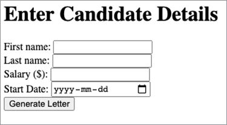

# Angebotsschreiben von Mitarbeitern verwalten


Angebotsschreiben von Mitarbeitern sind eine der ersten Erfahrungen, die Mitarbeiter mit Ihrer Organisation machen. Daher ist es wichtig, dass eure Angebotsschreiben zur Marke passen, aber ihr möchtet nicht jedes Mal einen Brief von Grund auf neu in eurem Textverarbeitungsprogramm erstellen müssen. [!DNL Adobe Acrobat Services]-APIs bieten eine schnelle, einfache und effektive Möglichkeit, wichtige Teile von [ zu verarbeiten, indem sie Angebotsschreiben erstellen und an neue Mitarbeiter senden](https://developer.adobe.com/document-services/use-cases/agreements-and-contracts/employee-offer-letters).

## Lernziel.

Dieses praktische Tutorial führt Sie durch die Einrichtung eines Node Express-Projekts, das ein Webformular für einen Benutzer anzeigt, um die Mitarbeiterdetails anzuzeigen. Diese Angaben verwenden [!DNL Acrobat Services] über das Internet, um ein Angebotsschreiben als PDF zu generieren, das einem Kunden zur Signatur mithilfe der Adobe Sign-API zugestellt werden kann.

## Relevante APIs und Ressourcen

* [PDF Services-API](https://opensource.adobe.com/pdftools-sdk-docs/release/latest/index.html)

* [API für die Dokumentenerzeugung ](https://developer.adobe.com/document-services/apis/doc-generation) für Adobe

* [Adobe Sign-API](https://developer.adobe.com/adobesign-api/)

* [Word-Add-in für Tagger für Dokumenterstellung](https://developer.adobe.com/document-services/docs/overview/document-generation-api/wordaddin)

* [Projektbeispiel](https://developer.adobe.com/document-services/use-cases/agreements-and-contracts/employee-offer-letters)

## Erste Schritte

[Node.js](https://nodejs.org/) ist die Programmierplattform. Es verfügt über eine enorme Menge an Bibliotheken, wie z. B. den Express Webserver. [Laden Sie Node.js](https://nodejs.org/en/download/) herunter und befolgen Sie die Schritte zum Installieren dieser großartigen Open-Source-Entwicklungsumgebung.

Um die Adobe-Dokumentengenerierungs-API in &quot;Node.js&quot; zu verwenden, wechseln Sie zur Website [Dokumentengenerierungs-API](https://developer.adobe.com/document-services/apis/doc-generation), um auf Ihr Konto zuzugreifen oder sich für ein neues Konto zu registrieren. Ihr Konto ist sechs Monate lang [kostenlos und zahlt dann nach Bedarf](https://developer.adobe.com/document-services/pricing/main) für nur 0,05 US-Dollar pro Dokumenttransaktion, sodass Sie es risikofrei ausprobieren und dann nur zahlen können, wenn Ihr Unternehmen wächst.

Nachdem Sie sich bei der [Adobe Developer Console](https://developer.adobe.com/console/) angemeldet haben, klicken Sie auf **[!UICONTROL Neues Projekt erstellen]**. Das Projekt hat standardmäßig den Namen &quot;Projekt 1&quot;. Klicken Sie auf die Schaltfläche **[!UICONTROL Projekt bearbeiten]** und ändern Sie den Namen in &quot;Angebotsschreiben-Generator&quot;. In der Mitte des Bildschirms befindet sich der Abschnitt **[!UICONTROL Erste Schritte mit Ihrem neuen Projekt]**. Um die Sicherheit Ihres Projekts zu aktivieren, führen Sie die folgenden Schritte aus:

Klicken Sie auf **API hinzufügen**. Es wird eine Reihe von APIs zur Auswahl angezeigt. Wählen Sie im Abschnitt **[!UICONTROL Nach Produkt filtern]** die Option **[!UICONTROL Document Cloud]** aus, und klicken Sie dann auf **[!UICONTROL Weiter]**.

Generieren Sie jetzt die Anmeldeinformationen, um auf die API zuzugreifen. Die Anmeldeinformationen liegen in Form eines JSON-Web-Tokens ([JWT](https://jwt.io/)) vor: einem offenen Standard für sichere Kommunikation. Wenn Sie mit JWT vertraut sind und bereits Schlüssel generiert haben, können Sie hier Ihren öffentlichen Schlüssel hochladen. Alternativ können Sie mit **Option 1** fortfahren, damit Adobe die Schlüssel für Sie generiert.


Klicken Sie auf die Schaltfläche **[!UICONTROL Tastenpaar generieren]**. Sie erhalten eine config.zip -Datei zum Herunterladen. Entpacken Sie die Archivdatei. Es enthält zwei Dateien: certificate_pub.crt und private.key. Achten Sie darauf, dass die Sicherheitseinstellungen aktiviert sind, da sie Ihre persönlichen Daten enthalten und dazu verwendet werden können, falsche Dokumente zu generieren, falls Sie diese nicht mehr kontrollieren.

Klicken Sie auf **[!UICONTROL Weiter]**. Nein, ermöglicht den Zugriff auf die PDF-Generierungs-API. Aktivieren Sie auf dem Bildschirm **[!UICONTROL Produktprofile auswählen]** die Option **[!UICONTROL Enterprise PDF Services Developer]**, und klicken Sie auf die Schaltfläche **[!UICONTROL Konfigurierte API speichern]**. Jetzt können Sie die API verwenden.

## Einrichten des Projekts

Einrichten eines Knotenprojekts, um den Code auszuführen. In diesem Beispiel wird [Visual Studio Code](https://code.visualstudio.com/) (VS-Code) als Editor verwendet. Erstellen Sie einen Ordner namens &quot;letter-generator&quot; und öffnen Sie ihn in VS Code. Wählen Sie im Menü **[!UICONTROL Datei]** die Option **[!UICONTROL Terminal]** \> **[!UICONTROL Neues Terminal]** aus, um eine Shell in diesem Ordner zu öffnen. Überprüfen Sie, ob Node installiert ist und sich auf Ihrem Pfad befindet, indem Sie Folgendes eingeben:

```
node -v
```

Sie sollten die Version von Node sehen, die Sie installiert haben.

Nachdem Sie Ihre Entwicklungsumgebung installiert haben, können Sie mit dem Erstellen Ihres Projekts fortfahren.

Initialisieren Sie zunächst das Projekt mit dem Node Package Manager (npm). Geben Sie Folgendes ein:

```
npm init
```

Ihnen werden einige Fragen zu Ihrem Node-Projekt gestellt. Sie können die meisten dieser Fragen überspringen, aber stellen Sie sicher, dass der Projektname &quot;letter-generator&quot; und der Einstiegspunkt **index.js** lautet. Wählen Sie **Ja**, um die Projektinitialisierung abzuschließen.

Du hast jetzt eine package.json-Datei. Node verwendet diese Datei, um Ihr Projekt zu organisieren. Bevor Sie die Datei &quot;index.js&quot; erstellen, müssen Sie Adobe-Bibliotheken mit den folgenden Eigenschaften hinzufügen:
Befehl:

```
npm install --save @adobe/documentservices-pdftools-node-sdk
```

Es sollte ein neuer Ordner mit dem Namen node_modules zu Ihrem Projekt hinzugefügt werden. In diesem Ordner werden alle Bibliotheken (im Knoten Abhängigkeiten genannt) heruntergeladen. Die Datei package.json wird ebenfalls mit einem Verweis auf Adobe PDF Services aktualisiert.

Jetzt möchten Sie Express als Ihr schlankes Web-Framework installieren. Geben Sie den folgenden Befehl ein:

```
npm install express –save
```

Wie zuvor wird der Abschnitt &quot;Abhängigkeiten&quot; von package.json entsprechend aktualisiert.

## Vorlagen für Angebotsschreiben erstellen

Erstellen Sie nun im Projektstamm eine Datei mit dem Namen &quot;app.js&quot;. Fügen wir den folgenden Startcode hinzu:

```
const express = require('express');
const bodyParser = require('body-parser');
const PDFToolsSdk = require('@adobe/documentservices-pdftools-node-sdk')
const path = require('path');
const app = express();
const port = 8000;
app.use(bodyParser.urlencoded({ extended: true }));
app.get('/', (req, res) => {
res.sendFile(path.join(__dirname + '/index.html'));
});
app.post('/', (req, res) => {
console.log('Got body:', req.body);
res.sendStatus(200);
});
app.listen(port, () => {
console.log(`Candidate offer letter app listening on port ${port}!`)
});
```

Beachten Sie, dass die Get-Route eine **index.html**-Datei zurückgibt. Erstellen Sie eine HTML-Datei mit diesem Namen und der folgenden einfachen Form. Sie können CSS-Stile und andere Design-Elemente später nach Belieben hinzufügen. Dieses Formular enthält die grundlegenden Details des Bewerbers zum Erstellen eines Begrüßungsschreibens:

```
<!DOCTYPE html>
<html lang="en">
<head>
<meta charset="UTF-8">
<meta http-equiv="X-UA-Compatible" content="IE=edge">
<meta name="viewport" content="width=device-width, initial-scale=1.0">
<title>Offer Letter Generator</title>
</head>
<body>
<h1>Enter Candidate Details</h1>
<form action="" method="post">
<div>
<label for="firstname">First name: </label>
<input type="text" name="firstname" id="firstname" required>
</div>
<div>
<label for="lastname">Last name: </label>
<input type="text" name="lastname" id="lastname" required>
</div>
<div>
<label for="salary">Salary ($): </label>
<input type="number" name="salary" id="salary" required>
</div>
<div>
<label for="startdate">Start Date: </label>
<input type="date" name="startdate" id="startdate" required>
</div>
<div>
<input type="submit" value="Generate Letter">
</div>
</form>
</body>
</html>
```

Führen Sie den Webserver mit dem folgenden Befehl aus:

```
node app.js
```

Sie sollten die Meldung &quot;Candidate offer letter app listen on port 8000&quot; sehen. Wenn Sie Ihren Browser zu <http://localhost:8000/> öffnen, sollte das Formular wie folgt aussehen:



Beachten Sie, dass das Formular an sich selbst gesendet wird. Wenn Sie Daten eingeben und auf **Brief generieren** klicken, sollten Sie die folgenden Informationen auf der Konsole sehen:

```
Got body: { firstname: 'John',
lastname: 'Doe',
salary: '887888',
startdate: '2021-04-01' }
```

Sie ersetzen diese Konsolenprotokollierung durch einen Webdienstaufruf an [!DNL Acrobat Services]. Zuerst müssen Sie ein JSON-basiertes Modell der Informationen erstellen. Das Format dieses Modells sieht folgendermaßen aus:

```
{
    "offer_letter": {
    "firstname": "John",
    "lastname": "Doe",
    "salary": "887888",
    "startdate": "2021-04-01"
    }
}
```

Du kannst das Modell auf Wunsch etwas aufwändiger gestalten. In diesem Tutorial lernst du aber ein einfaches Beispiel. Dieses Formular wurde nicht validiert, da es nicht in den Geltungsbereich dieses Artikels fällt. Um den Formulartext in das oben beschriebene Datenmodell zu konvertieren, ändern Sie die app.post-Handler-Methode in folgenden Code:

```
app.post('/', (req, res) => {
const docModel = {'offer_letter': req.body};
generateLetter(docModel);
res.sendStatus(200);
});
```

In der ersten Zeile werden Ihre JSON-Daten im gewünschten Format abgelegt. Diese Daten übergeben Sie nun an eine generateLetter-Funktion. Beenden Sie den Server und fügen Sie den folgenden Code am Ende von app.js ein. In diesem Code wird ein Word-Dokument als Vorlage verwendet, und Platzhalter werden mit Informationen aus einem JSON-Dokument gefüllt.

```
// Letter generation function
function generateLetter(jsonDataForMerge) {
try {
// Initial setup, create credentials instance.
const credentials = PDFToolsSdk.Credentials
.serviceAccountCredentialsBuilder()
.fromFile("pdftools-api-credentials.json")
.build();
// Create an ExecutionContext using credentials
const executionContext = PDFToolsSdk.ExecutionContext.create(credentials);
// Create a new DocumentMerge options instance
const documentMerge = PDFToolsSdk.DocumentMerge,
documentMergeOptions = documentMerge.options,
options = new documentMergeOptions.DocumentMergeOptions(jsonDataForMerge,
documentMergeOptions.OutputFormat.PDF);
// Create a new operation instance using the options instance
const documentMergeOperation = documentMerge.Operation.createNew(options)
// Set operation input document template from a source file.
const input = PDFToolsSdk.FileRef.createFromLocalFile(
'resources/OfferLetter-Template.docx');
documentMergeOperation.setInput(input);
// Execute the operation and Save the result to the specified location.
documentMergeOperation.execute(executionContext)
.then(result => result.saveAsFile('output/OfferLetter.pdf'))
.catch(err => {
if(err instanceof PDFToolsSdk.Error.ServiceApiError
|| err instanceof PDFToolsSdk.Error.ServiceUsageError) {
console.log(
'Exception encountered while executing operation', err);
} else {
console.log(
'Exception encountered while executing operation', err);
}
});
} catch (err) {
console.log('Exception encountered while executing operation', err);
}
}
```

Dort gibt es viel Code zum Entpacken. Nehmen wir zuerst den Hauptteil: die `documentMergeOperation`. In diesem Abschnitt können Sie Ihre JSON-Daten nehmen und mit einer Word-Dokumentvorlage zusammenführen. Sie können das [-Beispiel auf der Adobe-Site ](https://developer.adobe.com/document-services/apis/doc-generation#sample-blade) als Referenz verwenden. Erstellen Sie ein eigenes, einfaches Beispiel. Öffnen Sie Word und erstellen Sie ein neues leeres Dokument. Du kannst sie beliebig oft anpassen, hast aber wenigstens etwas Ähnliches:

Hallo X,

Wir freuen uns, Ihnen eine Position für $X pro Jahr anbieten zu können. Ihr Startdatum ist X.

Willkommen

Speichern Sie das Dokument unter dem Namen &quot;OfferLetter-Template.docx&quot; in einem Ordner namens &quot;resources&quot; im Stammordner Ihres Projekts. Beachten Sie die drei Xs in dem Dokument. Diese Xs sind temporäre Platzhalter für Ihre JSON-Informationen. Obwohl Sie diese Platzhalter durch eine spezielle Syntax ersetzen können, bietet Adobe ein Word-Add-in, das diese Aufgabe vereinfacht. Um das Add-In zu installieren, wechseln Sie zur Website Adobe [Document Generation Tagger Word Add-In](https://developer.adobe.com/document-services/docs/overview/document-generation-api/wordaddin).

Klicken Sie in Ihrer OfferLetter-Vorlage auf die neue Schaltfläche **Dokumentengenerierung**. Ein Seitenbedienfeld wird geöffnet. Klicken Sie auf **Erste Schritte**. Sie erhalten einen Textbereich, der in die JSON-Beispieldaten eingefügt werden kann. Kopieren Sie den &quot;Angebot-Daten&quot;-Ausschnitt von JSON von oben in den Textbereich. Es sollte wie folgt aussehen:


Klicken Sie auf die Schaltfläche **Tags generieren**. Sie erhalten ein Dropdown-Menü mit Tags, die Sie an den entsprechenden Stellen im Dokument einfügen können. Markieren Sie das erste X im Dokument, und wählen Sie **[!UICONTROL Vorname]**. Klicken Sie auf **[!UICONTROL Text einfügen]**, und &quot;Lieber X,&quot; wird in &quot;Lieber ```{{`offer_letter`.firstname}}```,&quot; geändert. Dieses Tag hat das richtige Format für `documentMergeOperation`. Nun fügen Sie die restlichen drei Tags an den entsprechenden Xs hinzu. Vergessen Sie nicht, OfferLetter-template.docx zu speichern. Es sollte wie folgt aussehen:

Guten Tag ```{{`offer_letter`.firstname}} {{`offer_letter`.lastname}}```,

Wir freuen uns, Ihnen eine Position für ```{{`offer_letter`.salary}}``` $ pro Jahr anbieten zu können. Ihr Startdatum ist ```{{`offer_letter`.startdate}}```.

Willkommen

Die Word-Vorlage enthält Markup, das dem JSON-Format entspricht. Beispielsweise wird ```{{`offer_letter`.`firstname`}}``` am Anfang des Word-Dokuments durch den Wert im Abschnitt &quot;firstName&quot; der JSON-Daten ersetzt.

Zurück zur `generateLetter`-Funktion. Erstellen Sie zum Sichern Ihres REST-Aufrufs eine neue Datei mit dem Namen pdftools-api-credentials.json im Projektstamm. Fügen Sie die folgenden JSON-Daten ein, und passen Sie sie mit Details aus dem Abschnitt &quot;Service Account (JWT)&quot; (Dienstkonto (JSON-Konto) Ihrer [Entwicklerkonsole](https://developer.adobe.com/console/)) an.

```
{
"client_credentials": {
"client_id": "<YOUR_CLIENT_ID>",
"client_secret": "<YOUR_CLIENT_SECRET>"
},
"service_account_credentials": {
"organization_id": "<YOUR_ORGANIZATION_ID>",
"account_id": "<YOUR_TECHNICAL_ACCOUNT_ID>",
"private_key_file": "<PRIVATE_KEY_FILE_PATH>"
}
}
```

* Die Client-ID, der Client-Schlüssel und die Organisations-ID können direkt aus dem Abschnitt **[!UICONTROL Anmeldeinformationsdetails]** der Konsole kopiert werden.

* Die Konto-ID ist die **Technische Konto-ID**.

* Kopieren Sie die zuvor generierte Datei private.key in das Projekt und geben Sie ihren Namen im Abschnitt private_key_file der
pdftools-api-credentials.json-Datei. Wenn Sie möchten, können Sie hier einen Pfad zur privaten Schlüsseldatei angeben. Denken Sie daran, es sicher zu halten, da es falsch verwendet werden kann, sobald Sie es nicht mehr kontrollieren.

Um eine PDF mit ausgefüllten JSON-Daten zu generieren, kehren Sie zu Ihrem Webformular **[!UICONTROL Bewerberdetails eingeben]** zurück und senden Sie einige Daten. Es dauert etwas, da das Dokument von Adobe heruntergeladen werden muss, aber Sie sollten eine Datei mit dem Namen OfferLetter.pdf in einem neuen Ordner mit dem Titel &quot;output&quot; haben.

## Nächste Schritte

Das war&#39;s! Das ist erst der Anfang. Wenn Sie sich im Abschnitt &quot;Erweitert&quot; der Registerkarte &quot;Dokumenterstellung&quot; des Word-Add-ins umsehen, werden Sie feststellen, dass nicht alle Platzhaltermarken aus den zugeordneten JSON-Daten stammen. Sie können auch Signatur-Tags hinzufügen. Mit diesen Tags können Sie das resultierende Dokument an [Adobe Sign](https://www.adobe.com/ca/sign.html) hochladen, um es an den neuen Mitarbeiter zu senden und zu signieren. Lesen Sie &quot;Erste Schritte mit der Adobe Sign API&quot;, um mehr über diese Möglichkeiten zu erfahren. Dieser Vorgang ist ähnlich, da Sie REST-Aufrufe verwenden, die mit einem JWT-Token gesichert sind.

Das oben angegebene Beispiel für ein einzelnes Dokument kann als Grundlage für eine Anwendung verwendet werden, wenn eine Organisation [die saisonale Einstellung](https://developer.adobe.com/document-services/use-cases/agreements-and-contracts/employee-offer-letters) von Mitarbeitern an mehreren Standorten erhöhen muss. Wie gezeigt, besteht der Hauptfluss darin, Daten von Bewerbern über eine Online-Bewerbung zu sammeln. Die Daten werden verwendet, um die Felder eines Angebotsschreibens auszufüllen und zum elektronischen Unterschreiben zu senden.

[!DNL Adobe Acrobat Services] kann sechs Monate lang kostenlos genutzt werden, danach [Pay-as-you-go](https://developer.adobe.com/document-services/pricing/main) für nur 0,05 US-Dollar pro Dokumenttransaktion, sodass Sie es ausprobieren und Ihren Workflow für Angebotsschreiben skalieren können, wenn Ihr Unternehmen wächst. [Erste Schritte](https://www.adobe.io/apis/documentcloud/dcsdk/gettingstarted.html)
Ihre eigenen Vorlagen zu erstellen, [melden Sie sich für Ihr Entwicklerkonto an](https://developer.adobe.com/).
