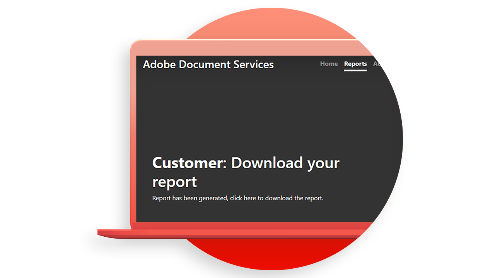

# [!DNL Adobe Acrobat Services] API-Anwendungsfälle

## Was können die [!DNL Adobe Acrobat Services]-APIs für mich tun?

Erfahren Sie, wie die [!DNL Adobe Acrobat Services]-APIs Ihr Unternehmen mithilfe dieser praktischen Anwendungsfälle verändern können.

### [!DNL Acrobat Services] APIs

<table style="table-layout:fixed">
<tr>
  <td>
    
    

    <a href="automatelegalworkflows.md"><strong>Rechtsgültige Arbeitsabläufe automatisieren</strong></a>
    

    <em>Erfahren Sie, wie Sie rechtliche Workflows mit bedingten Inhalten automatisieren</em>
    2 
  </td>
  <td>
      
      

      <a href="employeeonboarding.md"><strong>Modernisierung des Mitarbeitereinstiegs</strong></a>
      

      <em>Erfahren Sie, wie Sie das Onboarding von Mitarbeitern modernisieren</em>
      2 
  </td>
  <td>
      
      

      <a href="acceleratesales.md"><strong>Vertriebsprozess beschleunigen</strong></a>
      

      <em>Informationen zur Beschleunigung des Umsatzes durch die Integration von Dokumentenerlebnissen</em>
      2 
    </td>
    <td>
      
      

      <a href="sales.md"><strong>Verwalten von Verkaufsangeboten und Verträgen</strong></a>
      

      <em>Erfahren Sie, wie Sie einen effizienten Workflow zur Automatisierung und Vereinfachung von Verkaufsangeboten erstellen</em>
      2 
    </td>
</tr>
<tr>
  <td>
    
    

    <a href="nda.md"><strong>Erstellen einer Geheimhaltungsvereinbarung</strong></a>
    

    <em>Erfahren Sie, wie Sie eine dynamische PDF mit Geheimhaltungsvereinbarung für die Zusammenarbeit erstellen</em>
    2 
  </td>
  <td>
    
    

    <a href="legal.md"><strong>Verwalten rechtsgültiger Verträge</strong></a>
    

    <em>Weitere Informationen zum automatischen Generieren und Schützen von Rechtsdokumenten mit benutzerdefinierten Dateneingaben</em>
    2 
  </td>
  <td>
    
    

    <a href="offer.md"><strong>Angebotsschreiben für Mitarbeiter verwalten</strong></a>
    

    <em>Erfahren Sie, wie Sie ein Angebotsschreiben generieren, das einem neuen Mitarbeiter zur Unterzeichnung zugestellt werden kann</em>
    2 
  </td>
  <td>
    
    

    <a href="searching.md"><strong>Suchen und Indizieren</strong></a>
    

    <em>Erfahren Sie, wie Sie aus gescannten Dokumenten durchsuchbare PDF-Dateien erstellen</em>
    2 
  </td>
</tr>
<tr>
  <td>
    
    

    <a href="reviews.md"><strong>Überprüfungen und Genehmigungen</strong></a>
    

    <em>Erfahren Sie, wie Sie einen Workflow für die Überprüfung und Genehmigung von Dokumenten für die Zusammenarbeit zwischen Teams erstellen</em>
    2 
  </td>
  <td>
    
    

    <a href="reportcreation.md"><strong>Erstellen und Bearbeiten von Berichten</strong></a>
    

    <em>Erfahren Sie, wie Sie PDF-Berichte für Kunden auf Ihrer Website generieren</em>
    2 
  </td>
  <td>
    
    

    <a href="jobposting.md"><strong>Auftragsbuchung</strong></a>
    

    <em>Erfahren Sie, wie Sie ein reibungsloses und konsistentes Weberlebnis für Stellenbewerber und Arbeitgeber entwickeln</em>
    2 
  </td>
  <td>
    
    

    <a href="educationcollab.md"><strong>Zusammenarbeit zwischen Schülern und Lehrern</strong></a>
    

    <em>Erfahren Sie, wie Sie eine Online-Lernplattform erstellen, mit der Lehrkräfte und Schüler Ressourcen auf PDF einfach gemeinsam nutzen können</em>
    2 
  </td>
</tr>
<tr>
  <td>
    
    

    <a href="agreementworkflowsnodejs.md"><strong>Vereinbarungs-Workflows in Node.js</strong></a>
    

    <em>[!DNL Adobe Acrobat Services] APIs integrieren PDF-Funktionen ganz einfach in Ihre Webanwendungen</em>
    2 
  </td>
  <td>
    
    

    <a href="hragreementworkflowsjava.md"><strong>Workflows für HR-Dokumente in Java</strong></a>
    

    <em>[!DNL Adobe Acrobat Services] APIs integrieren PDF-Funktionen ganz einfach in Ihre HR-Webanwendungen</em>
    2 
  </td>
  <td>
    
    

    <a href="financeworkflowsjava.md"><strong>Verwalten von Workflows für Finanzdokumente in Java</strong></a>
    

    <em>[!DNL Adobe Acrobat Services] stellt alle erforderlichen Tools, Services und Funktionen bereit, um Daten aus PDF-Finanzdokumenten zu verarbeiten und zu extrahieren</em>
    2 
  </td>
  <td>
    
    

     
  </td>
</tr>
</table>

### APIs zur Dokumentenerzeugung

<table style="table-layout:fixed">
<tr>
  <td>
    
    

    <a href="invoices.md"><strong>Rechnungen verarbeiten</strong></a>
    

    <em>Erfahren Sie, wie Sie Kundenrechnungen automatisch generieren, mit einem Kennwort schützen und bereitstellen</em>
    2 
  </td>
  <td>
    
    

     
  </td>
  <td>
    
    

     
  </td>
  <td>
    
    

     
  </td>
</tr>
</table>

### PDF Embed-API

<table style="table-layout:fixed">
<tr>
   <td>
    
    

    <a href="ddppdfembedapi.md"><strong>Veröffentlichung digitaler Dokumente</strong></a>
    

    <em>Erfahren Sie, wie Sie eingebettete PDF-Dokumente mithilfe der Adobe PDF Embed-API in Webseiten anzeigen</em>
    2 
  </td>
  <td>
    
    

     
  </td>
  <td>
    
    

     
  </td>
  <td>
    
    

     
  </td>
</tr>
</table>